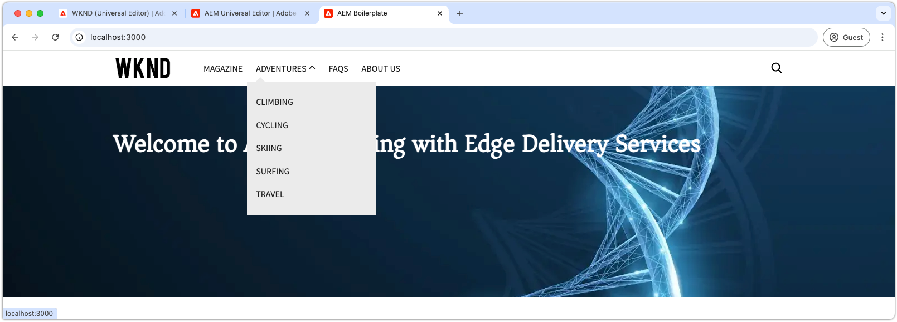
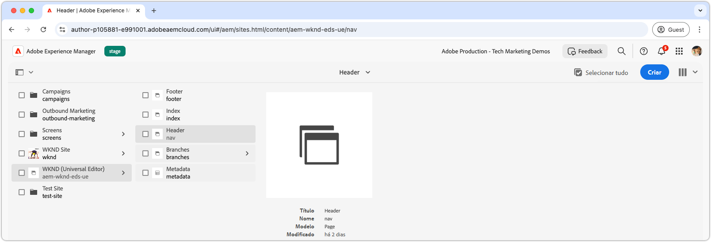
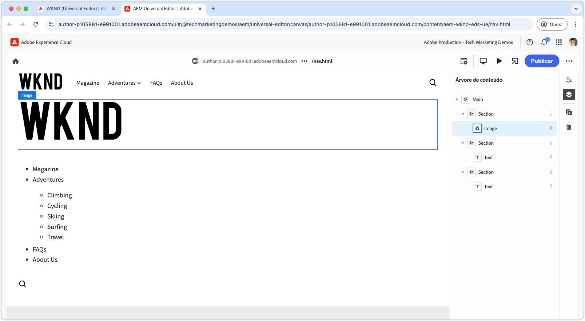
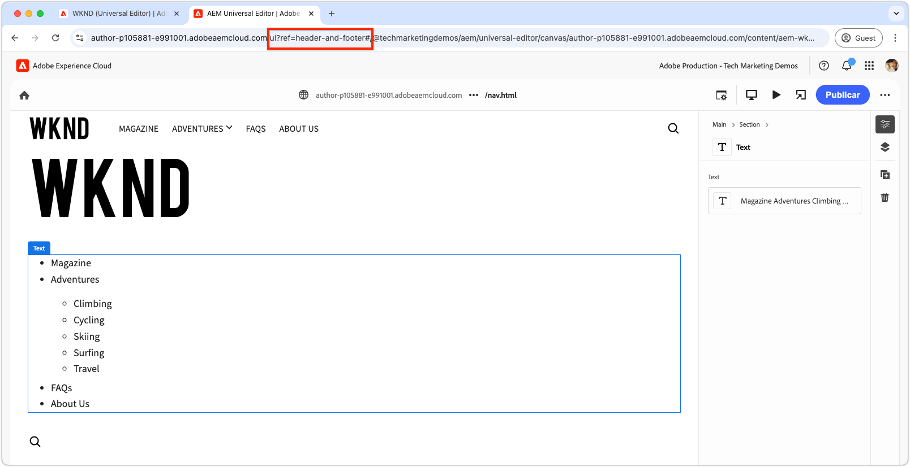
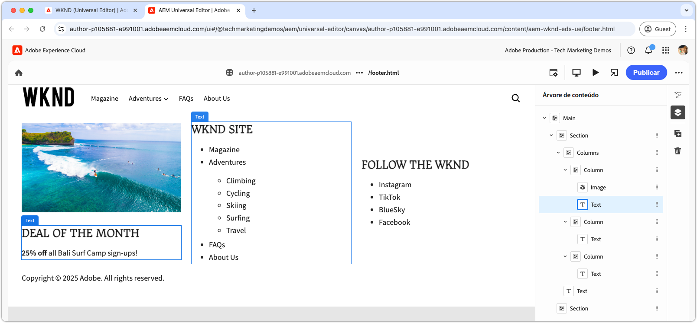

# Desenvolver um cabeçalho e um rodapé

{align="center"}

Os cabeçalhos e rodapés desempenham uma função exclusiva no Edge Delivery Services (EDS), pois estão vinculados diretamente aos elementos de HTML `<header>` e `<footer>`. Diferentemente do conteúdo normal da página, eles são gerenciados separadamente e podem ser atualizados de forma independente, sem a necessidade de limpar todo o cache da página. Embora sua implementação fique no projeto de código como blocos em `blocks/header` e `blocks/footer`, os criadores podem editar seu conteúdo por meio de páginas dedicadas do AEM que podem conter qualquer combinação de blocos.

## Bloco de cabeçalho

{align="center"}

O cabeçalho é um bloco especial vinculado ao elemento de HTML `<header>` do Edge Delivery Services.
O elemento `<header>` é entregue em branco e preenchido via XHR (AJAX) em uma página separada do AEM.
Isso permite que o cabeçalho seja gerenciado independentemente do conteúdo da página e atualizado sem exigir uma limpeza completa do cache de todas as páginas.

O bloco de cabeçalho é responsável por solicitar o fragmento de página do AEM que contém o conteúdo do cabeçalho e renderizá-lo no elemento `<header>`.

[!BADGE /blocks/header/header.js]{type=Neutral tooltip="Nome do arquivo da amostra de código abaixo."}

```javascript
import { getMetadata } from '../../scripts/aem.js';
import { loadFragment } from '../fragment/fragment.js';

...

export default async function decorate(block) {
  // load nav as fragment

  // Get the path to the AEM page fragment that defines the header content from the <meta name="nav"> tag. This is set via the site's Metadata file.
  const navMeta = getMetadata('nav');

  // If the navMeta is not defined, use the default path `/nav`.
  const navPath = navMeta ? new URL(navMeta, window.location).pathname : '/nav';

  // Make an XHR (AJAX) call to request the AEM page fragment and serialize it to a HTML DOM tree.
  const fragment = await loadFragment(navPath);
  
  // Add the content from the fragment HTML to the block and decorate it as needed
  ...
}
```

A função `loadFragment()` faz uma solicitação XHR (AJAX) a `${navPath}.plain.html`, que retorna uma representação de EDS HTML do HTML da página do AEM que existe na tag `<main>` da página, processa seu conteúdo com qualquer bloco que possa conter e retorna a árvore de DOM atualizada.

## Criar a página de cabeçalho

Antes de desenvolver o bloco de cabeçalho, crie seu conteúdo no editor universal para ter algo para desenvolver.

O conteúdo do cabeçalho fica em uma página dedicada do AEM denominada `nav`.

{align="center"}

Para criar o cabeçalho:

1. Abra a página `nav` no editor universal
1. Substitua o botão padrão por um **Bloco de imagem** que contém o logotipo WKND
1. Atualize o menu de navegação no **Bloco de texto** da seguinte forma:
   - Adicione os links de navegação desejados
   - Crie itens de subnavegação onde forem necessários
   - Defina todos os links para a página inicial (`/`) por enquanto

{align="center"}

### Publicar para visualização

Com a página de cabeçalho atualizada, [publique a página para visualização](../6-author-block.md).

Como o conteúdo do cabeçalho fica em sua própria página (a página `nav`), é necessário publicar essa página especificamente, para que as alterações do cabeçalho tenham efeito. Publicar outras páginas que usam o cabeçalho não atualizará o conteúdo do cabeçalho no Edge Delivery Services.

## HTML do bloco

Para iniciar o desenvolvimento do bloco, revise primeiro a estrutura do DOM exposta pela visualização do Edge Delivery Services. O DOM é aprimorado com o JavaScript e estilizado com o CSS, servindo de base para a criação e personalização do bloco.

Como o cabeçalho é carregado como um fragmento, precisamos examinar o HTML retornado pela solicitação XHR depois de inserida no DOM e decorada via `loadFragment()`. Para isso, é possível inspecionar o DOM nas ferramentas do desenvolvedor do navegador.


>[!BEGINTABS]

>[!TAB DOM a ser decorado]

Confira abaixo o HTML da página de cabeçalho depois que ela é carregada com o `header.js` fornecido e injetada no DOM:

```html
<header class="header-wrapper">
  <div class="header block" data-block-name="header" data-block-status="loaded">
    <div class="nav-wrapper">
      <nav id="nav" aria-expanded="true">
        <div class="nav-hamburger">
          <button type="button" aria-controls="nav" aria-label="Close navigation">
            <span class="nav-hamburger-icon"></span>
          </button>
        </div>
        <div class="section nav-brand" data-section-status="loaded" style="">
          <div class="default-content-wrapper">
            <p class="">
              <a href="#" title="Button" class="">Button</a>
            </p>
          </div>
        </div>
        <div class="section nav-sections" data-section-status="loaded" style="">
          <div class="default-content-wrapper">
            <ul>
              <li aria-expanded="false">Examples</li>
              <li aria-expanded="false">Getting Started</li>
              <li aria-expanded="false">Documentation</li>
            </ul>
          </div>
        </div>
        <div class="section nav-tools" data-section-status="loaded" style="">
          <div class="default-content-wrapper">
            <p>
              <span class="icon icon-search">
                
              </span>
            </p>
          </div>
        </div>
      </nav>
    </div>
  </div>
</header>
```

>[!TAB Como encontrar o DOM]

Para localizar e inspecionar o elemento `<header>` da página nas ferramentas do desenvolvedor do navegador da web.

{align="center"}

>[!ENDTABS]


## JavaScript do bloco

O arquivo `/blocks/header/header.js` do [modelo de projeto XWalk padronizado do AEM](https://github.com/adobe-rnd/aem-boilerplate-xwalk) fornece o JavaScript para navegação, incluindo menus suspensos e uma exibição responsiva para dispositivos móveis.

Embora o script `header.js` geralmente seja altamente personalizado para corresponder ao design de um site, é essencial manter as primeiras linhas em `decorate()`, que recuperam e processam o fragmento da página de cabeçalho.

[!BADGE /blocks/header/header.js]{type=Neutral tooltip="Nome do arquivo da amostra de código abaixo."}

```javascript
export default async function decorate(block) {
  // load nav as fragment
  const navMeta = getMetadata('nav');
  const navPath = navMeta ? new URL(navMeta, window.location).pathname : '/nav';
  const fragment = await loadFragment(navPath);
  ...
```

O código restante pode ser modificado para suprir as necessidades do projeto.

Dependendo dos requisitos do cabeçalho, o código padronizado pode ser ajustado ou removido. Neste tutorial, usaremos o código fornecido, aprimorando-o por meio da adição de um hiperlink ao redor da primeira imagem criada e vinculando-o à página inicial do site.

O código do modelo processa o fragmento de página de cabeçalho, presumindo que ele consiste em três seções na seguinte ordem:

1. **Seção da marca**: contém o logotipo e é estilizada com a classe `.nav-brand`.
2. **Seção de seções**: define o menu principal do site e é estilizada com `.nav-sections`.
3. **Seção de ferramentas**: inclui elementos como pesquisa, logon/logoff e perfil, estilizada com `.nav-tools`.

Para criar um hiperlink da imagem do logotipo para a página inicial, atualizamos o JavaScript do bloco da seguinte maneira:

>[!BEGINTABS]

>[!TAB JavaScript atualizado]

O código atualizado que envolve a imagem do logotipo com um link para a página inicial do site (`/`) é mostrado abaixo:

[!BADGE /blocks/header/header.js]{type=Neutral tooltip="Nome do arquivo da amostra de código abaixo."}

```javascript
export default async function decorate(block) {

  ...
  const navBrand = nav.querySelector('.nav-brand');
  
  // WKND: Turn the picture (image) into a linked site logo
  const logo = navBrand.querySelector('picture');
  
  if (logo) {
    // Replace the first section's contents with the authored image wrapped with a link to '/' 
    navBrand.innerHTML = `<a href="/" aria-label="Home" title="Home" class="home">${logo.outerHTML}</a>`;
    // Make sure the logo is not lazy loaded as it's above the fold and can affect page load speed
    navBrand.querySelector('img').settAttribute('loading', 'eager');
  }

  const navSections = nav.querySelector('.nav-sections');
  if (navSections) {
    // WKND: Remove Edge Delivery Services button containers and buttons from the nav sections links
    navSections.querySelectorAll('.button-container, .button').forEach((button) => {
      button.classList = '';
    });

    ...
  }
  ...
}
```

>[!TAB JavaScript original]

Confira abaixo o `header.js` original gerado a partir do modelo:

[!BADGE /blocks/header/header.js]{type=Neutral tooltip="Nome do arquivo da amostra de código abaixo."}

```javascript
export default async function decorate(block) {
  ...
  const navBrand = nav.querySelector('.nav-brand');
  const brandLink = navBrand.querySelector('.button');
  if (brandLink) {
    brandLink.className = '';
    brandLink.closest('.button-container').className = '';
  }

  const navSections = nav.querySelector('.nav-sections');
  if (navSections) {
    navSections.querySelectorAll(':scope .default-content-wrapper > ul > li').forEach((navSection) => {
      if (navSection.querySelector('ul')) navSection.classList.add('nav-drop');
      navSection.addEventListener('click', () => {
        if (isDesktop.matches) {
          const expanded = navSection.getAttribute('aria-expanded') === 'true';
          toggleAllNavSections(navSections);
          navSection.setAttribute('aria-expanded', expanded ? 'false' : 'true');
        }
      });
    });
  }
  ...
}
```

>[!ENDTABS]


## CSS do bloco

Atualize o `/blocks/header/header.css` para estilizá-lo de acordo com a marca WKND.

Adicionaremos o CSS personalizado na parte inferior do `header.css` para facilitar a visualização e o entendimento das alterações no tutorial. Embora esses estilos possam ser integrados diretamente às regras de CSS do modelo, mantê-los separados ajuda a ilustrar o que foi modificado.

Como estamos adicionando as novas regras após o conjunto original, vamos envolvê-las com um seletor de CSS `header .header.block nav` para garantir que elas tenham prioridade sobre as regras do modelo.

[!BADGE /blocks/header/header.css]{type=Neutral tooltip="Nome do arquivo da amostra de código abaixo."}

```css
/* /blocks/header/header.css */

... Existing CSS generated by the template ...

/* Add the following CSS to the end of the header.css */

/** 
* WKND customizations to the header 
* 
* These overrides can be incorporated into the provided CSS,
* however they are included discretely in thus tutorial for clarity and ease of addition.
* 
* Because these are added discretely
* - They are added to the bottom to override previous styles.
* - They are wrapped in a header .header.block nav selector to ensure they have more specificity than the provided CSS.
* 
**/

header .header.block nav {
  /* Set the height of the logo image.
     Chrome natively sets the width based on the images aspect ratio */
  .nav-brand img {
    height: calc(var(--nav-height) * .75);
    width: auto;
    margin-top: 5px;
  }
  
  .nav-sections {
    /* Update menu items display properties */
    a {
      text-transform: uppercase;
      background-color: transparent;
      color: var(--text-color);
      font-weight: 500;
      font-size: var(--body-font-size-s);
    
      &:hover {
        background-color: auto;
      }
    }

    /* Adjust some spacing and positioning of the dropdown nav */
    .nav-drop {
      &::after {
        transform: translateY(-50%) rotate(135deg);
      }
      
      &[aria-expanded='true']::after {
        transform: translateY(50%) rotate(-45deg);
      }

      & > ul {
        top: 2rem;
        left: -1rem;      
       }
    }
  }
```

## Visualização do desenvolvimento

À medida que o CSS e o JavaScript são desenvolvidos, o ambiente de desenvolvimento local da CLI do AEM recarrega as alterações automaticamente, permitindo uma visualização rápida e fácil de como o código afeta o bloco. Passe o mouse sobre a CTA e verifique se o zoom da imagem do teaser aumenta ou diminui.

{align="center"}

## Limpar o seu código

Certifique-se de [limpar com frequência](../3-local-development-environment.md#linting) as alterações no seu código para que esteja limpo e seja consistente. A limpeza periódica ajuda a detectar problemas antecipadamente, reduzindo o tempo geral de desenvolvimento. Lembre-se de que você não pode mesclar o seu trabalho de desenvolvimento com a ramificação `main` até que todos os problemas de limpeza sejam resolvidos.

```bash
# ~/Code/aem-wknd-eds-ue

$ npm run lint
```

## Visualizar no editor universal

Para exibir as alterações no editor universal do AEM, adicione, confirme e envie-as à ramificação do repositório do Git usada pelo editor universal. Isso garante que a implementação do bloco não interrompa a experiência de criação.

```bash
# ~/Code/aem-wknd-eds-ue

$ git add .
$ git commit -m "CSS and JavaScript implementation for Header block"
# JSON files are compiled automatically and added to the commit via a Husky pre-commit hook
$ git push origin header-and-footer
```

Agora, as alterações ficam visíveis no editor universal ao usar o parâmetro de consulta `?ref=header-and-footer`.

{align="center"}

## Rodapé

Assim como o cabeçalho, o conteúdo do rodapé é criado em uma página dedicada do AEM; neste caso, a página de rodapé (`footer`). O rodapé segue o mesmo padrão de ser carregado como um fragmento e decorado com CSS e JavaScript.

>[!BEGINTABS]

>[!TAB Rodapé]

O rodapé deve ser implementado com um layout de três colunas, contendo:

- Uma coluna à esquerda com uma promoção (imagem e texto)
- Uma coluna no meio com links de navegação
- Uma coluna à direita com links para redes sociais
- Uma linha na parte inferior, abrangendo as três colunas, com os direitos autorais

{align="center"}

>[!TAB Conteúdo do rodapé]

Use o bloco de colunas na página de rodapé para criar o efeito de três colunas.

| Coluna 1 | Coluna 2 | Coluna 3 |
| ---------|----------------|---------------|
| Imagem | Cabeçalho 3 | Cabeçalho 3 |
| Texto | Lista de links | Lista de links |

{align="center"}

>[!TAB Código do rodapé]

O CSS abaixo define o estilo do bloco de rodapé com um layout de três colunas, espaçamento consistente e tipografia. A implementação do rodapé usa somente o JavaScript fornecido pelo modelo.

[!BADGE /blocks/footer/footer.css]{type=Neutral tooltip="Nome do arquivo da amostra de código abaixo."}

```css
/* /blocks/footer/footer.css */

footer {
  background-color: var(--light-color);

  .block.footer {
    border-top: solid 1px var(--dark-color);
    font-size: var(--body-font-size-s);

    a { 
      all: unset;
      
      &:hover {
        text-decoration: underline;
        cursor: pointer;
      }
    }

    img {
      width: 100%;
      height: 100%;
      object-fit: cover;
      border: solid 1px white;
    }

    p {
      margin: 0;
    }

    ul {
      list-style: none;
      padding: 0;
      margin: 0;

      li {
        padding-left: .5rem;
      }
    }

    & > div {
      margin: auto;
      max-width: 1200px;
    }

    .columns > div {
      gap: 5rem;
      align-items: flex-start;

      & > div:first-child {
        flex: 2;
      }
    }

    .default-content-wrapper {
      padding-top: 2rem;
      margin-top: 2rem;
      font-style: italic;
      text-align: right;
    }
  }
}

@media (width >= 900px) {
  footer .block.footer > div {
    padding: 40px 32px 24px;
  }
}
```


>[!ENDTABS]

## Parabéns!

Agora, você já sabe como os cabeçalhos e rodapés são gerenciados e desenvolvidos no Edge Delivery Services e no editor universal. Você aprendeu que eles são:

- Criados em páginas dedicadas do AEM separadamente do conteúdo principal
- Carregados de forma assíncrona como fragmentos para permitir atualizações independentes
- Decorados com JavaScript e CSS para criar experiências de navegação responsivas
- Integrados perfeitamente ao editor universal para facilitar o gerenciamento de conteúdo

Esse padrão fornece uma abordagem flexível e passível de manutenção à implementação de componentes de navegação em todo o site.

Para ver mais práticas recomendadas e técnicas avançadas, consulte a [documentação do editor universal](https://experienceleague.adobe.com/pt-br/docs/experience-manager-cloud-service/content/edge-delivery/wysiwyg-authoring/create-block#block-options).
