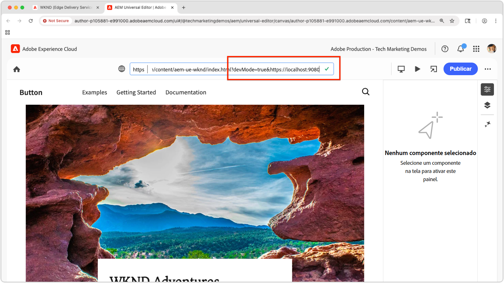

# Visualizar uma extensão local do Universal Editor

>[!TIP]
> Saiba como [criar uma extensão do Universal Editor](https://developer.adobe.com/uix/docs/services/aem-universal-editor/).

Para visualizar uma extensão do Universal Editor durante o desenvolvimento, é necessário:

1. Execute a extensão localmente.
2. Aceite o certificado autoassinado.
3. Abra uma página no Universal Editor.
4. Atualize o URL do local para carregar a extensão local.

## Executar a extensão localmente

Isso pressupõe que você já tenha criado uma [extensão de Editor Universal](https://developer.adobe.com/uix/docs/services/aem-universal-editor/) e deseja visualizá-la durante os testes e o desenvolvimento local.

Inicie sua extensão do Universal Editor com:

```bash
$ aio app run
```

Você verá resultados como:

```
To view your local application:
  -> https://localhost:9080
To view your deployed application in the Experience Cloud shell:
  -> https://experience.adobe.com/?devMode=true#/custom-apps/?localDevUrl=https://localhost:9080
```

Por padrão, essa opção executa sua extensão em `https://localhost:9080`.


## Aceitar o certificado autoassinado

O Universal Editor requer HTTPS para carregar extensões. Como o desenvolvimento local usa um certificado autoassinado, seu navegador deve confiar explicitamente nele.

Abra uma nova guia do navegador e navegue até a saída de URL de extensão local pelo comando `aio app run`:

```
https://localhost:9080
```

Seu navegador mostrará um aviso de certificado. Aceite o certificado para continuar.


Depois de aceito, você verá a página de espaço reservado da extensão local:


## Abrir uma página no Universal Editor

Abra o Universal Editor por meio do [console do Universal Editor](https://experience.adobe.com/#/@myOrg/aem/editor/canvas/) ou editando uma página no AEM Sites que usa o Universal Editor:


## Carregar a extensão

No Universal Editor, localize o campo **Localização** na parte superior central da interface. Expanda e atualize a **URL no campo Localização**, **não a barra de endereços do navegador**.

Anexe os seguintes parâmetros de consulta:

* `devMode=true` - Habilita o modo de desenvolvimento para o Editor Universal.
* `ext=https://localhost:9080` - Carrega a extensão em execução localmente.

Exemplo:

```
https://author-pXXX-eXXX.adobeaemcloud.com/content/aem-ue-wknd/index.html?devMode=true&ext=https://localhost:9080
```




## Visualizar a extensão

Execute uma **recarga forçada** do navegador para garantir que a URL atualizada seja usada.

O Universal Editor agora carregará sua extensão local, somente na sessão do navegador.

Quaisquer alterações de código feitas localmente serão refletidas imediatamente.


