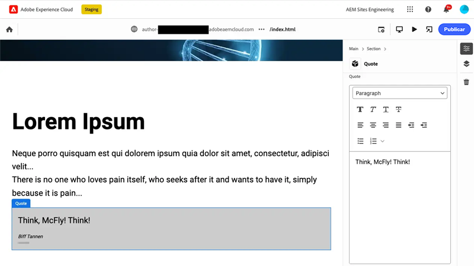

# vídeos do Edge Delivery Services

Saiba como tornar os sites rápidos com o Edge Delivery Services.

>[!VIDEO](https://video.tv.adobe.com/v/3427989/?learn=on)

Revise a [documentação](https://experienceleague.adobe.com/en/docs/experience-manager-cloud-service/content/edge-delivery/overview) para obter detalhes completos sobre o Edge Delivery Services e seus recursos.

## tutoriais do desenvolvedor do Edge Delivery Services

    <!-- Document-based authoring -->
    

      

        

          <figure class="image is-16by9">
            
          </figure>
        

        

          

            

              <a href="https://experienceleague.adobe.com/en/docs/experience-manager-cloud-service/content/edge-delivery/build/tutorial" title="Tutorial do site de criação baseado em documento">Tutorial do site de criação baseado em documentos</a>
            

            
Saiba como criar sites do Edge Delivery Services criados usando a criação baseada em documento.

            <a href="https://experienceleague.adobe.com/en/docs/experience-manager-cloud-service/content/edge-delivery/build/tutorial" class="spectrum-Button
              spectrum-Button--outline spectrum-Button--primary
              spectrum-Button--sizeM">
              Iniciar o tutorial
            </a>
          

        

      

    

    <!-- Universal Editor -->
    

      

        

          <figure class="image is-16by9">
            
          </figure>
        

        

          

            

              <a href="https://experienceleague.adobe.com/en/docs/experience-manager-cloud-service/content/edge-delivery/wysiwyg-authoring/edge-dev-getting-started" title="Tutorial do site do Universal Editor">Tutorial do site do Universal Editor</a>
            

            
Saiba como criar sites do Edge Delivery Services criados usando o Universal Editor.

            <a href="https://experienceleague.adobe.com/en/docs/experience-manager-cloud-service/content/edge-delivery/wysiwyg-authoring/edge-dev-getting-started" class="spectrum-Button
              spectrum-Button--outline spectrum-Button--primary
              spectrum-Button--sizeM">
              Iniciar o tutorial
            </a>
          

        

      

    
    
  

## Introdução ao Edge Delivery Services

    <!-- Prerequisites -->
    

      

        

          <figure class="image is-16by9">
            
          </figure>
        

        

          

            
5 minutos

            

              <a href="./developing/prerequisites.md" title="Pré-requisitos">Pré-requisitos do desenvolvedor</a>
            

            
O que será necessário para começar a desenvolver com o Edge Delivery Services.

            <a href="./developing/prerequisites.md" class="spectrum-Button
              spectrum-Button--outline spectrum-Button--primary
              spectrum-Button--sizeM">
              Assista ao vídeo
            </a>
          

        

      

    
 
    <!-- Setting up your Repository-->
    

      

        

          <figure class="image is-16by9">
            
          </figure>
        

        

          

            
1 minuto

            

              <a href="./developing/aem-boilerplate.md" title="Usar modelo padrão">Modelo do AEM</a>
            

            
Use o modelo de boletim AEM para configurar o repositório de código.

            <a href="./developing/aem-boilerplate.md" class="spectrum-Button
              spectrum-Button--outline spectrum-Button--primary
              spectrum-Button--sizeM">
              Assista ao vídeo
            </a>
          

        

      

    

    <!-- Linking Google Drive -->
    

      

        

          <figure class="image is-16by9">
            
          </figure>
        

        

          

            
1 minuto

            

              <a href="./developing/content-repository.md" title="Vincular unidade Google">Vincular Unidade Google</a>
            

            
Use o Google Drive como repositório para todo o conteúdo.

            <a href="./developing/content-repository.md" class="spectrum-Button
              spectrum-Button--outline spectrum-Button--primary
              spectrum-Button--sizeM">
              Assista ao vídeo
            </a>
          

        

      

    

    <!-- Link Sharepoint --->
    

      

        

          <figure class="image is-16by9">
            
          </figure>
        

        

          

            
1 minuto

            

              <a href="./developing/content-repository.md" title="Vincular Sharepoint">Vincular SharePoint</a>
            

            
Use o SharePoint como repositório para todo o seu conteúdo.

            <a href="./developing/content-repository.md"
              class="spectrum-Button spectrum-Button--outline
              spectrum-Button--primary spectrum-Button--sizeM">
              Assista ao vídeo
            </a>
          

        

      

    

    <!-- Previewing and Publishing Content -->
    

      

        

          <figure class="image is-16by9">
            
          </figure>
        

        

          

            
1 minuto

            

              <a href="./developing/preview-and-publish.md" title="Visualização e conteúdo do Publish">Visualizar e publicar conteúdo</a>
            

            
Pré-visualize e publique conteúdo usando o AEM Sidekick.

            <a href="./developing/preview-and-publish.md" class="spectrum-Button
              spectrum-Button--outline spectrum-Button--primary
              spectrum-Button--sizeM">
              Assista ao vídeo
            </a>
          

        

      

    

    <!-- Using the Sidekick -->
    

      

        

          <figure class="image is-16by9">
            
          </figure>
        

        

          

            
1 minuto

            

              <a href="./developing/sidekick.md" title="Uso do Sidekick">Usar o AEM Sidekick</a>
            

            
Saiba como usar o AEM Sidekick.

            <a href="./developing/sidekick.md" class="spectrum-Button
              spectrum-Button--outline spectrum-Button--primary
              spectrum-Button--sizeM">
              Assista ao vídeo
            </a>
          

        

      

    

 <!-- Document Structure -->
    

      

        

          <figure class="image is-16by9">
            
          </figure>
        

        

          

            
1 minuto

            

              <a href="./developing/document-structure.md" title="Estrutura do documento">Estrutura do documento</a>
            

            
Explorar a estrutura do documento, incluindo o conteúdo padrão, seções e blocos 

            <a href="./developing/document-structure.md" class="spectrum-Button
              spectrum-Button--outline spectrum-Button--primary
              spectrum-Button--sizeM">
              Assista ao vídeo
            </a>
          

        

      

    
  
     <!--Local Development -->
    

      

        

          <figure class="image is-16by9">
            
          </figure>
        

        

          

            
2 minutos

            

              <a href="./developing/local-development.md" title="Desenvolvimento local">Desenvolvimento local</a>
            

            
Configurar o ambiente de desenvolvimento local.

            <a href="./developing/local-development.md" class="spectrum-Button
              spectrum-Button--outline spectrum-Button--primary
              spectrum-Button--sizeM">
              Assista ao vídeo
            </a>
          

        

      

    

    <!--Integrate with Git -->
    

      

        

          <figure class="image is-16by9">
            
          </figure>
        

        

          

            
2 minutos

            

              <a href="./developing/git.md" title="Integrar ao Git">Integrar com o Git</a>
            

            
Configure Git e Edge Delivery Services.

            <a href="./developing/git.md" class="spectrum-Button
              spectrum-Button--outline spectrum-Button--primary
              spectrum-Button--sizeM">
              Assista ao vídeo
            </a>
          

        

      

    

## Vídeos explicativos

    <!--Create RSS Feeds -->
    

      

        

          <figure class="image is-16by9">
            
          </figure>
        

        

          

            
2 minutos

            

              <a href="./how-to/rss.md" title="Criar RSS Feeds">Criar RSS feeds</a>
            

            
Saiba como criar feeds RSS.

            <a href="./how-to/rss.md" class="spectrum-Button
              spectrum-Button--outline spectrum-Button--primary
              spectrum-Button--sizeM">
              Assista ao vídeo
            </a>
          

        

      

    

    <!--Social Media Sharing -->
    

      

        

          <figure class="image is-16by9">
            
          </figure>
        

        

          

            
2 minutos

            

              <a href="./how-to/social-media-sharing.md" title="Compartilhamento em redes sociais">Compartilhamento em redes sociais</a>
            

            
Saiba como otimizar seu conteúdo para compartilhamento em redes sociais.

            <a href="./how-to/social-media-sharing.md" class="spectrum-Button
              spectrum-Button--outline spectrum-Button--primary
              spectrum-Button--sizeM">
              Assista ao vídeo
            </a>
          

        

      

    

    <!--Delete a Page -->
    

      

        

          <figure class="image is-16by9">
            
          </figure>
        

        

          

            
2 minutos

            

              <a href="./how-to/delete-page.md" title="Excluir páginas">Excluindo páginas</a>
            

            
Saiba como excluir páginas.

            <a href="./how-to/delete-page.md" class="spectrum-Button
              spectrum-Button--outline spectrum-Button--primary
              spectrum-Button--sizeM">
              Assista ao vídeo
            </a>
          

        

      

    
    
  

