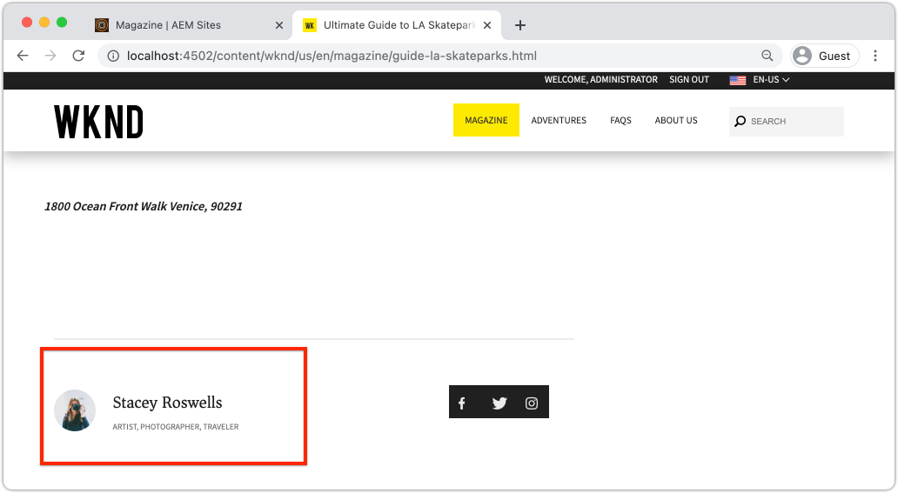

# Personalizar a camada de dados do cliente da Adobe com componentes do AEM {#customize-data-layer}

Saiba como personalizar a Camada de dados do cliente da Adobe com conteúdo de componentes personalizados do AEM. Saiba como usar APIs fornecidas por [Componentes principais do AEM para estender](https://experienceleague.adobe.com/docs/experience-manager-core-components/using/developing/data-layer/extending.html) e personalizar a camada de dados.

## O que você vai criar


Neste tutorial, você explorará várias opções para estender a Camada de dados do cliente da Adobe, atualizando o componente de Byline [WKND](https://experienceleague.adobe.com/docs/experience-manager-learn/getting-started-wknd-tutorial-develop/custom-component.html). Este é um componente personalizado e as lições aprendidas neste tutorial podem ser aplicadas a outros componentes personalizados.

### Objetivos {#objective}

1. Insira dados de componentes na camada de dados estendendo um Modelo do Sling e um HTL do componente
1. Use os utilitários de camada de dados dos Componentes principais para reduzir o esforço
1. Usar os atributos de dados do Componente principal para se conectar aos eventos da camada de dados existente

## Pré-requisitos {#prerequisites}

Um **ambiente de desenvolvimento local** é necessário para concluir este tutorial. Capturas de tela e vídeo são capturados usando o SDK do AEM as a Cloud Service em execução em um macOS. Os comandos e o código são independentes do sistema operacional local, a menos que observado de outra forma.

**Novo no AEM as a Cloud Service?** Consulte o [guia a seguir para configurar um ambiente de desenvolvimento local usando o SDK do AEM as a Cloud Service](https://docs.adobe.com/content/help/en/experience-manager-learn/cloud-service/local-development-environment-set-up/overview.html).

**Novo no AEM 6.5?** Consulte o guia a  [seguir para configurar um ambiente](https://docs.adobe.com/content/help/en/experience-manager-learn/foundation/development/set-up-a-local-aem-development-environment.html) de desenvolvimento local.

## Baixe e implante o site de referência WKND {#set-up-wknd-site}

Este tutorial estende o componente Byline no site de referência WKND. Clonar e instalar a base de código WKND no ambiente local.

1. Inicie uma instância do Quickstart local **author** do AEM em execução em [http://localhost:4502](http://localhost:4502).
1. Abra uma janela de terminal e clone a base de código WKND usando Git:

   ```shell
   $ git clone git@github.com:adobe/aem-guides-wknd.git
   ```

1. Implante a base de código WKND em uma instância local do AEM:

   ```shell
   $ cd aem-guides-wknd
   $ mvn clean install -PautoInstallSinglePackage
   ```

   >[!NOTE]
   >
   > Se estiver usando o AEM 6.5 e o service pack mais recente, adicione o perfil `classic` ao comando Maven:
   >
   > `mvn clean install -PautoInstallSinglePackage -Pclassic`

1. Abra uma nova janela do navegador e faça logon no AEM. Abra uma página **Revista** como: [http://localhost:4502/content/wknd/us/en/magazine/guide-la-skateparks.html](http://localhost:4502/content/wknd/us/en/magazine/guide-la-skateparks.html).

   

   Você deve ver um exemplo do componente Byline que foi adicionado à página como parte de um Fragmento de experiência. Você pode exibir o Fragmento de experiência em [http://localhost:4502/editor.html/content/experience-fragments/wknd/language-masters/en/contributors/stacey-roswells/byline.html](http://localhost:4502/editor.html/content/experience-fragments/wknd/language-masters/en/contributors/stacey-roswells/byline.html)
1. Abra as ferramentas do desenvolvedor e insira o seguinte comando no **Console**:

   ```js
   window.adobeDataLayer.getState();
   ```

   Inspecione a resposta para ver o estado atual da camada de dados em um site do AEM. Você deve ver informações sobre a página e os componentes individuais.

   

   Observe que o componente Byline não está listado na Camada de dados.

## Atualizar o Modelo de Sling Byline {#sling-model}

Para inserir dados sobre o componente na camada de dados, primeiro devemos atualizar o Modelo do Sling do componente. Em seguida, atualize a interface Java do Byline e a implementação do Modelo do Sling para adicionar um novo método `getData()`. Esse método conterá as propriedades que queremos injetar na camada de dados.

1. No IDE de sua escolha, abra o projeto `aem-guides-wknd`. Navegue até o módulo `core`.
1. Abra o arquivo `Byline.java` em `core/src/main/java/com/adobe/aem/guides/wknd/core/models/Byline.java`.

   

1. Adicione um novo método à interface:

   ```java
   public interface Byline {
       ...
       /***
        * Return data about the Byline Component to populate the data layer
        * @return String
        */
       String getData();
   }
   ```

1. Abra o arquivo `BylineImpl.java` em `core/src/main/java/com/adobe/aem/guides/wknd/core/models/impl/BylineImpl.java`.

   Essa é a implementação da interface `Byline` e é implementada como um Modelo do Sling.

1. Adicione as seguintes declarações de importação ao início do arquivo:

   ```java
   import java.util.HashMap;
   import java.util.Map;
   import org.apache.sling.api.resource.Resource;
   import com.fasterxml.jackson.core.JsonProcessingException;
   import com.fasterxml.jackson.databind.ObjectMapper;
   import com.adobe.cq.wcm.core.components.util.ComponentUtils;
   ```

   As APIs `fasterxml.jackson` serão usadas para serializar os dados que queremos expor como JSON. O `ComponentUtils` dos Componentes principais do AEM será usado para verificar se a camada de dados está ativada.

1. Adicione o método não implementado `getData()` a `BylineImple.java`:

   ```java
   public class BylineImpl implements Byline {
       ...
       @Override
       public String getData() {
           Resource bylineResource = this.request.getResource();
           // Use ComponentUtils to verify if the DataLayer is enabled
           if (ComponentUtils.isDataLayerEnabled(bylineResource)) {
   
               //Create a map of properties we want to expose
               Map<String, Object> bylineProperties = new HashMap<String,Object>();
               bylineProperties.put("@type", bylineResource.getResourceType());
               bylineProperties.put("name", this.getName());
               bylineProperties.put("occupation", this.getOccupations());
               bylineProperties.put("fileReference", image.getFileReference());
   
               //Use AEM Core Component utils to get a unique identifier for the Byline component (in case multiple are on the page)
               String bylineComponentID = ComponentUtils.getId(bylineResource, this.currentPage, this.componentContext);
   
               // Return the bylineProperties as a JSON String with a key of the bylineResource's ID
               try {
                   return String.format("{\"%s\":%s}",
                       bylineComponentID,
                       // Use the ObjectMapper to serialize the bylineProperties to a JSON string
                       new ObjectMapper().writeValueAsString(bylineProperties));
               } catch (JsonProcessingException e) {
   
                   LOGGER.error("Unable to generate dataLayer JSON string", e);
               }
   
           }
           // return null if the Data Layer is not enabled
           return null;
       }
   }
   ```

   No método acima, um novo `HashMap` é usado para capturar as propriedades que queremos expor como JSON. Observe que métodos existentes como `getName()` e `getOccupations()` são usados. `@type` representa o tipo de recurso exclusivo do componente, isso permite que um cliente identifique eventos e/ou acionadores facilmente com base no tipo de componente.

   O `ObjectMapper` é usado para serializar as propriedades e retornar uma string JSON. Essa cadeia de caracteres JSON pode ser inserida na camada de dados.

1. Abra uma janela de terminal. Crie e implante apenas o módulo `core` usando suas habilidades Maven:

   ```shell
   $ cd aem-guides-wknd/core
   $ mvn clean install -PautoInstallBundle
   ```

## Atualizar o HTL Byline {#htl}

Em seguida, atualize o `Byline` [HTL](https://experienceleague.adobe.com/docs/experience-manager-htl/using/htl/block-statements.html?lang=en#htl). HTL (Linguagem de modelo HTML) é o modelo usado para renderizar o HTML do componente.

Um atributo de dados especial `data-cmp-data-layer` em cada Componente AEM é usado para expor sua camada de dados.  O JavaScript fornecido pelos Componentes principais do AEM procura por esse atributo de dados, cujo valor será preenchido com a Cadeia de caracteres JSON retornada pelo método `getData()` do Modelo de sling Byline e injeta os valores na camada de Dados do cliente da Adobe.

1. No IDE, abra o projeto `aem-guides-wknd`. Navegue até o módulo `ui.apps`.
1. Abra o arquivo `byline.html` em `ui.apps/src/main/content/jcr_root/apps/wknd/components/byline/byline.html`.

   

1. Atualize `byline.html` para incluir o atributo `data-cmp-data-layer`:

   ```diff
     <div data-sly-use.byline="com.adobe.aem.guides.wknd.core.models.Byline"
       data-sly-use.placeholderTemplate="core/wcm/components/commons/v1/templates.html"
       data-sly-test.hasContent="${!byline.empty}"
   +   data-cmp-data-layer="${byline.data}"
       class="cmp-byline">
       ...
   ```

   O valor de `data-cmp-data-layer` foi definido como `"${byline.data}"`, onde `byline` é o Modelo do Sling atualizado anteriormente. `.data` é a notação padrão para chamar um método Java Getter no HTL da  `getData()` implementada no exercício anterior.

1. Abra uma janela de terminal. Crie e implante apenas o módulo `ui.apps` usando suas habilidades Maven:

   ```shell
   $ cd aem-guides-wknd/ui.apps
   $ mvn clean install -PautoInstallPackage
   ```

1. Retorne ao navegador e abra novamente a página com um componente Byline: [http://localhost:4502/content/wknd/us/en/magazine/guide-la-skateparks.html](http://localhost:4502/content/wknd/us/en/magazine/guide-la-skateparks.html).

1. Abra as ferramentas do desenvolvedor e inspecione a fonte HTML da página para o componente Byline :

   

   Você deve ver que `data-cmp-data-layer` foi preenchido com a Cadeia de caracteres JSON do Modelo do Sling.

1. Abra as ferramentas do desenvolvedor do navegador e insira o seguinte comando no **Console**:

   ```js
   window.adobeDataLayer.getState();
   ```

1. Navegue abaixo da resposta em `component` para descobrir que a instância do componente `byline` foi adicionada à camada de dados:

   

   Você deve ver uma entrada como a seguinte:

   ```json
   byline-136073cfcb:
       @type: "wknd/components/byline"
       fileReference: "/content/dam/wknd/en/contributors/stacey-roswells.jpg"
       name: "Stacey Roswells"
       occupation: (3) ["Artist", "Photographer", "Traveler"]
       parentId: "page-30d989b3f8"
   ```

   Observe que as propriedades expostas são as mesmas adicionadas no `HashMap` no Modelo do Sling.

## Adicionar um evento de clique {#click-event}

A Camada de dados do cliente da Adobe é orientada por eventos e um dos eventos mais comuns para acionar uma ação é o evento `cmp:click`. Os componentes principais do AEM facilitam o registro do seu componente com a ajuda do elemento de dados: `data-cmp-clickable`.

Os elementos clicáveis geralmente são um botão CTA ou um link de navegação. Infelizmente, o componente Byline não tem nenhum desses componentes, mas registraremos de qualquer maneira, pois isso pode ser comum para outros componentes personalizados.

1. Abra o módulo `ui.apps` no IDE
1. Abra o arquivo `byline.html` em `ui.apps/src/main/content/jcr_root/apps/wknd/components/byline/byline.html`.

1. Atualize `byline.html` para incluir o atributo `data-cmp-clickable` no elemento **name** do Byline:

   ```diff
     <h2 class="cmp-byline__name" 
   +    data-cmp-clickable="${byline.data ? true : false}">
        ${byline.name}
     </h2>
   ```

1. Abra um novo terminal. Crie e implante apenas o módulo `ui.apps` usando suas habilidades Maven:

   ```shell
   $ cd aem-guides-wknd/ui.apps
   $ mvn clean install -PautoInstallPackage
   ```

1. Retorne ao navegador e abra novamente a página com o componente Byline adicionado: [http://localhost:4502/content/wknd/us/en/magazine/guide-la-skateparks.html](http://localhost:4502/content/wknd/us/en/magazine/guide-la-skateparks.html).

   Para testar nosso evento, adicionaremos alguns JavaScript manualmente usando o console do desenvolvedor. Consulte [Uso da camada de dados do cliente da Adobe com componentes principais do AEM](data-layer-overview.md) para obter um vídeo sobre como fazer isso.

1. Abra as ferramentas do desenvolvedor do navegador e insira o seguinte método no **Console**:

   ```javascript
   function bylineClickHandler(event) {
       var dataObject = window.adobeDataLayer.getState(event.eventInfo.path);
       if (dataObject != null && dataObject['@type'] === 'wknd/components/byline') {
           console.log("Byline Clicked!");
           console.log("Byline name: " + dataObject['name']);
       }
   }
   ```

   Este método simples deve lidar com o clique do nome do componente Byline.

1. Insira o seguinte método no **Console**:

   ```javascript
   window.adobeDataLayer.push(function (dl) {
        dl.addEventListener("cmp:click", bylineClickHandler);
   });
   ```

   O método acima envia um ouvinte de evento para a camada de dados para ouvir o evento `cmp:click` e chama o `bylineClickHandler`.

   >[!CAUTION]
   >
   > Será importante **e não** atualizar o navegador durante todo esse exercício; caso contrário, o JavaScript do console será perdido.

1. No navegador, com o **Console** aberto, clique no nome do autor no componente Linha de Byte:

   

   Você deve ver a mensagem do console `Byline Clicked!` e o nome da linha de bytes.

   O evento `cmp:click` é o mais fácil de se conectar. Para componentes mais complexos e para rastrear outros comportamentos, é possível adicionar javascript personalizado para adicionar e registrar novos eventos. Um excelente exemplo é o componente Carrossel, que dispara um evento `cmp:show` sempre que um slide é alternado. Consulte o [código-fonte para obter mais detalhes](https://github.com/adobe/aem-core-wcm-components/blob/master/content/src/content/jcr_root/apps/core/wcm/components/carousel/v1/carousel/clientlibs/site/js/carousel.js#L219).

## Usar o utilitário DataLayerBuilder {#data-layer-builder}

Quando o Modelo do Sling era [atualizado](#sling-model) anteriormente no capítulo, optamos por criar a Cadeia de caracteres JSON usando um `HashMap` e definindo cada uma das propriedades manualmente. Esse método funciona bem para componentes únicos pequenos, no entanto, para componentes que estendem os Componentes principais do AEM, isso pode resultar em muito código extra.

Existe uma classe de utilidade, `DataLayerBuilder`, para executar a maior parte da elevação pesada. Isso permite que as implementações estendam apenas as propriedades desejadas. Vamos atualizar o Modelo do Sling para usar o `DataLayerBuilder`.

1. Retorne ao IDE e navegue até o módulo `core`.
1. Abra o arquivo `Byline.java` em `core/src/main/java/com/adobe/aem/guides/wknd/core/models/Byline.java`.
1. Modifique o método `getData()` para retornar um tipo de `ComponentData`

   ```java
   import com.adobe.cq.wcm.core.components.models.datalayer.ComponentData;
   ...
   public interface Byline {
       ...
       /***
        * Return data about the Byline Component to populate the data layer
        * @return ComponentData
        */
       ComponentData getData();
   }
   ```

   `ComponentData` é um objeto fornecido pelos Componentes principais do AEM. Ele resulta em uma string JSON, exatamente como no exemplo anterior, mas também executa muito trabalho adicional.

1. Abra o arquivo `BylineImpl.java` em `core/src/main/java/com/adobe/aem/guides/wknd/core/models/impl/BylineImpl.java`.

1. Adicione as seguintes declarações de importação:

   ```java
   import com.adobe.cq.wcm.core.components.models.datalayer.ComponentData;
   import com.adobe.cq.wcm.core.components.models.datalayer.builder.DataLayerBuilder;
   ```

1. Substitua o método `getData()` pelo seguinte:

   ```java
   @Override
   public ComponentData getData() {
       Resource bylineResource = this.request.getResource();
       // Use ComponentUtils to verify if the DataLayer is enabled
       if (ComponentUtils.isDataLayerEnabled(bylineResource)) {
   
           return DataLayerBuilder.extending(getImage().getData()).asImageComponent()
               .withTitle(this::getName)
               .build();
   
       }
       // return null if the Data Layer is not enabled
       return null;
   }
   ```

   O componente Byline reutiliza partes do Componente principal da imagem para exibir uma imagem que representa o autor. No trecho acima, o [DataLayerBuilder](https://javadoc.io/doc/com.adobe.cq/core.wcm.components.core/latest/com/adobe/cq/wcm/core/components/models/datalayer/builder/ComponentDataBuilder.html) é usado para estender a camada de dados do componente `Image`. Isso preenche previamente o objeto JSON com todos os dados sobre a imagem usada. Também faz algumas das funções de rotina, como definir o `@type` e o identificador exclusivo do componente. Observe que o método é muito pequeno!

   A única propriedade estendeu o `withTitle` que é substituído pelo valor de `getName()`.

1. Abra uma janela de terminal. Crie e implante apenas o módulo `core` usando suas habilidades Maven:

   ```shell
   $ cd aem-guides-wknd/core
   $ mvn clean install -PautoInstallBundle
   ```

1. Retorne ao IDE e abra o arquivo `byline.html` em `ui.apps`
1. Atualize o HTL para usar `byline.data.json` para preencher o atributo `data-cmp-data-layer`:

   ```diff
     <div data-sly-use.byline="com.adobe.aem.guides.wknd.core.models.Byline"
       data-sly-use.placeholderTemplate="core/wcm/components/commons/v1/templates.html"
       data-sly-test.hasContent="${!byline.empty}"
   -   data-cmp-data-layer="${byline.data}"
   +   data-cmp-data-layer="${byline.data.json}"
   ```

   Lembre-se de que agora estamos retornando um objeto do tipo `ComponentData`. Este objeto inclui um método getter `getJson()` e é usado para preencher o atributo `data-cmp-data-layer`.

1. Abra uma janela de terminal. Crie e implante apenas o módulo `ui.apps` usando suas habilidades Maven:

   ```shell
   $ cd aem-guides-wknd/ui.apps
   $ mvn clean install -PautoInstallPackage
   ```

1. Retorne ao navegador e abra novamente a página com o componente Byline adicionado: [http://localhost:4502/content/wknd/us/en/magazine/guide-la-skateparks.html](http://localhost:4502/content/wknd/us/en/magazine/guide-la-skateparks.html).
1. Abra as ferramentas do desenvolvedor do navegador e insira o seguinte comando no **Console**:

   ```js
   window.adobeDataLayer.getState();
   ```

1. Navegue abaixo da resposta em `component` para localizar a instância do componente `byline`:

   

   Você deve ver uma entrada como a seguinte:

   ```json
   byline-136073cfcb:
       @type: "wknd/components/byline"
       dc:title: "Stacey Roswells"
       image:
           @type: "image/jpeg"
           repo:id: "142658f8-4029-4299-9cd6-51afd52345c0"
           repo:modifyDate: "2019-10-25T23:49:51Z"
           repo:path: "/content/dam/wknd/en/contributors/stacey-roswells.jpg"
           xdm:tags: []
       parentId: "page-30d989b3f8"
       repo:modifyDate: "2019-10-18T20:17:24Z"
   ```

   Observe que agora há um objeto `image` na entrada do componente `byline`. Isso tem muito mais informações sobre o ativo no DAM. Observe também que `@type` e a id exclusiva (neste caso `byline-136073cfcb`) foram preenchidas automaticamente, bem como o `repo:modifyDate` que indica quando o componente foi modificado.

## Exemplos adicionais {#additional-examples}

1. Outro exemplo de extensão da camada de dados pode ser visualizado inspecionando o componente `ImageList` na base de código WKND:
   * `ImageList.java` - Interface Java no  `core` módulo .
   * `ImageListImpl.java` - Modelo do Sling no  `core` módulo.
   * `image-list.html` - Modelo HTL no  `ui.apps` módulo .

   >[!NOTE]
   >
   > É um pouco mais difícil incluir propriedades personalizadas como `occupation` ao usar o [DataLayerBuilder](https://javadoc.io/doc/com.adobe.cq/core.wcm.components.core/latest/com/adobe/cq/wcm/core/components/models/datalayer/builder/ComponentDataBuilder.html). No entanto, se você estender um Componente principal que inclui uma Imagem ou Página, o utilitário economiza muito tempo.

   >[!NOTE]
   >
   > Se estiver criando uma camada de dados avançada para objetos reutilizados em uma implementação, é recomendável extrair os elementos da camada de dados em seus próprios objetos Java específicos da camada de dados. Por exemplo, os Componentes principais de comércio adicionaram interfaces para `ProductData` e `CategoryData`, pois elas podem ser usadas em muitos componentes em uma implementação do Commerce. Revise [o código no aem-CIF-core-components repo](https://github.com/adobe/aem-core-cif-components/tree/master/bundles/core/src/main/java/com/adobe/cq/commerce/core/components/datalayer) para obter mais detalhes.

## Parabéns! {#congratulations}

Você acabou de explorar algumas maneiras de estender e personalizar a Camada de dados do cliente da Adobe com componentes do AEM!

## Recursos adicionais {#additional-resources}

* [Documentação da camada de dados do cliente da Adobe](https://github.com/adobe/adobe-client-data-layer/wiki)
* [Integração da camada de dados com os componentes principais](https://github.com/adobe/aem-core-wcm-components/blob/master/DATA_LAYER_INTEGRATION.md)
* [Uso da camada de dados do cliente da Adobe e da documentação dos componentes principais](https://docs.adobe.com/content/help/pt-BR/experience-manager-core-components/using/developing/data-layer/overview.html)
