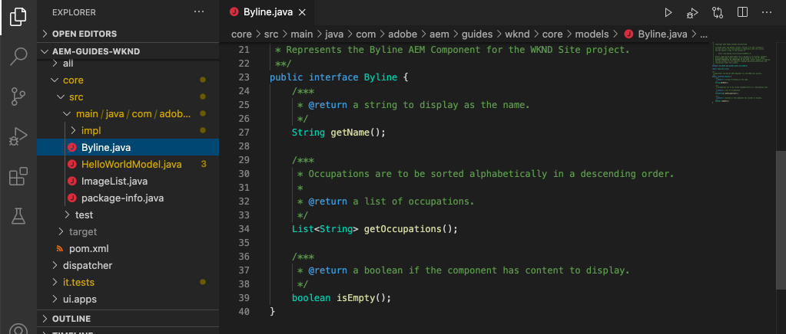

# Personalizar a Camada de dados do cliente Adobe com componentes AEM {#customize-data-layer}

Saiba como personalizar a Camada de dados do cliente Adobe com conteúdo de componentes AEM personalizados. Saiba como usar APIs fornecidas pelo [Componentes principais do AEM a serem estendidos](https://experienceleague.adobe.com/docs/experience-manager-core-components/using/developing/data-layer/extending.html) e personalize a camada de dados.

## O que você vai criar


Neste tutorial, vamos explorar várias opções para estender a Camada de dados do cliente Adobe atualizando a WKND [Componente de byline](https://experienceleague.adobe.com/docs/experience-manager-learn/getting-started-wknd-tutorial-develop/project-archetype/custom-component.html). A variável _Subtítulo_ o componente é um **componente personalizado** As lições aprendidas neste tutorial podem ser aplicadas a outros componentes personalizados.

### Objetivos {#objective}

1. Insira dados do componente na camada de dados estendendo um Modelo Sling e o componente HTL
1. Usar utilitários de camada de dados dos Componentes principais para reduzir o esforço
1. Usar atributos de dados do Componente principal para conectar-se aos eventos existentes da camada de dados

## Pré-requisitos {#prerequisites}

A **ambiente de desenvolvimento local** é necessário para concluir este tutorial. Capturas de tela e vídeos são capturados usando o SDK as a Cloud Service do AEM em execução em um macOS. Os comandos e o código são independentes do sistema operacional local, a menos que indicado de outra forma.

**Novo no AEM as a Cloud Service?** Consulte o [guia a seguir para configurar um ambiente de desenvolvimento local usando o SDK do AEM as a Cloud Service](https://experienceleague.adobe.com/docs/experience-manager-learn/cloud-service/local-development-environment-set-up/overview.html?lang=pt-BR).

**Novo no AEM 6.5?** Confira o [guia a seguir para configurar um ambiente de desenvolvimento local](https://experienceleague.adobe.com/docs/experience-manager-learn/foundation/development/set-up-a-local-aem-development-environment.html?lang=pt-BR).

## Baixar e implantar o site de referência WKND {#set-up-wknd-site}

Este tutorial estende o componente Subtítulo no site de referência WKND. Clonar e instalar a base de código WKND em seu ambiente local.

1. Iniciar um Quickstart local **autor** instância de AEM em execução [http://localhost:4502](http://localhost:4502).
1. Abra uma janela de terminal e clone a base de código WKND usando Git:

   ```shell
   $ git clone git@github.com:adobe/aem-guides-wknd.git
   ```

1. Implante a base de código WKND em uma instância local de AEM:

   ```shell
   $ cd aem-guides-wknd
   $ mvn clean install -PautoInstallSinglePackage
   ```

   >[!NOTE]
   >
   > Para o AEM 6.5 e o pacote de serviços mais recente, adicione o `classic` perfil para o comando Maven:
   >
   > `mvn clean install -PautoInstallSinglePackage -Pclassic`

1. Abra uma nova janela do navegador e faça logon no AEM. Abra um **Revista** página como: [http://localhost:4502/content/wknd/us/en/magazine/guide-la-skateparks.html](http://localhost:4502/content/wknd/us/en/magazine/guide-la-skateparks.html).

   

   Você deve ver um exemplo do componente Subtítulo que foi adicionado à página como parte de um Fragmento de experiência. Você pode visualizar o fragmento de experiência em [http://localhost:4502/editor.html/content/experience-fragments/wknd/language-masters/en/contributors/stacey-roswells/byline.html](http://localhost:4502/editor.html/content/experience-fragments/wknd/language-masters/en/contributors/stacey-roswells/byline.html)
1. Abra as ferramentas do desenvolvedor e digite o seguinte comando no **Console**:

   ```js
   window.adobeDataLayer.getState();
   ```

   Para ver o estado atual da camada de dados em um site AEM, inspecione a resposta. Você deve ver informações sobre a página e os componentes individuais.

   

   Observe que o componente Subtítulo não está listado na Camada de dados.

## Atualizar o modelo Sling de byline {#sling-model}

Para inserir dados sobre o componente na camada de dados, primeiro vamos atualizar o Modelo Sling do componente. Em seguida, atualize a interface Java™ do Byline e a implementação do Modelo Sling para ter um novo método `getData()`. Esse método contém as propriedades a serem inseridas na camada de dados.

1. Abra o `aem-guides-wknd` projeto no IDE de sua escolha. Navegue até a `core` módulo.
1. Abra o arquivo `Byline.java` em `core/src/main/java/com/adobe/aem/guides/wknd/core/models/Byline.java`.

   

1. Adicionar o método abaixo à interface:

   ```java
   public interface Byline {
       ...
       /***
        * Return data about the Byline Component to populate the data layer
        * @return String
        */
       String getData();
   }
   ```

1. Abra o arquivo `BylineImpl.java` em `core/src/main/java/com/adobe/aem/guides/wknd/core/models/impl/BylineImpl.java`. Trata-se da implementação da `Byline` e é implementado como um Modelo Sling.

1. Adicione as seguintes instruções de importação no início do arquivo:

   ```java
   import java.util.HashMap;
   import java.util.Map;
   import org.apache.sling.api.resource.Resource;
   import com.fasterxml.jackson.core.JsonProcessingException;
   import com.fasterxml.jackson.databind.ObjectMapper;
   import com.adobe.cq.wcm.core.components.util.ComponentUtils;
   ```

   A variável `fasterxml.jackson` As APIs são usadas para serializar os dados a serem expostos como JSON. A variável `ComponentUtils` dos Componentes principais do AEM são usados para verificar se a camada de dados está ativada.

1. Adicionar o método não implementado `getData()` para `BylineImple.java`:

   ```java
   public class BylineImpl implements Byline {
       ...
       @Override
       public String getData() {
           Resource bylineResource = this.request.getResource();
           // Use ComponentUtils to verify if the DataLayer is enabled
           if (ComponentUtils.isDataLayerEnabled(bylineResource)) {
   
               //Create a map of properties we want to expose
               Map<String, Object> bylineProperties = new HashMap<String,Object>();
               bylineProperties.put("@type", bylineResource.getResourceType());
               bylineProperties.put("name", this.getName());
               bylineProperties.put("occupation", this.getOccupations());
               bylineProperties.put("fileReference", image.getFileReference());
   
               //Use AEM Core Component utils to get a unique identifier for the Byline component (in case multiple are on the page)
               String bylineComponentID = ComponentUtils.getId(bylineResource, this.currentPage, this.componentContext);
   
               // Return the bylineProperties as a JSON String with a key of the bylineResource's ID
               try {
                   return String.format("{\"%s\":%s}",
                       bylineComponentID,
                       // Use the ObjectMapper to serialize the bylineProperties to a JSON string
                       new ObjectMapper().writeValueAsString(bylineProperties));
               } catch (JsonProcessingException e) {
   
                   LOGGER.error("Unable to generate dataLayer JSON string", e);
               }
   
           }
           // return null if the Data Layer is not enabled
           return null;
       }
   }
   ```

   No método acima, um novo `HashMap` é usado para capturar as propriedades a serem expostas como JSON. Observe que métodos existentes como `getName()` e `getOccupations()` são usados. A variável `@type` representa o tipo de recurso exclusivo do componente; permite que um cliente identifique eventos e/ou acionadores facilmente com base no tipo de componente.

   A variável `ObjectMapper` é usado para serializar as propriedades e retornar uma string JSON. Essa cadeia de caracteres JSON pode ser inserida na camada de dados.

1. Abra uma janela de terminal. Crie e implante apenas o `core` usando suas habilidades em Maven:

   ```shell
   $ cd aem-guides-wknd/core
   $ mvn clean install -PautoInstallBundle
   ```

## Atualizar o HTL do byline {#htl}

Em seguida, atualize o `Byline` [HTL](https://experienceleague.adobe.com/docs/experience-manager-htl/content/specification.html?lang=en). HTL (Linguagem de modelo de HTML) é o modelo usado para renderizar o HTML do componente.

Um atributo de dados especial `data-cmp-data-layer` em cada componente do AEM é usado para expor sua camada de dados. O JavaScript fornecido pelos Componentes principais do AEM procura esse atributo de dados. O valor desse atributo de dados é preenchido com a sequência JSON retornada pelo modelo Sling de byline `getData()` e inserida na camada Dados do cliente Adobe.

1. Abra o `aem-guides-wknd` projeto no IDE. Navegue até a `ui.apps` módulo.
1. Abra o arquivo `byline.html` em `ui.apps/src/main/content/jcr_root/apps/wknd/components/byline/byline.html`.

   

1. Atualizar `byline.html` para incluir o `data-cmp-data-layer` atributo:

   ```diff
     <div data-sly-use.byline="com.adobe.aem.guides.wknd.core.models.Byline"
       data-sly-use.placeholderTemplate="core/wcm/components/commons/v1/templates.html"
       data-sly-test.hasContent="${!byline.empty}"
   +   data-cmp-data-layer="${byline.data}"
       class="cmp-byline">
       ...
   ```

   O valor de `data-cmp-data-layer` foi definido como `"${byline.data}"` onde `byline` O é o Modelo do Sling atualizado anteriormente. `.data` é a notação padrão para chamar um método Getter Java™ no HTL de `getData()` no exercício anterior.

1. Abra uma janela de terminal. Crie e implante apenas o `ui.apps` usando suas habilidades em Maven:

   ```shell
   $ cd aem-guides-wknd/ui.apps
   $ mvn clean install -PautoInstallPackage
   ```

1. Retorne ao navegador e reabra a página com um componente Subtítulo: [http://localhost:4502/content/wknd/us/en/magazine/guide-la-skateparks.html](http://localhost:4502/content/wknd/us/en/magazine/guide-la-skateparks.html).

1. Abra as ferramentas do desenvolvedor e inspecione o código-fonte HTML da página para o componente Subtítulo:

   

   Você deve ver que a variável `data-cmp-data-layer` foi preenchida com a cadeia de caracteres JSON a partir do modelo Sling.

1. Abra as ferramentas de desenvolvedor do navegador e digite o seguinte comando no **Console**:

   ```js
   window.adobeDataLayer.getState();
   ```

1. Navegue abaixo da resposta em `component` para encontrar a instância do `byline` O componente foi adicionado à camada de dados:

   

   Você deve ver uma entrada como a seguinte:

   ```json
   byline-136073cfcb:
       @type: "wknd/components/byline"
       fileReference: "/content/dam/wknd/en/contributors/stacey-roswells.jpg"
       name: "Stacey Roswells"
       occupation: (3) ["Artist", "Photographer", "Traveler"]
       parentId: "page-30d989b3f8"
   ```

   Observe que as propriedades expostas são as mesmas adicionadas na variável `HashMap` no Modelo Sling.

## Adicionar um evento de clique {#click-event}

A Camada de dados de clientes Adobe é orientada por eventos e um dos eventos mais comuns para acionar uma ação é o `cmp:click` evento. Os Componentes principais do AEM facilitam o registro do componente com a ajuda do elemento de dados: `data-cmp-clickable`.

Os elementos clicáveis geralmente são um botão CTA ou um link de navegação. Infelizmente, o componente Subtítulo não tem nenhum desses, mas vamos registrá-lo de qualquer maneira, pois isso pode ser comum para outros componentes personalizados.

1. Abra o `ui.apps` módulo em seu IDE
1. Abra o arquivo `byline.html` em `ui.apps/src/main/content/jcr_root/apps/wknd/components/byline/byline.html`.

1. Atualizar `byline.html` para incluir o `data-cmp-clickable` atributo no campo **name** elemento:

   ```diff
     <h2 class="cmp-byline__name" 
   +    data-cmp-clickable="${byline.data ? true : false}">
        ${byline.name}
     </h2>
   ```

1. Abra um novo terminal. Crie e implante apenas o `ui.apps` usando suas habilidades em Maven:

   ```shell
   $ cd aem-guides-wknd/ui.apps
   $ mvn clean install -PautoInstallPackage
   ```

1. Retorne ao navegador e abra a página novamente com o componente Subtítulo adicionado: [http://localhost:4502/content/wknd/us/en/magazine/guide-la-skateparks.html](http://localhost:4502/content/wknd/us/en/magazine/guide-la-skateparks.html).

   Para testar nosso evento, adicionaremos manualmente alguns JavaScripts usando o console do desenvolvedor. Consulte [Utilização da camada de dados do cliente Adobe com componentes principais AEM](data-layer-overview.md) para ver um vídeo sobre como fazer isso.

1. Abra as ferramentas de desenvolvedor do navegador e insira o seguinte método no **Console**:

   ```javascript
   function bylineClickHandler(event) {
       var dataObject = window.adobeDataLayer.getState(event.eventInfo.path);
       if (dataObject != null && dataObject['@type'] === 'wknd/components/byline') {
           console.log("Byline Clicked!");
           console.log("Byline name: " + dataObject['name']);
       }
   }
   ```

   Este método simples deve lidar com o clique do nome do componente Subtítulo.

1. Insira o seguinte método no campo **Console**:

   ```javascript
   window.adobeDataLayer.push(function (dl) {
        dl.addEventListener("cmp:click", bylineClickHandler);
   });
   ```

   O método acima envia um ouvinte de eventos para a camada de dados para ouvir o `cmp:click` e chama o evento de `bylineClickHandler`.

   >[!CAUTION]
   >
   > É importante **não** para atualizar o navegador durante todo este exercício, caso contrário, o JavaScript do console será perdido.

1. No navegador, com a variável **Console** abra, clique no nome do autor no componente Subtítulo:

   

   Você deve ver a mensagem do console `Byline Clicked!` e o nome do Subtítulo.

   A variável `cmp:click` é o mais fácil de conectar ao evento. Para componentes mais complexos e rastrear outros comportamentos, é possível adicionar JavaScript personalizado para adicionar e registrar novos eventos. Um ótimo exemplo é o componente Carrossel, que aciona um `cmp:show` evento sempre que um slide é alternado. Consulte a [código-fonte para obter mais detalhes](https://github.com/adobe/aem-core-wcm-components/blob/main/content/src/content/jcr_root/apps/core/wcm/components/carousel/v1/carousel/clientlibs/site/js/carousel.js).

## Usar o utilitário DataLayerBuilder {#data-layer-builder}

Quando o modelo Sling foi [atualizado](#sling-model) anteriormente neste capítulo, optamos por criar a cadeia de caracteres JSON usando um `HashMap` e definindo cada uma das propriedades manualmente. Esse método funciona bem para componentes únicos pequenos, no entanto, para componentes que estendem os Componentes principais do AEM, isso pode resultar em muito código extra.

Uma classe de utilitário, `DataLayerBuilder`, existe para executar a maior parte do trabalho pesado. Isso permite que as implementações estendam apenas as propriedades que desejam. Vamos atualizar o Modelo do Sling para usar o `DataLayerBuilder`.

1. Retorne ao IDE e navegue até o `core` módulo.
1. Abra o arquivo `Byline.java` em `core/src/main/java/com/adobe/aem/guides/wknd/core/models/Byline.java`.
1. Modifique o `getData()` método para retornar um tipo de `ComponentData`

   ```java
   import com.adobe.cq.wcm.core.components.models.datalayer.ComponentData;
   ...
   public interface Byline {
       ...
       /***
        * Return data about the Byline Component to populate the data layer
        * @return ComponentData
        */
       ComponentData getData();
   }
   ```

   `ComponentData` é um objeto fornecido pelos Componentes principais do AEM. Ele resulta em uma sequência JSON, como no exemplo anterior, mas também executa muito trabalho adicional.

1. Abra o arquivo `BylineImpl.java` em `core/src/main/java/com/adobe/aem/guides/wknd/core/models/impl/BylineImpl.java`.

1. Adicione as seguintes instruções de importação:

   ```java
   import com.adobe.cq.wcm.core.components.models.datalayer.ComponentData;
   import com.adobe.cq.wcm.core.components.models.datalayer.builder.DataLayerBuilder;
   ```

1. Substitua o `getData()` com o seguinte:

   ```java
   @Override
   public ComponentData getData() {
       Resource bylineResource = this.request.getResource();
       // Use ComponentUtils to verify if the DataLayer is enabled
       if (ComponentUtils.isDataLayerEnabled(bylineResource)) {
   
           return DataLayerBuilder.extending(getImage().getData()).asImageComponent()
               .withTitle(this::getName)
               .build();
   
       }
       // return null if the Data Layer is not enabled
       return null;
   }
   ```

   O componente Subtítulo reutiliza partes do Componente principal de imagem para exibir uma imagem representando o autor. No trecho acima, a variável [DataLayerBuilder](https://javadoc.io/doc/com.adobe.cq/core.wcm.components.core/latest/com/adobe/cq/wcm/core/components/models/datalayer/builder/ComponentDataBuilder.html) é usado para estender a camada de dados do `Image` componente. Isso preenche o objeto JSON previamente com todos os dados sobre a imagem usada. Também executa algumas funções de rotina, como definir o `@type` e o identificador exclusivo do componente. Observe que o método é pequeno!

   A única propriedade estendia a variável `withTitle` que é substituído pelo valor de `getName()`.

1. Abra uma janela de terminal. Crie e implante apenas o `core` usando suas habilidades em Maven:

   ```shell
   $ cd aem-guides-wknd/core
   $ mvn clean install -PautoInstallBundle
   ```

1. Retorne ao IDE e abra o `byline.html` arquivo em `ui.apps`
1. Atualize o HTL para usar `byline.data.json` para preencher o `data-cmp-data-layer` atributo:

   ```diff
     <div data-sly-use.byline="com.adobe.aem.guides.wknd.core.models.Byline"
       data-sly-use.placeholderTemplate="core/wcm/components/commons/v1/templates.html"
       data-sly-test.hasContent="${!byline.empty}"
   -   data-cmp-data-layer="${byline.data}"
   +   data-cmp-data-layer="${byline.data.json}"
   ```

   Lembre-se de que agora estamos retornando um objeto do tipo `ComponentData`. Este objeto inclui um método getter `getJson()` e é usado para preencher o `data-cmp-data-layer` atributo.

1. Abra uma janela de terminal. Crie e implante apenas o `ui.apps` usando suas habilidades em Maven:

   ```shell
   $ cd aem-guides-wknd/ui.apps
   $ mvn clean install -PautoInstallPackage
   ```

1. Retorne ao navegador e abra a página novamente com o componente Subtítulo adicionado: [http://localhost:4502/content/wknd/us/en/magazine/guide-la-skateparks.html](http://localhost:4502/content/wknd/us/en/magazine/guide-la-skateparks.html).
1. Abra as ferramentas de desenvolvedor do navegador e digite o seguinte comando no **Console**:

   ```js
   window.adobeDataLayer.getState();
   ```

1. Navegue abaixo da resposta em `component` para encontrar a instância do `byline` componente:

   

   Você deve ver uma entrada como a seguinte:

   ```json
   byline-136073cfcb:
       @type: "wknd/components/byline"
       dc:title: "Stacey Roswells"
       image:
           @type: "image/jpeg"
           repo:id: "142658f8-4029-4299-9cd6-51afd52345c0"
           repo:modifyDate: "2019-10-25T23:49:51Z"
           repo:path: "/content/dam/wknd/en/contributors/stacey-roswells.jpg"
           xdm:tags: []
       parentId: "page-30d989b3f8"
       repo:modifyDate: "2019-10-18T20:17:24Z"
   ```

   Observe que agora há uma `image` objeto dentro do `byline` entrada de componente. Há muito mais informações sobre o ativo no DAM. Observe também que o `@type` e o identificador exclusivo (neste caso `byline-136073cfcb`) foram preenchidos automaticamente e a variável `repo:modifyDate` que indica quando o componente foi modificado.

## Exemplos adicionais {#additional-examples}

1. Outro exemplo de extensão da camada de dados pode ser visualizado ao inspecionar o `ImageList` componente na base de código WKND:
   * `ImageList.java` - Interface Java no `core` módulo.
   * `ImageListImpl.java` - Modelo Sling no `core` módulo.
   * `image-list.html` - Modelo HTL no `ui.apps` módulo.

   >[!NOTE]
   >
   > É um pouco mais difícil incluir propriedades personalizadas como `occupation` ao usar o [DataLayerBuilder](https://javadoc.io/doc/com.adobe.cq/core.wcm.components.core/latest/com/adobe/cq/wcm/core/components/models/datalayer/builder/ComponentDataBuilder.html). No entanto, se estender um Componente principal que inclua uma Imagem ou Página, o utilitário economiza muito tempo.

   >[!NOTE]
   >
   > Se estiver criando uma Camada de dados avançada para objetos reutilizados em uma implementação, é recomendável extrair os elementos da Camada de dados em seus próprios objetos Java™ específicos da camada de dados. Por exemplo, os Componentes principais do Commerce adicionaram interfaces para `ProductData` e `CategoryData` já que eles podem ser usados em muitos componentes em uma implementação do Commerce. Revisão [o código no repositório aem-cif-core-components](https://github.com/adobe/aem-core-cif-components/tree/master/bundles/core/src/main/java/com/adobe/cq/commerce/core/components/datalayer) para obter mais detalhes.

## Parabéns. {#congratulations}

Você acabou de explorar algumas maneiras de estender e personalizar a Camada de dados do cliente Adobe com componentes AEM!

## Recursos adicionais {#additional-resources}

* [Documentação da Camada de dados do cliente Adobe](https://github.com/adobe/adobe-client-data-layer/wiki)
* [Integração da camada de dados com os componentes principais](https://github.com/adobe/aem-core-wcm-components/blob/main/DATA_LAYER_INTEGRATION.md)
* [Uso da Camada de dados do cliente Adobe e da Documentação dos Componentes principais](https://experienceleague.adobe.com/docs/experience-manager-core-components/using/developing/data-layer/overview.html?lang=pt-BR)
