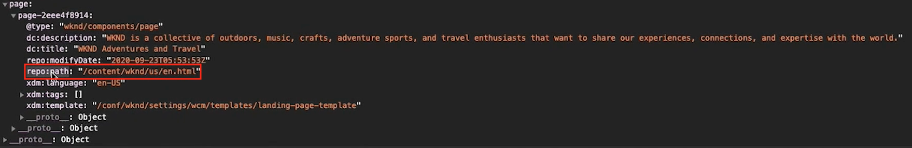

# Carregar e acionar uma chamada de Público alvo {#load-fire-target}

Saiba como carregar, passar parâmetros para a solicitação de página e acionar uma chamada de Público alvo da página do site usando uma regra de inicialização. As informações da página são recuperadas e passadas como parâmetros usando a Camada de dados do cliente Adobe que permite coletar e armazenar dados sobre a experiência do visitante em uma página da Web e, em seguida, facilitar o acesso a esses dados.

>[!VIDEO](https://video.tv.adobe.com/v/41243?quality=12&learn=on)

## Regra de carregamento de página

A Camada de dados do cliente Adobe é uma camada de dados orientada por evento. Quando a camada de dados Página AEM for carregada, ela acionará um evento `cmp:show` . No vídeo, a `Launch Library Loaded` regra é invocada usando um evento personalizado. Abaixo, você pode encontrar os trechos de código usados no vídeo para o evento personalizado, bem como para os elementos de dados.

### Evento personalizado

O trecho de código abaixo adicionará um ouvinte de evento empurrando uma função para dentro da camada de dados. Quando o `cmp:show` evento é acionado, a `pageShownEventHandler` função é chamada. Nessa função, algumas verificações de integridade são adicionadas e uma nova `dataObject` é construída com o estado mais recente da camada de dados do componente que acionou o evento.

Depois isso `trigger(dataObject)` é chamado. `trigger()` é um nome reservado no Launch e &quot;acionará&quot; a regra de inicialização. Enviamos o objeto de evento como um parâmetro que, por sua vez, será exposto por outro nome reservado no Launch chamado evento. Os Elementos de dados no Launch agora podem fazer referência a várias propriedades, como: `event.component['someKey']`.

```javascript
var pageShownEventHandler = function(evt) {
// defensive coding to avoid a null pointer exception
if(evt.hasOwnProperty("eventInfo") && evt.eventInfo.hasOwnProperty("path")) {
   //trigger Launch Rule and pass event
   console.debug("cmp:show event: " + evt.eventInfo.path);
   var event = {
      //include the id of the component that triggered the event
      id: evt.eventInfo.path,
      //get the state of the component that triggered the event
      component: window.adobeDataLayer.getState(evt.eventInfo.path)
   };

      //Trigger the Launch Rule, passing in the new `event` object
      // the `event` obj can now be referenced by the reserved name `event` by other Launch data elements
      // i.e `event.component['someKey']`
      trigger(event);
   }
}

//set the namespace to avoid a potential race condition
window.adobeDataLayer = window.adobeDataLayer || [];
//push the event listener for cmp:show into the data layer
window.adobeDataLayer.push(function (dl) {
   //add event listener for `cmp:show` and callback to the `pageShownEventHandler` function
   dl.addEventListener("cmp:show", pageShownEventHandler);
});
```

### ID da página da camada de dados

```
if(event && event.id) {
    return event.id;
}
```


### Caminho da página

```
if(event && event.component && event.component.hasOwnProperty('repo:path')) {
    return event.component['repo:path'];
}
```



### Título da página

```
if(event && event.component && event.component.hasOwnProperty('dc:title')) {
    return event.component['dc:title'];
}
```


### Problemas comuns

#### Por que minhas mboxes não estão sendo acionadas em minhas páginas da Web?

**Mensagem de erro quando o cookie mboxDisable não está definido**


**Solução**

Os clientes do público alvo às vezes usam instâncias baseadas em nuvem com Público alvo para testes ou para fins simples de prova de conceito. Esses domínios, e muitos outros, fazem parte da Lista Sufixo Público .
Os navegadores modernos não salvarão cookies se você estiver usando esses domínios, a menos que você personalize a `cookieDomain` configuração usando `targetGlobalSettings()`.

```
window.targetGlobalSettings = {  
   cookieDomain: 'your-domain' //set the cookie directly on this subdomain 
};
```

## Links de suporte

* [Documentação da camada de dados do cliente Adobe](https://github.com/adobe/adobe-client-data-layer/wiki)
* [Adobe Experience Cloud Debugger - Chrome](https://chrome.google.com/webstore/detail/adobe-experience-cloud-de/ocdmogmohccmeicdhlhhgepeaijenapj)
* [Adobe Experience Cloud Debugger - Firefox](https://addons.mozilla.org/en-US/firefox/addon/adobe-experience-platform-dbg/)
* [Uso da camada de dados do cliente Adobe e da documentação dos componentes principais](https://docs.adobe.com/content/help/pt-BR/experience-manager-core-components/using/developing/data-layer/overview.html)
* [Introdução ao Adobe Experience Platform Debugger](https://docs.adobe.com/content/help/en/platform-learn/tutorials/data-ingestion/web-sdk/introduction-to-the-experience-platform-debugger.html)