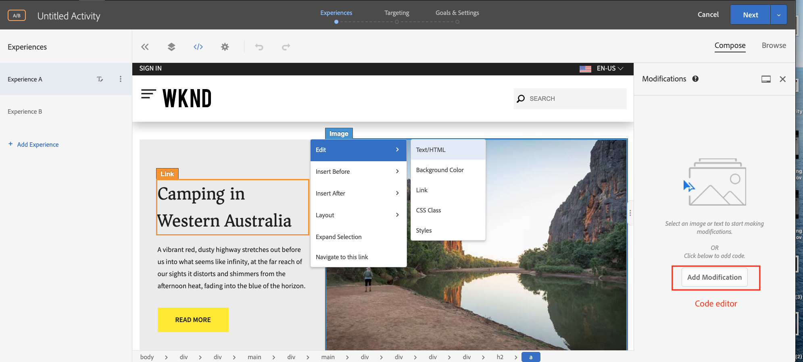
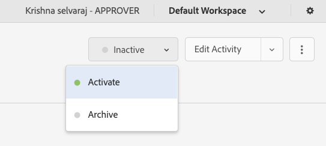

# Personalização usando o Visual Experience Composer {#personalization-vec}

Saiba como criar uma Atividade de teste A/B usando o Visual Experience Composer (VEC).

## Pré-requisitos

Para utilizar a VEC num sítio Web AEM, deve ser concluída a seguinte configuração:

1. [Adicionar Adobe Target ao seu site AEM](./add-target-launch-extension.md)
1. [Acionar uma chamada do Adobe Target do Launch](./load-and-fire-target.md)

## Visão geral do cenário

O home page do site WKND exibe atividades locais ou a melhor coisa a se fazer em uma cidade na forma de cartões informativos. Como comerciante, você recebeu a tarefa para modificar o home page, fazendo alterações no texto da seção de aventura e entendendo como ela melhora a conversão.

## Etapas para criar um teste A/B usando o Visual Experience Composer (VEC)

1. Faça logon no [Adobe Experience Cloud](https://experience.adobe.com/), toque no __Público alvo__ e navegue até a guia __Atividade__

   + Se você não vir o __Público alvo__ no painel Experience Cloud, verifique se a organização do Adobe correta está selecionada no alternador da organização no canto superior direito e se o usuário recebeu acesso ao Público alvo no [Adobe Admin Console](https://adminconsole.adobe.com/).

1. Clique no botão **Criar Atividade** e escolha **atividade de teste** A/B

   

1. Selecione a opção **Visual Experience Composer** , forneça o URL da Atividade e clique em **Avançar**

   

1. O Visual Experience Composer exibe duas guias no lado esquerdo após a criação de uma nova atividade: *Experiência A* e *Experiência B*. Selecione uma experiência na lista. Você pode adicionar novas experiências à lista usando o botão **Adicionar experiência** .

   

1. Selecione uma imagem ou texto na sua página para fazer modificações ou use o editor de código para selecionar um elemento HTML.

   

1. Altere o texto de *Camping in Western Australia* para *Adventures of Australia*. Uma lista de alterações adicionadas a uma Experiência será exibida em Modificações. Você pode clicar e editar o item modificado para visualização em seu seletor de CSS e o novo conteúdo adicionado a ele.

   

1. Renomeie a *Experiência A* para *Aventura*
1. Da mesma forma, atualize o texto sobre a *Experiência B* de *Camping no oeste da Austrália* para *Explorar a natureza selvagem* australiana.

   

1. Clique em **Avançar** para ir para Definição de metas e vamos manter uma alocação de tráfego Manual de 50 a 50 entre as duas experiências.

   

1. Para Metas e configurações, escolha a fonte do Relatórios como Adobe Target e selecione a métrica Meta como Conversão com uma ação de visualização de página.

   

1. Forneça um nome para sua atividade e Salvar.
1. Ative sua atividade salva para colocar suas alterações em execução.

   

1. Abra a página do site (URL da Atividade da etapa 3) em uma nova guia e você deve ser capaz de visualização de qualquer uma das experiências (Adventure ou Explore) de nossa atividade de teste A/B.

   

## Resumo

Neste capítulo, um profissional de marketing conseguiu criar uma experiência usando o Visual Experience Composer arrastando e soltando, trocando e modificando o layout e o conteúdo de uma página da Web sem alterar nenhum código para executar um teste.

## Links de suporte

+ [Adobe Experience Cloud Debugger - Chrome](https://chrome.google.com/webstore/detail/adobe-experience-cloud-de/ocdmogmohccmeicdhlhhgepeaijenapj)
+ [Adobe Experience Cloud Debugger - Firefox](https://addons.mozilla.org/en-US/firefox/addon/adobe-experience-platform-dbg/)
