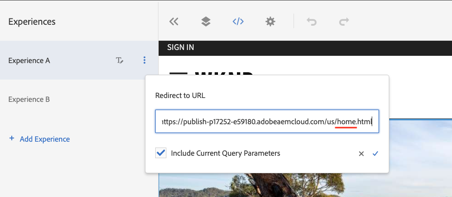

# Personalização da página da Web completa Experiência {#personalization-fpe}

Saiba como criar uma atividade para redirecionar as páginas do site hospedadas em AEM para uma nova página usando o Adobe Target.

## Pré-requisitos

Para personalizar páginas completas de um site AEM, é necessário concluir a seguinte configuração:

1. [Adicionar o Adobe Target ao seu site AEM](./add-target-launch-extension.md)
1. [Acionar uma chamada do Adobe Target a partir do Launch](./load-and-fire-target.md)

## Visão geral do cenário

O site WKND reprojetou sua página inicial e gostaria de redirecionar seus visitantes atuais da página inicial para a nova página inicial. Ao mesmo tempo, também compreenda como a página inicial reprojetada ajuda a melhorar a participação do usuário e a receita. Como comerciante, você recebeu a tarefa de criar uma atividade para redirecionar os visitantes para a nova página inicial. Vamos explorar a página inicial do site WKND e saber como criar uma atividade usando o Adobe Target.

## Etapas para criar um teste A/B usando o Visual Experience Composer (VEC)

1. Faça logon no Adobe Target e navegue até a guia Atividades
1. Clique no botão **Criar atividade** e escolha **Teste A/B** atividade

   

1. Selecione a opção **Visual Experience Composer**, forneça o URL da atividade e clique em **Avançar**

   

1. O Visual Experience Composer exibe duas guias do lado esquerdo depois que você cria uma nova atividade: *Experiência A* e *Experiência B*. Selecione uma experiência na lista. Você pode adicionar novas experiências à lista, usando o botão **Adicionar Experiência**.

   

1. Exiba as opções disponíveis para a Experiência A e selecione a opção **Redirecionar para URL** e forneça um URL para a nova página inicial do Site WKND.

   

1. Renomeie *Experiência A* para *Nova Página Inicial WKND* e *Experiência B* para *Página Inicial WKND*

   

1. Clique em **Next** para ir até o Targeting e manter uma alocação de tráfego manual de 50-50 entre as duas experiências.

   

1. Para Metas e configurações, escolha a Fonte de relatórios como Adobe Target e selecione a métrica de meta como Conversão com uma ação de exibição de página.

   

1. Forneça um nome para a atividade e Salve.
1. Ative a atividade salva para colocar as alterações em funcionamento.

   

1. Abra a página do site (URL da atividade da etapa 3) em uma nova guia e você deve ser capaz de visualizar qualquer uma das experiências (Página inicial WKND ou Nova página inicial WKND) da nossa atividade de teste A/B. `us/en.html` redireciona para  `us/home.html`.

   

## Resumo

Como profissional de marketing, você foi capaz de criar uma atividade para redirecionar as páginas do site hospedadas em AEM para uma nova página usando o Adobe Target.

## Links de suporte

* [Adobe Experience Cloud Debugger - Chrome](https://chrome.google.com/webstore/detail/adobe-experience-cloud-de/ocdmogmohccmeicdhlhhgepeaijenapj)
* [Adobe Experience Cloud Debugger - Firefox](https://addons.mozilla.org/en-US/firefox/addon/adobe-experience-platform-dbg/)
