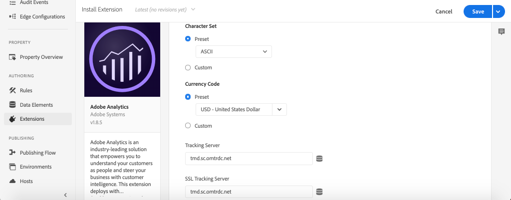
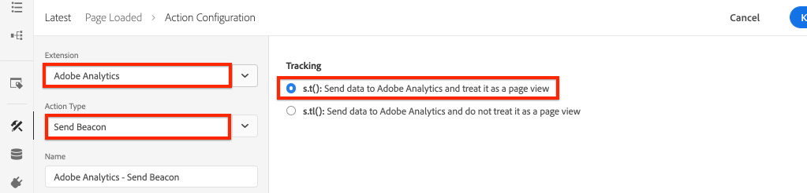

# Coletar dados de página com o Adobe Analytics

Saiba como usar os recursos incorporados da [Camada de Dados do Cliente Adobe com AEM Componentes Principais](https://docs.adobe.com/content/help/pt-BR/experience-manager-core-components/using/developing/data-layer/overview.html) para coletar dados sobre uma página no Adobe Experience Manager Sites. [Experience Platform ](https://www.adobe.com/experience-platform/launch.html) Inicialização e a extensão  [Adobe Analytics ](https://docs.adobe.com/content/help/en/launch/using/extensions-ref/adobe-extension/analytics-extension/overview.html) serão usadas para criar regras para enviar dados de página à Adobe Analytics.

## O que você vai criar


Neste tutorial, você acionará uma regra de inicialização com base em um evento da camada de dados do cliente Adobe, adicionará condições para quando a regra deve ser acionada e enviará **Nome da página** e **Modelo de página** de uma página AEM à Adobe Analytics.

### Objetivos {#objective}

1. Criar uma regra orientada por evento no Launch com base nas alterações feitas na camada de dados
1. Mapear propriedades de camada de dados de página para Elementos de dados no Launch
1. Coletar dados da página e enviar para a Adobe Analytics com o beacon de visualização da página

## Pré-requisitos

São necessários os seguintes:

* **Experience Platform** LaunchProperty
* **ID do conjunto de relatórios do Adobe** Analytics/dev e servidor de rastreamento. Consulte a documentação a seguir para [criar um novo conjunto de relatórios](https://docs.adobe.com/content/help/en/analytics/admin/manage-report-suites/new-report-suite/new-report-suite.html).
* [extensão do navegador ](https://docs.adobe.com/content/help/en/platform-learn/tutorials/data-ingestion/web-sdk/introduction-to-the-experience-platform-debugger.html) Depurador de Experience Platform. Capturas de tela neste tutorial capturadas do navegador Chrome.
* (Opcional) AEM Site com a [camada de dados do cliente Adobe ativada](https://docs.adobe.com/content/help/en/experience-manager-core-components/using/developing/data-layer/overview.html#installation-activation). Este tutorial usará o site público [https://wknd.site/us/en.html](https://wknd.site/us/en.html), mas você pode usar seu próprio site.

>[!NOTE]
>
> Precisa de ajuda para integrar o Launch ao seu site AEM? [Veja esta série](../experience-platform-launch/overview.md) de vídeos.

## Alternar Ambientes de inicialização para o site WKND

[https://wknd.](https://wknd.site) sité um site público criado com base em  [um ](https://github.com/adobe/aem-guides-wknd) projeto de código aberto projetado como referência e  [](https://docs.adobe.com/content/help/en/experience-manager-learn/getting-started-wknd-tutorial-develop/overview.html) tutorial para implementações AEM.

Em vez de configurar um ambiente AEM e instalar a base de código WKND, você pode usar o depurador Experience Platform para **alternar** a [https://wknd.site/](https://wknd.site/) *propriedade* Launch. É claro que você pode usar seu próprio site AEM se ele já tiver a [camada de dados do cliente Adobe ativada](https://docs.adobe.com/content/help/en/experience-manager-core-components/using/developing/data-layer/overview.html#installation-activation)

1. Faça logon no Experience Platform Launch e [crie uma propriedade de inicialização](https://docs.adobe.com/content/help/en/core-services-learn/implementing-in-websites-with-launch/configure-launch/launch.html) (caso ainda não tenha feito isso).
1. Certifique-se de que uma biblioteca inicial de inicialização [foi criada](https://docs.adobe.com/content/help/en/launch/using/reference/publish/libraries.html#create-a-library) e promovida para um ambiente Launch [](https://docs.adobe.com/content/help/en/launch/using/reference/publish/environments.html).
1. Copie o código incorporado do Launch do ambiente para o qual sua biblioteca foi publicada.

   

1. No navegador, abra uma nova guia e navegue até [https://wknd.site/](https://wknd.site/)
1. Abra a extensão do navegador do Experience Platform Debugger

   

1. Navegue até **Iniciar** > **Configuração** e, em **Códigos Incorporados Injetados** substitua o código incorporado Iniciar existente por *your* código incorporado copiado da etapa 3.

   

1. Ative **Registro de Console** e **Bloquear** o depurador na guia WKND.

   

## Verificar a camada de dados do cliente Adobe no site WKND

O [projeto de referência WKND](https://github.com/adobe/aem-guides-wknd) é construído com AEM Componentes Principais e tem a [camada de dados do cliente Adobe ativada](https://docs.adobe.com/content/help/en/experience-manager-core-components/using/developing/data-layer/overview.html#installation-activation) por padrão. Em seguida, verifique se a Camada de dados do cliente Adobe está ativada.

1. Navegue até [https://wknd.site](https://wknd.site).
1. Abra as ferramentas do desenvolvedor do navegador e navegue até **Console**. Execute o seguinte comando:

   ```js
   adobeDataLayer.getState();
   ```

   Isso retorna o estado atual da Camada de Dados do Cliente Adobe.

   

1. Expanda a resposta e inspecione a entrada `page`. Você deve ver um schema de dados como o seguinte:

   ```json
   page-2eee4f8914:
       @type: "wknd/components/page"
       dc:description: "WKND is a collective of outdoors, music, crafts, adventure sports, and travel enthusiasts that want to share our experiences, connections, and expertise with the world."
       dc:title: "WKND Adventures and Travel"
       repo:modifyDate: "2020-08-31T21:02:21Z"
       repo:path: "/content/wknd/us/en.html"
       xdm:language: "en-US"
       xdm:tags: ["Attract"]
       xdm:template: "/conf/wknd/settings/wcm/templates/landing-page-template"
   ```

   Usaremos as propriedades padrão derivadas do [schema de página](https://docs.adobe.com/content/help/en/experience-manager-core-components/using/developing/data-layer/overview.html#page), `dc:title`, `xdm:language` e `xdm:template` da camada de dados para enviar dados de página para a Adobe Analytics.

   >[!NOTE]
   >
   > Não vê o objeto javascript `adobeDataLayer`? Certifique-se de que a [Camada de Dados do Cliente Adobe tenha sido ativada](https://docs.adobe.com/content/help/en/experience-manager-core-components/using/developing/data-layer/overview.html#installation-activation) no site.

## Criar uma regra de página carregada

A Camada de Dados do Cliente Adobe é uma camada de dados orientada por **evento**. Quando a camada de dados AEM **Page** for carregada, acionará um evento `cmp:show`. Crie uma regra que será acionada com base no evento `cmp:show`.

1. Navegue até Experience Platform Launch e na propriedade da Web integrada ao Site AEM.
1. Navegue até a seção **Regras** na interface de usuário Iniciar e clique em **Criar nova regra**.

   

1. Nomeie a regra **Página carregada**.
1. Clique em **Eventos** **Adicionar** para abrir o assistente **Configuração de Eventos**.
1. Em **Tipo de evento** selecione **Código Personalizado**.

   

1. Clique em **Abrir editor** no painel principal e insira o seguinte trecho de código:

   ```js
   var pageShownEventHandler = function(evt) {
      // defensive coding to avoid a null pointer exception
      if(evt.hasOwnProperty("eventInfo") && evt.eventInfo.hasOwnProperty("path")) {
         //trigger Launch Rule and pass event
         console.debug("cmp:show event: " + evt.eventInfo.path);
         var event = {
            //include the path of the component that triggered the event
            path: evt.eventInfo.path,
            //get the state of the component that triggered the event
            component: window.adobeDataLayer.getState(evt.eventInfo.path)
         };
   
         //Trigger the Launch Rule, passing in the new `event` object
         // the `event` obj can now be referenced by the reserved name `event` by other Launch data elements
         // i.e `event.component['someKey']`
         trigger(event);
      }
   }
   
   //set the namespace to avoid a potential race condition
   window.adobeDataLayer = window.adobeDataLayer || [];
   //push the event listener for cmp:show into the data layer
   window.adobeDataLayer.push(function (dl) {
      //add event listener for `cmp:show` and callback to the `pageShownEventHandler` function
      dl.addEventListener("cmp:show", pageShownEventHandler);
   });
   ```

   O trecho de código acima adicionará um ouvinte de evento [empurrando uma função](https://github.com/adobe/adobe-client-data-layer/wiki#pushing-a-function) para a camada de dados. Quando o evento `cmp:show` é acionado, a função `pageShownEventHandler` é chamada. Nesta função, algumas verificações de integridade são adicionadas e um novo `event` é construído com o estado mais recente [da camada de dados](https://github.com/adobe/adobe-client-data-layer/wiki#getstate) para o componente que acionou o evento.

   Depois que `trigger(event)` for chamado. `trigger()` é um nome reservado no Launch e &quot;acionará&quot; a regra de inicialização. Enviamos o objeto `event` como um parâmetro que, por sua vez, será exposto por outro nome reservado no Launch chamado `event`. Os Elementos de dados no Launch agora podem fazer referência a várias propriedades, como: `event.component['someKey']`.

1. Salve as alterações.
1. Em **Ações**, clique em **Adicionar** para abrir o assistente **Configuração de Ação**.
1. Em **Tipo de ação** escolha **Código personalizado**.

   

1. Clique em **Abrir editor** no painel principal e insira o seguinte trecho de código:

   ```js
   console.debug("Page Loaded ");
   console.debug("Page name: " + event.component['dc:title']);
   console.debug("Page type: " + event.component['@type']);
   console.debug("Page template: " + event.component['xdm:template']);
   ```

   O objeto `event` é transmitido pelo método `trigger()` chamado no evento personalizado. `component` é a página atual derivada da camada de dados  `getState` no evento personalizado. Lembre-se de antes do [schema de página](https://docs.adobe.com/content/help/en/experience-manager-core-components/using/developing/data-layer/overview.html#page) exposto pela camada de dados para ver as várias teclas expostas da caixa.

1. Salve as alterações e execute um [build](https://docs.adobe.com/content/help/en/launch/using/reference/publish/builds.html) no Launch para promover o código ao [ambiente](https://docs.adobe.com/content/help/en/launch/using/reference/publish/environments.html) usado no seu Site AEM.

   >[!NOTE]
   >
   > Pode ser muito útil usar o [Adobe Experience Platform Debugger](https://docs.adobe.com/content/help/en/platform-learn/tutorials/data-ingestion/web-sdk/introduction-to-the-experience-platform-debugger.html) para alternar o código incorporado para um ambiente **Development**.

1. Navegue até o site AEM e abra as ferramentas do desenvolvedor para visualização do console. Atualize a página e você deverá ver que as mensagens do console foram registradas:

   

## Criar elementos de dados

Em seguida, crie vários Elementos de dados para capturar valores diferentes da Camada de dados do cliente Adobe. Conforme observado no exercício anterior, vimos que é possível acessar as propriedades da camada de dados diretamente por meio do código personalizado. A vantagem de usar os Elementos de dados é que eles podem ser reutilizados nas regras de lançamento.

Lembre-se de antes do [schema de página](https://docs.adobe.com/content/help/en/experience-manager-core-components/using/developing/data-layer/overview.html#page) exposto pela camada de dados:

Os elementos de dados serão mapeados para as propriedades `@type`, `dc:title` e `xdm:template`.

### Tipo de recurso do componente

1. Navegue até Experience Platform Launch e na propriedade da Web integrada ao Site AEM.
1. Navegue até a seção **Elementos de dados** e clique em **Criar novo elemento de dados**.
1. Para **Nome** introduza **Tipo de Recurso de Componente**.
1. Para **Tipo de elemento de dados** selecione **Código personalizado**.

   

1. Clique em **Abrir editor** e insira o seguinte no editor de código personalizado:

   ```js
   if(event && event.component && event.component.hasOwnProperty('@type')) {
       return event.component['@type'];
   }
   ```

   Salve as alterações.

   >[!NOTE]
   >
   > Lembre-se de que o objeto `event` está disponível e com escopo com base no evento que acionou **Rule** no Launch. O valor de um Elemento de dados não é definido até que o Elemento de dados seja *referenciado* em uma Regra. Portanto, é seguro usar esse Elemento de dados dentro de uma Regra como a regra **Página carregada** criada na etapa anterior *mas* não seria segura para uso em outros contextos.

### Nome da Página

1. Clique em **Adicionar elemento de dados**.
1. Para **Nome** digite **Nome da página**.
1. Para **Tipo de elemento de dados** selecione **Código personalizado**.
1. Clique em **Abrir editor** e insira o seguinte no editor de código personalizado:

   ```js
   if(event && event.component && event.component.hasOwnProperty('dc:title')) {
       return event.component['dc:title'];
   }
   ```

   Salve as alterações.

### Modelo da página

1. Clique em **Adicionar elemento de dados**.
1. Para **Nome** digite **Modelo de página**.
1. Para **Tipo de elemento de dados** selecione **Código personalizado**.
1. Clique em **Abrir editor** e insira o seguinte no editor de código personalizado:

   ```js
   if(event && event.component && event.component.hasOwnProperty('xdm:template')) {
       return event.component['xdm:template'];
   }
   ```

   Salve as alterações.

1. Agora você deve ter três elementos de dados como parte da sua regra:

   

## Adicionar a extensão do Analytics

Em seguida, adicione a extensão do Analytics à propriedade Launch. Precisamos enviar esses dados para algum lugar!

1. Navegue até Experience Platform Launch e na propriedade da Web integrada ao Site AEM.
1. Vá para **Extensões** > **Catálogo**
1. Localize a extensão **Adobe Analytics** e clique em **Instalar**

   

1. Em **Gerenciamento de biblioteca** > **Report Suites**, insira as IDs do report suite que você gostaria de usar com cada ambiente de inicialização.

   

   >[!NOTE]
   >
   > Não há problema em usar um conjunto de relatórios para todos os ambientes neste tutorial, mas na vida real você gostaria de usar conjuntos de relatórios separados, como mostrado na imagem abaixo

   >[!TIP]
   >
   >Recomendamos usar a opção *Gerenciar a biblioteca para mim* como a configuração de Gerenciamento de biblioteca, pois facilita muito a atualização da biblioteca `AppMeasurement.js`.

1. Marque a caixa para ativar **Use Activity Map**.

   

1. Em **Geral** > **Servidor de rastreamento**, insira o servidor de rastreamento, por exemplo, `tmd.sc.omtrdc.net`. Digite seu Servidor de rastreamento SSL se o site suportar `https://`

   

1. Clique em **Salvar** para salvar as alterações.

## Adicionar uma condição à regra Página carregada

Em seguida, atualize a regra **Página carregada** para usar o elemento de dados **Component Resource Type** para garantir que a regra só seja acionada quando o evento `cmp:show` for para **Page**. Outros componentes podem acionar o evento `cmp:show`, por exemplo, o componente Carrossel o acionará quando os slides mudarem. Portanto, é importante adicionar uma condição para esta regra.

1. Na interface de usuário Iniciar, navegue até a regra **Página carregada** criada anteriormente.
1. Em **Condições**, clique em **Adicionar** para abrir o assistente **Configuração da Condição**.
1. Para **Tipo de condição** selecione **Comparação de valores**.
1. Defina o primeiro valor no campo de formulário como `%Component Resource Type%`. Você pode usar o ícone de elemento de dados  para selecionar o elemento de dados **Tipo de recurso de componente**. Deixe o comparador definido como `Equals`.
1. Defina o segundo valor como `wknd/components/page`.

   

   >[!NOTE]
   >
   > É possível adicionar essa condição dentro da função de código personalizada que escuta o evento `cmp:show` criado anteriormente no tutorial. No entanto, a adição na interface do usuário dá mais visibilidade a usuários adicionais que podem precisar fazer alterações na regra. Além disso, usamos nosso elemento de dados!

1. Salve as alterações.

## Definir variáveis do Analytics e acionar o beacon de Visualização da página

Atualmente, a regra **Página carregada** simplesmente gera uma declaração de console. Em seguida, use os elementos de dados e a extensão do Analytics para definir as variáveis do Analytics como uma **ação** na regra **Página carregada**. Também definiremos uma ação adicional para acionar o **Beacon de Visualização da página** e enviar os dados coletados para a Adobe Analytics.

1. Na regra **Página carregada** **remove** a ação **Core - Código personalizado** (as instruções do console):

   

1. Em Ações, clique em **Adicionar** para adicionar uma nova ação.
1. Defina o tipo **Extension** como **Adobe Analytics** e defina o **Tipo de ação** como **Definir variáveis**

   

1. No painel principal, selecione um **eVar** disponível e defina como o valor do Elemento de dados **Modelo de página**. Use o ícone Elementos de dados  para selecionar o elemento **Modelo de página**.

   

1. Role para baixo, em **Additional Settings**, defina **Page Name** como o elemento de dados **Page Name**:

   

   Salve as alterações.

1. Em seguida, adicione uma Ação adicional à direita de **Adobe Analytics - Set Variables** tocando no ícone **mais**:

   

1. Defina o tipo **Extension** como **Adobe Analytics** e defina o **Tipo de ação** como **Enviar beacon**. Como isso é considerado uma visualização de página, deixe o conjunto de rastreamento padrão definido como **`s.t()`**.

   

1. Salve as alterações. A regra **Página carregada** agora deve ter a seguinte configuração:

   

   * **1.** Escute o  `cmp:show` evento.
   * **2.** Verifique se o evento foi acionado por uma página.
   * **3.** Definir variáveis do Analytics para o Nome  **da** página e o Modelo  **da página**
   * **4.** Enviar o sinal de Visualização da página do Analytics
1. Salve todas as alterações e crie a biblioteca do Launch, promovendo o Ambiente apropriado.

## Validar a chamada Beacon de Visualização da página e do Analytics

Agora que a regra **Página carregada** envia o beacon do Analytics, você deve ser capaz de ver as variáveis de rastreamento do Analytics usando o Depurador de Experience Platform.

1. Abra o [Site WKND](https://wknd.site/us/en.html) no seu navegador.
1. Clique no ícone do Depurador  para abrir o Experience Platform Debugger.
1. Verifique se o Depurador está mapeando a propriedade Launch para *seu* ambiente de desenvolvimento, conforme descrito anteriormente, e **Registro do console** está marcado.
1. Abra o menu Análises e verifique se o conjunto de relatórios está definido como *seu* conjunto de relatórios. O Nome da página também deve ser preenchido:

   

1. Role para baixo e expanda **Solicitações de rede**. Você deve encontrar o **evar** definido para **Modelo de Página**:

   

1. Retorne ao navegador e abra o console do desenvolvedor. Clique em **Carrossel** na parte superior da página.

   

1. Observe no console do navegador a declaração do console:

   

   Isso ocorre porque o carrossel aciona um evento `cmp:show` *mas* devido à nossa verificação do **Tipo de recurso do componente**, nenhum evento é acionado.

   >[!NOTE]
   >
   > Se você não vir nenhum log do console, verifique se **Registro do console** está marcado em **Iniciar** no Depurador de Experience Platform.

1. Navegue até uma página de artigo como [Austrália Ocidental](https://wknd.site/us/en/magazine/western-australia.html). Observe que o Nome da página e o Tipo de modelo são alterados.

## Parabéns!

Você acabou de usar a Camada de Dados e o Experience Platform Launch para Cliente do Adobe orientado pelo evento para coletar dados da página de dados de um Site AEM e enviá-los para a Adobe Analytics.

### Próximas etapas

Consulte o tutorial a seguir para saber como usar a camada de Dados do cliente Adobe orientada por evento para [rastrear cliques de componentes específicos em um site da Adobe Experience Manager](track-clicked-component.md).
