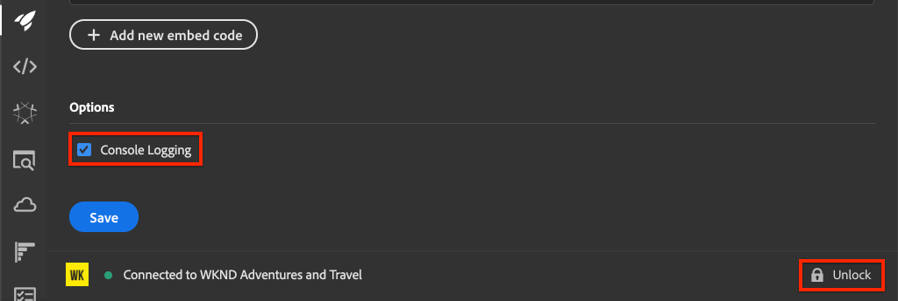
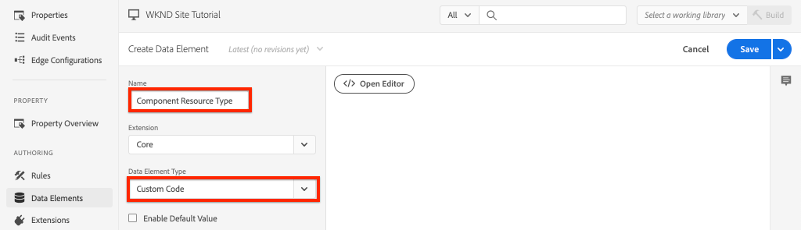
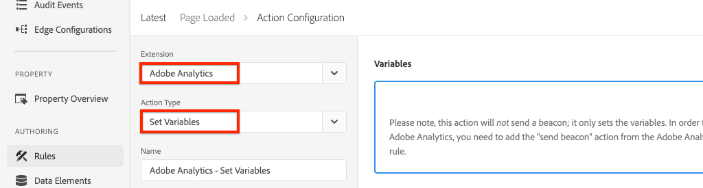

# Integrar o AEM Sites e o Adobe Analytics

Saiba como integrar o AEM Sites e o Adobe Analytics à extensão de tags da Adobe Analytics, usando os recursos integrados da [Camada de dados do cliente Adobe com os Componentes principais do AEM](https://experienceleague.adobe.com/docs/experience-manager-core-components/using/developing/data-layer/overview.html?lang=pt-BR) para coletar dados sobre uma página no Adobe Experience Manager Sites. [As marcas no Experience Platform](https://experienceleague.adobe.com/docs/experience-platform/tags/home.html) e na [extensão do Adobe Analytics](https://experienceleague.adobe.com/docs/experience-platform/tags/extensions/client/analytics/overview.html) são usadas para criar regras para enviar dados de página para o Adobe Analytics.

## O que você vai criar {#what-build}


Neste tutorial, você acionará uma regra de tag com base em um evento da Camada de dados de clientes Adobe. Além disso, adicione condições para quando a regra deve ser acionada e envie os valores de **Nome da página** e **Modelo de página** de uma página do AEM para a Adobe Analytics.

### Objetivos {#objective}

1. Crie uma regra orientada por eventos na propriedade de tag que capture alterações da camada de dados
1. Mapear propriedades da camada de dados da página para Elementos de dados na propriedade da tag
1. Coletar e enviar dados de página para o Adobe Analytics usando o sinal de exibição de página

## Pré-requisitos

Os seguintes são obrigatórios:

* **Propriedade de marca** no Experience Platform
* Servidor de rastreamento e ID do conjunto de relatórios de teste/desenvolvimento do **Adobe Analytics**. Consulte a documentação a seguir para [criar um conjunto de relatórios](https://experienceleague.adobe.com/docs/analytics/admin/admin-tools/manage-report-suites/c-new-report-suite/new-report-suite.html).
* Extensão do navegador do [Experience Platform Debugger](https://experienceleague.adobe.com/docs/platform-learn/data-collection/debugger/overview.html). Capturas de tela deste tutorial capturadas do navegador Chrome.
* (Opcional) Site do AEM com a [Camada de Dados de Clientes Adobe habilitada](https://experienceleague.adobe.com/docs/experience-manager-core-components/using/developing/data-layer/overview.html#installation-activation). Este tutorial usa o site [WKND](https://wknd.site/us/en.html) voltado ao público, mas você pode usar seu próprio site.

>[!NOTE]
>
> Precisa de ajuda para integrar a propriedade de tag ao site da AEM? [Ver esta série de vídeos](../experience-platform/data-collection/tags/overview.md).

## Alternar ambiente de tag para o site da WKND

O [WKND](https://wknd.site/us/en.html) é um site voltado para o público criado com base em [um projeto de código aberto](https://github.com/adobe/aem-guides-wknd) projetado como uma referência e [tutorial](https://experienceleague.adobe.com/docs/experience-manager-learn/getting-started-wknd-tutorial-develop/overview.html?lang=pt-BR) para uma implementação do AEM.

Em vez de configurar um ambiente AEM e instalar a base de código WKND, você pode usar o depurador da Experience Platform para **alternar** o [Site WKND](https://wknd.site/us/en.html) ativo para *sua propriedade de marca*. No entanto, você pode usar seu próprio site do AEM se ele já tiver a [Camada de Dados de Clientes Adobe habilitada](https://experienceleague.adobe.com/docs/experience-manager-core-components/using/developing/data-layer/overview.html#installation-activation).

1. Faça logon no Experience Platform e [crie uma propriedade de Marca](https://experienceleague.adobe.com/docs/platform-learn/implement-in-websites/configure-tags/create-a-property.html) (caso ainda não o tenha feito).
1. Certifique-se de que uma biblioteca [de JavaScript de marca inicial tenha sido criada](https://experienceleague.adobe.com/docs/experience-platform/tags/publish/libraries.html#create-a-library) e promovida para o [ambiente](https://experienceleague.adobe.com/docs/experience-platform/tags/publish/environments/environments.html?lang=pt-BR) de marca.
1. Copie o código de inserção do JavaScript do ambiente de tag em que sua biblioteca foi publicada.

   

1. No navegador, abra uma nova guia e navegue até o [Site da WKND](https://wknd.site/us/en.html)
1. Abra a extensão do navegador do Experience Platform Debugger

   

1. Navegue até **Marcas do Experience Platform** > **Configuração** e, em **Códigos Incorporados Inseridos**, substitua o código incorporado existente pelo *seu* código incorporado copiado da etapa 3.

   

1. Habilite o **Log do Console** e **Bloqueie** o depurador na guia WKND.

   

## Verificar a camada de dados do cliente Adobe no site WKND

O [projeto de referência WKND](https://github.com/adobe/aem-guides-wknd) é compilado com os Componentes Principais do AEM e tem a [Camada de Dados de Clientes Adobe habilitada](https://experienceleague.adobe.com/docs/experience-manager-core-components/using/developing/data-layer/overview.html#installation-activation) por padrão. Em seguida, verifique se a Camada de dados de clientes Adobe está ativada.

1. Navegue até [WKND Site](https://wknd.site/us/en.html).
1. Abra as ferramentas de desenvolvedor do navegador e navegue até o **Console**. Execute o seguinte comando:

   ```js
   adobeDataLayer.getState();
   ```

   O código acima retorna o estado atual da Camada de dados de clientes Adobe.

   

1. Expanda a resposta e inspecione a entrada `page`. Você deve ver um schema de dados como o seguinte:

   ```json
   page-2eee4f8914:
       @type: "wknd/components/page"
       dc:description: WKND is a collective of outdoors, music, crafts, adventure sports, and travel enthusiasts that want to share our experiences, connections, and expertise with the world.
       dc:title: "WKND Adventures and Travel"
       repo:modifyDate: "2020-08-31T21:02:21Z"
       repo:path: "/content/wknd/us/en.html"
       xdm:language: "en-US"
       xdm:tags: ["Attract"]
       xdm:template: "/conf/wknd/settings/wcm/templates/landing-page-template"
   ```

   Para enviar dados de página para o Adobe Analytics, vamos usar as propriedades padrão como `dc:title`, `xdm:language` e `xdm:template` da camada de dados.

   Para obter mais informações, reveja o [Esquema de página](https://experienceleague.adobe.com/docs/experience-manager-core-components/using/developing/data-layer/overview.html#page) dos Esquemas de dados dos Componentes principais.

   >[!NOTE]
   >
   > Se você não vir o objeto JavaScript `adobeDataLayer`? Verifique se a [Camada de Dados de Clientes Adobe foi habilitada](https://experienceleague.adobe.com/docs/experience-manager-core-components/using/developing/data-layer/overview.html#installation-activation) no site.

## Criar uma regra de Página carregada

A Camada de Dados de Clientes Adobe é uma camada de dados **orientada por eventos**. Quando a camada de dados Página do AEM é carregada, ela aciona um evento `cmp:show`. Crie uma regra que seja acionada quando o evento `cmp:show` for acionado a partir da camada de dados da página.

1. Navegue até o Experience Platform e para a propriedade de tag integrada ao site do AEM.
1. Navegue até a seção **Regras** na interface do usuário da Propriedade de Marca e clique em **Criar nova regra**.

   

1. Nomeie a regra **Página carregada**.
1. Na subseção **Eventos**, clique em **Adicionar** para abrir o assistente de **Configuração de Evento**.
1. Para o campo **Tipo de evento**, selecione **Código personalizado**.

   

1. Clique em **Abrir editor** no painel principal e insira o seguinte trecho de código:

   ```js
   var pageShownEventHandler = function(evt) {
      // defensive coding to avoid a null pointer exception
      if(evt.hasOwnProperty("eventInfo") && evt.eventInfo.hasOwnProperty("path")) {
         //trigger the Tag Rule and pass event
         console.log("cmp:show event: " + evt.eventInfo.path);
         var event = {
            //include the path of the component that triggered the event
            path: evt.eventInfo.path,
            //get the state of the component that triggered the event
            component: window.adobeDataLayer.getState(evt.eventInfo.path)
         };
   
         //Trigger the Tag Rule, passing in the new `event` object
         // the `event` obj can now be referenced by the reserved name `event` by other Tag data elements
         // i.e `event.component['someKey']`
         trigger(event);
      }
   }
   
   //set the namespace to avoid a potential race condition
   window.adobeDataLayer = window.adobeDataLayer || [];
   //push the event listener for cmp:show into the data layer
   window.adobeDataLayer.push(function (dl) {
      //add event listener for `cmp:show` and callback to the `pageShownEventHandler` function
      dl.addEventListener("cmp:show", pageShownEventHandler);
   });
   ```

   O trecho de código acima adiciona um ouvinte de eventos ao [enviar uma função](https://github.com/adobe/adobe-client-data-layer/wiki#pushing-a-function) para a camada de dados. Quando o evento `cmp:show` é acionado, a função `pageShownEventHandler` é chamada. Nesta função, algumas verificações de integridade são adicionadas e um novo `event` é construído com o [estado mais recente da camada de dados](https://github.com/adobe/adobe-client-data-layer/wiki#getstate) para o componente que acionou o evento.

   Finalmente, a função `trigger(event)` é chamada. A função `trigger()` é um nome reservado na propriedade de marca e **aciona** a regra. O objeto `event` é passado como um parâmetro que, por sua vez, é exposto por outro nome reservado na propriedade de marca. Os elementos de dados na propriedade da marca agora podem fazer referência a várias propriedades usando o trecho de código como `event.component['someKey']`.

1. Salve as alterações.
1. Em seguida, em **Ações**, clique em **Adicionar** para abrir o assistente de **Configuração de Ação**.
1. Para o campo **Tipo de ação**, escolha **Código personalizado**.

   

1. Clique em **Abrir editor** no painel principal e insira o seguinte trecho de código:

   ```js
   console.log("Page Loaded ");
   console.log("Page name: " + event.component['dc:title']);
   console.log("Page type: " + event.component['@type']);
   console.log("Page template: " + event.component['xdm:template']);
   ```

   O objeto `event` é passado do método `trigger()` chamado no evento personalizado. Aqui, o `component` é a página atual derivada da camada de dados `getState` no evento personalizado.

1. Salve as alterações e execute uma [compilação](https://experienceleague.adobe.com/docs/experience-platform/tags/publish/builds.html) na propriedade da marca para promover o código ao [ambiente](https://experienceleague.adobe.com/docs/experience-platform/tags/publish/environments/environments.html?lang=pt-BR) usado no site do AEM.

   >[!NOTE]
   >
   > Pode ser útil usar o [Adobe Experience Platform Debugger](https://experienceleague.adobe.com/docs/platform-learn/data-collection/debugger/overview.html) para alternar o código de inserção para um ambiente de **Desenvolvimento**.

1. Navegue até o site do AEM e abra as ferramentas do desenvolvedor para visualizar o console. Atualize a página e você verá que as mensagens do console foram registradas:


## Criar elementos de dados

Em seguida, crie vários Elementos de dados para capturar valores diferentes da Camada de dados de clientes Adobe. Como visto no exercício anterior, é possível acessar as propriedades da camada de dados diretamente pelo código personalizado. A vantagem de usar elementos de dados é que eles podem ser reutilizados nas regras de tag.

Os elementos de dados são mapeados para as propriedades `@type`, `dc:title` e `xdm:template`.

### Tipo de recurso do componente

1. Navegue até o Experience Platform e para a propriedade de tag integrada ao site do AEM.
1. Navegue até a seção **Elementos de Dados** e clique em **Criar Novo Elemento de Dados**.
1. Para o campo **Nome**, insira o **Tipo de Recurso do Componente**.
1. Para o campo **Tipo de elemento de dados**, selecione **Código personalizado**.

   

1. Clique no botão **Abrir editor** e insira o seguinte no editor de código personalizado:

   ```js
   if(event && event.component && event.component.hasOwnProperty('@type')) {
       return event.component['@type'];
   }
   ```

1. Salve as alterações.

   >[!NOTE]
   >
   > Lembre-se de que o objeto `event` está disponível e com escopo baseado no evento que acionou a **Regra** na propriedade de marca. O valor de um Elemento de Dados não é definido até que o Elemento de Dados seja *referenciado* em uma Regra. Portanto, é seguro usar este Elemento de Dados dentro de uma Regra como a regra **Página Carregada** criada na etapa anterior *mas* não seria segura para uso em outros contextos.

### Nome da Página

1. Clique no botão **Adicionar elemento de dados**
1. Para o campo **Nome**, digite **Nome da Página**.
1. Para o campo **Tipo de elemento de dados**, selecione **Código personalizado**.
1. Clique no botão **Abrir editor** e insira o seguinte no editor de código personalizado:

   ```js
   if(event && event.component && event.component.hasOwnProperty('dc:title')) {
       return event.component['dc:title'];
   }
   ```

1. Salve as alterações.

### Modelo da página

1. Clique no botão **Adicionar elemento de dados**
1. Para o campo **Nome**, digite **Modelo de Página**.
1. Para o campo **Tipo de elemento de dados**, selecione **Código personalizado**.
1. Clique no botão **Abrir editor** e insira o seguinte no editor de código personalizado:

   ```js
   if(event && event.component && event.component.hasOwnProperty('xdm:template')) {
       return event.component['xdm:template'];
   }
   ```

1. Salve as alterações.

1. Agora você deve ter três elementos de dados como parte da regra:

   

## Adicionar a extensão Analytics

Em seguida, adicione a extensão do Analytics à propriedade de tag para enviar dados a um conjunto de relatórios.

1. Navegue até o Experience Platform e para a propriedade de tag integrada ao site do AEM.
1. Ir para **Extensões** > **Catálogo**
1. Localize a extensão **Adobe Analytics** e clique em **Instalar**

   

1. Em **Gerenciamento de biblioteca** > **Conjuntos de relatórios**, insira as IDs de conjunto de relatórios que você deseja usar com cada ambiente de tag.

   

   >[!NOTE]
   >
   > Não há problema em usar um conjunto de relatórios para todos os ambientes neste tutorial, mas na vida real você pode usar conjuntos de relatórios separados, como mostrado na imagem abaixo

   >[!TIP]
   >
   >Recomendamos usar a opção *Gerenciar a biblioteca para mim* como a configuração Gerenciamento da Biblioteca, pois facilita muito a atualização da biblioteca `AppMeasurement.js`.

1. Marque a caixa para habilitar **Usar Activity Map**.

   

1. Em **Geral** > **Servidor de Rastreamento**, insira seu servidor de rastreamento, por exemplo, `tmd.sc.omtrdc.net`. Insira seu Servidor de Rastreamento SSL se o site suporta o `https://`

   

1. Clique em **Salvar** para salvar as alterações.

## Adicionar uma condição à regra Página carregada

Em seguida, atualize a regra **Página carregada** para usar o elemento de dados **Tipo de Recurso de Componente** para garantir que a regra só seja acionada quando o evento `cmp:show` for para a **Página**. Outros componentes podem acionar o evento `cmp:show`, por exemplo, o componente Carrossel é acionado quando os slides são alterados. Portanto, é importante adicionar uma condição para essa regra.

1. Na interface da Propriedade de tag, navegue até a regra **Página carregada** criada anteriormente.
1. Em **Condições**, clique em **Adicionar** para abrir o assistente de **Configuração de Condição**.
1. Para o campo **Tipo de Condição**, selecione a opção **Comparação de Valores**.
1. Defina o primeiro valor no campo de formulário como `%Component Resource Type%`. Você pode usar o Ícone do Elemento de Dados  para selecionar o elemento de dados **Tipo de Recurso do Componente**. Deixe o comparador definido como `Equals`.
1. Defina o segundo valor como `wknd/components/page`.

   

   >[!NOTE]
   >
   > É possível adicionar essa condição na função de código personalizada que acompanha o evento `cmp:show` criado anteriormente no tutorial. No entanto, adicioná-la na interface do dá mais visibilidade a usuários adicionais que podem precisar fazer alterações na regra. Além disso, podemos usar nosso elemento de dados!

1. Salve as alterações.

## Definir variáveis do Analytics e acionar o sinal de Exibição de página

Atualmente, a regra **Página carregada** simplesmente gera uma instrução de console. Em seguida, use os elementos de dados e a extensão do Analytics para definir as variáveis do Analytics como uma **ação** na regra **Página carregada**. Também definimos uma ação extra para acionar o **Sinal de Exibição de Página** e enviar os dados coletados para o Adobe Analytics.

1. Na regra da Página Carregada, **remova** a ação **Núcleo - Código Personalizado** (as instruções do console):

   

1. Na subseção Ações, clique em **Adicionar** para adicionar uma nova ação.

1. Defina o tipo **Extensão** como **Adobe Analytics** e defina o **Tipo de Ação** como **Definir Variáveis**

   

1. No painel principal, selecione um **eVar** disponível e defina como o valor do Elemento de dados **Modelo de página**. Use o ícone Elementos de Dados  para selecionar o elemento **Modelo de Página**.

   

1. Role para baixo, em **Configurações Adicionais**, defina **Nome da Página** como o elemento de dados **Nome da Página**:

   

1. Salve as alterações.

1. Em seguida, adicione uma Ação extra à direita de **Adobe Analytics - Definir Variáveis** tocando no ícone **mais**:

   

1. Defina o tipo **Extensão** como **Adobe Analytics** e defina o **Tipo de Ação** como **Enviar Beacon**. Como esta ação é considerada uma exibição de página, deixe o rastreamento padrão definido como **`s.t()`**.

   

1. Salve as alterações. A regra **Página carregada** agora deve ter a seguinte configuração:

   

   * **1.** Ouça o evento `cmp:show`.
   * **2.** Verifique se o evento foi acionado por uma página.
   * **3.** Definir variáveis do Analytics para **Nome da Página** e **Modelo de Página**
   * **4.** Enviar o sinal de Exibição de página do Analytics

1. Salve todas as alterações e crie sua biblioteca de tags, promovendo para o ambiente apropriado.

## Validar o sinal de Exibição de página e a chamada do Analytics

Agora que a regra **Página carregada** envia o beacon do Analytics, você poderá ver as variáveis de rastreamento do Analytics usando o Experience Platform Debugger.

1. Abra o [Site WKND](https://wknd.site/us/en.html) em seu navegador.
1. Clique no ícone Depurador  para abrir o Experience Platform Debugger.
1. Verifique se o Depurador está mapeando a propriedade da tag para o *seu* ambiente de desenvolvimento, conforme descrito anteriormente, e se o **Log do console** está marcado.
1. Abra o menu do Analytics e verifique se o conjunto de relatórios está definido como *seu* conjunto de relatórios. O Nome da página também deve ser preenchido:

   

1. Role para baixo e expanda **Solicitações de Rede**. Você deve encontrar o **evar** definido para o **Modelo de Página**:

   

1. Retorne ao navegador e abra o console do desenvolvedor. Clique no **Carrossel**, na parte superior da página.

   

1. Observe a instrução do console no console do navegador:

   

   Isso ocorre porque o Carrossel não aciona um evento `cmp:show` *but* devido à nossa verificação do **Tipo de Recurso do Componente**, nenhum evento é acionado.

   >[!NOTE]
   >
   > Se você não visualizar nenhum log de console, verifique se a opção **Log de console** está marcada em **Tags do Experience Platform** no Experience Platform Debugger.

1. Navegue para uma página de artigo como [Austrália Ocidental](https://wknd.site/us/en/magazine/western-australia.html). Observe que o Nome da página e o Tipo de modelo são alterados.

## Parabéns.

Você acabou de usar a Camada de dados e as Tags do cliente da Adobe orientadas por eventos no Experience Platform para coletar dados de página de dados de um site da AEM e enviá-los para a Adobe Analytics.

### Próximas etapas

Confira o tutorial a seguir para saber como usar a camada de Dados do cliente do Adobe orientada por eventos para [rastrear cliques de componentes específicos em um site do Adobe Experience Manager](track-clicked-component.md).
