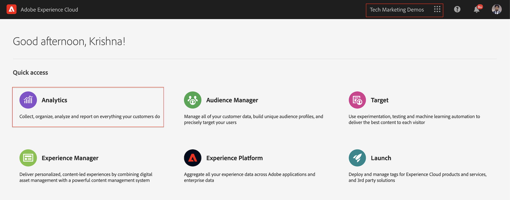
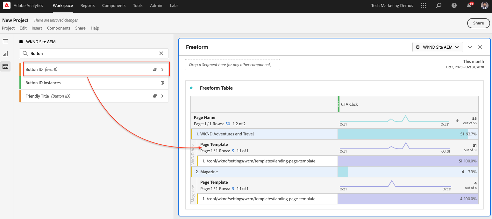
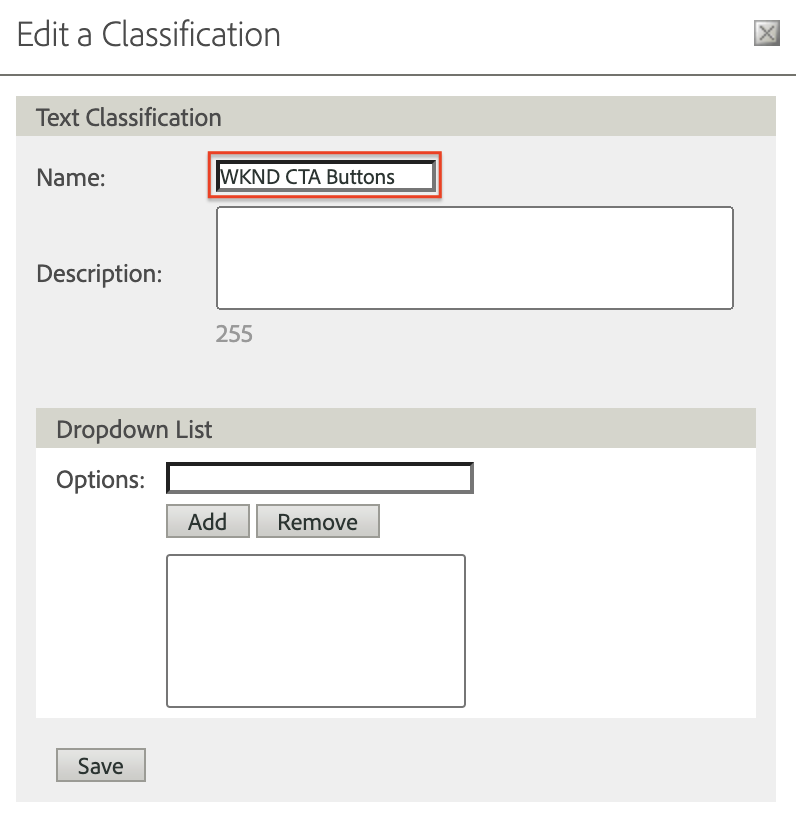
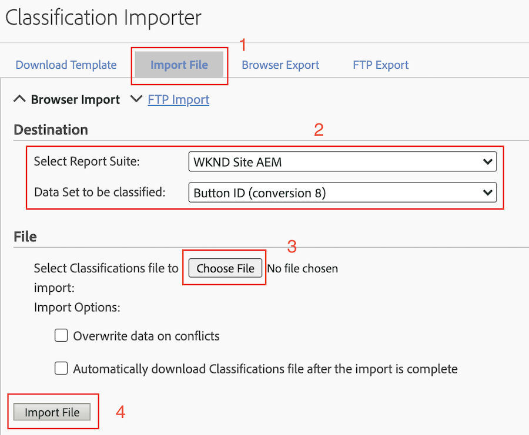

# Analisar dados com a Analysis Workspace

Saiba como mapear dados capturados de um site da Adobe Experience Manager para métricas e dimensões em conjuntos de relatórios da Adobe Analytics. Saiba como criar um painel de relatórios detalhado usando o recurso Analysis Workspace da Adobe Analytics.

## O que você vai criar

A equipe de marketing da WKND quer entender quais botões Chamada para Ação (CTA) têm melhor desempenho no home page. Neste tutorial, criaremos um novo projeto no Analysis Workspace para visualizar o desempenho de diferentes botões CTA e entender o comportamento do usuário no site. As seguintes informações são capturadas usando o Adobe Analytics quando um usuário clica em um botão Chamada para Ação (CTA) no home page WKND.

**Variáveis do Analytics**

Abaixo estão as variáveis do Analytics que estão sendo acompanhadas:

* `eVar5` -  `Page template`
* `eVar6` - `Page Id`
* `eVar7` -  `Page last modified date`
* `eVar8` -  `CTA Button Id`
* `eVar9` -  `Page Name`
* `event8` -  `CTA Button Click event`
* `prop8` -  `CTA Button Id`

### Objetivos {#objective}

1. Crie um novo conjunto de relatórios ou use um existente.
1. Configure [Variáveis de conversão (eVars)](https://docs.adobe.com/content/help/en/analytics/admin/admin-tools/conversion-variables/conversion-var-admin.html) e [Eventos de sucesso (Eventos)](https://docs.adobe.com/help/en/analytics/admin/admin-tools/success-events/success-event.html) no Conjunto de relatórios.
1. Crie um [projeto da Analysis Workspace](https://docs.adobe.com/content/help/en/analytics/analyze/analysis-workspace/home.html) para analisar dados com a ajuda de ferramentas que permitem criar, analisar e compartilhar insights rapidamente.
1. Compartilhe o projeto da Analysis Workspace com outros membros da equipe.

## Pré-requisitos

Este tutorial é uma continuação do [componente clicado de rastreamento com o Adobe Analytics](./track-clicked-component.md) e presume que você tenha:

* Uma **Iniciar propriedade** com a [extensão Adobe Analytics](https://docs.adobe.com/content/help/en/launch/using/extensions-ref/adobe-extension/analytics-extension/overview.html) ativada
* **ID do conjunto de relatórios do Adobe** Analytics/dev e servidor de rastreamento. Consulte a documentação a seguir para [criar um novo conjunto de relatórios](https://docs.adobe.com/content/help/en/analytics/admin/manage-report-suites/new-report-suite/new-report-suite.html).
* [Extensão do navegador ](https://docs.adobe.com/content/help/en/platform-learn/tutorials/data-ingestion/web-sdk/introduction-to-the-experience-platform-debugger.html) Depurador de Experience Platform configurada com sua propriedade Launch carregada em  [https://wknd.site/us/en.](https://wknd.site/us/en.html) htmlor um site AEM com a Camada de dados Adobe.

## Variáveis de conversão (eVars) e Eventos bem-sucedidos (Evento)

A Variável de conversão do Custom Insight (ou eVar) é colocada no código de Adobe nas páginas da Web selecionadas do site. Seu objetivo principal é segmentar métricas de sucesso de conversão em relatórios de marketing personalizados. Um eVar pode ser baseado em visitas e funcionar de forma semelhante aos cookies. Os valores passados para variáveis de eVar seguem o usuário por um período predeterminado.

Quando um eVar é definido como um valor de visitante, o Adobe lembra automaticamente esse valor até que expire. Todos os eventos bem-sucedidos que um visitante encontra enquanto o valor do eVar está ativo são contados em relação ao valor do eVar.

As eVars são mais bem usadas para medir causa e efeito, como:

* Quais campanhas internas influenciaram a receita
* Quais anúncios em banner resultaram em um registro
* O número de vezes que uma pesquisa interna foi usada antes de fazer um pedido

Eventos bem-sucedidos são ações que podem ser rastreadas. Você determina o que é um evento bem-sucedido. Por exemplo, se um visitante clicar em um botão CTA, o evento click pode ser considerado um evento bem-sucedido.

### Configurar eVars

1. No home page Adobe Experience Cloud, selecione sua organização e inicie o Adobe Analytics.

   

1. Na barra de ferramentas do Analytics, clique em **Admin** > **Report Suites** e localize seu Report Suite.

   

1. Selecione Report Suite > **Editar configurações** > **Conversão** > **Variáveis de conversão**

   

1. Usando a opção **Adicionar novo**, vamos criar Variáveis de conversão para mapear o schema como abaixo:

   * `eVar5` -   `Page Template`
   * `eVar6` -  `Page ID`
   * `eVar7` -  `Last Modified Date`
   * `eVar8` -  `Button Id`
   * `eVar9` -  `Page Name`

   

1. Forneça um nome e uma descrição apropriados para cada eVars e **Salve** suas alterações. Usaremos essas eVars para criar um projeto Analysis Workspace na próxima seção. Assim, um nome amigável torna as variáveis facilmente descobertas.

   

### Configurar Eventos bem-sucedidos

Em seguida, vamos criar um link par para rastrear o clique do botão CTA.

1. Na janela **Gerenciador de conjunto de relatórios**, selecione a **ID de conjunto de relatórios** e clique em **Editar configurações**.
1. Clique em **Conversão** > **Eventos bem-sucedidos**
1. Usando a opção **Adicionar novo**, crie um novo evento bem-sucedido personalizado para rastrear o clique do botão CTA e, em seguida, **Salve** suas alterações.
   * `Event` : `event8`
   * `Name`:`CTA Click`
   * `Type`:`Counter`

   

## Criar um novo projeto no Analysis Workspace {#workspace-project}

A Analysis Workspace é uma ferramenta de navegador flexível que permite criar análises e compartilhar insights rapidamente. Usando a interface de arrastar e soltar, você pode criar sua análise, adicionar visualizações para dar vida aos dados, preparar um conjunto de dados, compartilhar e agendar projetos com qualquer pessoa em sua organização.

Em seguida, crie um novo [projeto](https://docs.adobe.com/content/help/en/analytics/analyze/analysis-workspace/build-workspace-project/t-freeform-project.html) para criar um painel para analisar o desempenho dos botões CTA em todo o site.

1. Na barra de ferramentas do Analytics, selecione **Workspace** e clique em **Criar um novo projeto**.

   

1. Escolha start a partir de um **projeto em branco** ou selecione um dos modelos pré-criados, fornecido pelos modelos Adobe ou personalizados criados pela sua organização. Vários modelos estão disponíveis, dependendo da análise ou caso de uso que você tenha em mente. [Saiba ](https://docs.adobe.com/content/help/en/analytics/analyze/analysis-workspace/build-workspace-project/starter-projects.html) mais sobre as diferentes opções de modelo disponíveis.

   No projeto da Workspace, os painéis, as tabelas, as visualizações e os componentes são acessados do painel esquerdo. Estes são os blocos componentes do projeto.

   * **[Componentes](https://docs.adobe.com/content/help/en/analytics/analyze/analysis-workspace/components/analysis-workspace-components.html)**  - Os componentes são dimensões, métricas, segmentos ou intervalos de datas, todos os quais podem ser combinados em uma tabela de forma livre para o start que responde às suas perguntas comerciais. Familiarize-se com cada tipo de componente antes de mergulhar na análise. Depois de dominar a terminologia do componente, você pode começar a arrastar e soltar para criar sua análise em uma tabela de forma livre.
   * **[Visualizações](https://docs.adobe.com/content/help/en/analytics/analyze/analysis-workspace/visualizations/freeform-analysis-visualizations.html)**  - as visualizações, como uma barra ou um gráfico de linha, são adicionadas na parte superior dos dados para dar vida visualmente. No painel à esquerda, selecione o ícone do meio de Visualizações para ver a lista completa de visualizações disponíveis.
   * **[Painéis](https://docs.adobe.com/content/help/en/analytics/analyze/analysis-workspace/panels/panels.html)**  - Um painel é uma coleção de tabelas e visualizações. Você pode acessar os painéis a partir do ícone superior esquerdo na Workspace. Os painéis são úteis quando você deseja organizar seus projetos de acordo com períodos de tempo, conjuntos de relatórios ou casos de uso de análise. Os seguintes tipos de painel estão disponíveis no Analysis Workspace:

   

### Adicionar visualização de dados com o Analysis Workspace

Em seguida, crie uma tabela para criar uma representação visual de como os usuários interagem com os botões Call to Action (CTA) no home page do site WKND. Para criar tal representação, vamos usar os dados coletados no componente [Acompanhar cliques com o Adobe Analytics](./track-clicked-component.md). Abaixo está um rápido resumo dos dados rastreados para interações do usuário com os botões de Chamada para Ação do Site WKND.

* `eVar5` -   `Page template`
* `eVar6` -  `Page Id`
* `eVar7` -  `Page last modified date`
* `eVar8` -  `CTA Button Id`
* `eVar9` -  `Page Name`
* `event8` -  `CTA Button Click event`
* `prop8` -  `CTA Button Id`

1. Arraste e solte o componente de dimensão **Page** na Tabela de forma livre. Agora você pode visualização uma visualização que exibe o Nome da página (eVar 9) e as Visualizações de página correspondentes (Ocorrências) exibidas na tabela.

   

1. Arraste e solte a métrica **CTA Click** (evento8) na métrica de ocorrências e substitua-a. Agora você pode visualização uma visualização que exibe o Nome da página (eVar 9) e uma contagem correspondente de eventos de CTA Click em uma página.

   

1. Vamos analisar a página por tipo de modelo. Selecione a métrica de modelo de página dos componentes e arraste e solte a métrica de Modelo de página na dimensão Nome de página. Agora você pode visualização o nome da página detalhado por seu tipo de modelo.

   * **Antes**

      

   * **Depois**

      

1. Para entender como os usuários interagem com os botões CTA quando estão nas páginas do site WKND, é necessário detalhar ainda mais a métrica Modelo de página adicionando a métrica ID do botão (eVar8).

   

1. Abaixo, é possível ver uma representação visual do Site da WKND detalhada pelo modelo de página e detalhado ainda mais pela interação do usuário com os botões de ação de clique para o site da WKND (CTA).

   

1. Você pode substituir o valor da ID do botão por um nome mais fácil de usar usando as Classificações Adobe Analytics. Você pode ler mais sobre como criar uma classificação para uma métrica específica [aqui](https://docs.adobe.com/content/help/en/analytics/components/classifications/c-classifications.html). Nesse caso, temos uma métrica de classificação `Button Section (Button ID)` configurada para `eVar8` que mapeia a ID do botão para um nome amigável.

   

## Adicionar classificação a uma variável do Analytics

### Classificações de conversão

A Classificação do Analytics é uma forma de classificar os dados variáveis do Analytics e, em seguida, exibi-los de maneiras diferentes ao gerar relatórios. Para melhorar como a ID do botão é exibida no relatório do Analytics Workspace, vamos criar uma variável de classificação para a ID do botão (eVar 8). Ao classificar, você está estabelecendo uma relação entre a variável e os metadados relacionados a ela.

Em seguida, vamos criar uma variável Classificação para o Analytics.

1. No menu da barra de ferramentas **Admin**, selecione **Report Suites**
1. Selecione **Id do Report Suite** na janela **Gerenciador do Report Suite** e clique em **Editar Configurações** > **Conversão** > **Classificações de Conversão**

   

1. Na lista suspensa **Selecionar tipo de classificação**, selecione a variável (ID de botão do eVar8) para adicionar uma classificação.
1. Clique na seta ao lado da variável Classificação listada na seção Classificações para adicionar uma nova Classificação.

   

1. Na caixa de diálogo **Editar uma Classificação**, forneça um nome adequado para a Classificação de texto. Um componente de dimensão com o nome Classificação de texto é criado.

   

1. **** Salve as alterações.

### Importador de classificação

Use o importador para carregar classificações no Adobe Analytics. Também é possível exportar os dados para atualização antes de uma importação. Os dados que você importa usando a ferramenta de importação devem estar em um formato específico. O Adobe fornece a opção de baixar um modelo de dados com todos os detalhes de cabeçalho apropriados em um arquivo de dados delimitado por tabulação. Você pode adicionar seus novos dados a este modelo e depois importar o arquivo de dados no navegador usando FTP.

#### Modelo de classificação

Antes de importar classificações para relatórios de marketing, é possível baixar um modelo que ajuda a criar um arquivo de dados de classificações. O arquivo de dados usa suas classificações desejadas como cabeçalhos de coluna e, em seguida, organiza o conjunto de dados do relatórios nos cabeçalhos de classificação apropriados.

Em seguida, baixemos o Modelo de classificação para a variável de ID do botão (eVar 8)

1. Navegue até **Admin** > **Importador de classificação**
1. Vamos baixar um modelo de Classificação para a variável de conversão na guia **Baixar modelo**.
   

1. Na guia Baixar modelo, especifique a configuração do modelo de dados.
   * **Selecionar conjunto**  de relatórios: Selecione o conjunto de relatórios a ser usado no modelo. O conjunto de relatórios e o conjunto de dados devem corresponder.
   * **Conjunto de dados a ser classificado** : Selecione o tipo de dados para o arquivo de dados. O menu inclui todos os relatórios em seus conjuntos de relatórios configurados para classificações.
   * **Codificação** : Selecione a codificação de caracteres para o arquivo de dados. O formato de codificação padrão é UTF-8.

1. Clique em **Baixar** e salve o arquivo de modelo em seu sistema local. O arquivo de modelo é um arquivo de dados delimitado por tabulação (extensão de arquivo .tab) que a maioria dos aplicativos de planilha suporta.
1. Abra o arquivo de dados delimitado por tabulação usando um editor de sua escolha.
1. Adicione a ID do botão (eVar 9) e um nome de botão correspondente ao arquivo delimitado por tabulação para cada valor de eVar9 da Etapa 9 da seção.

   

1. **Salve** o arquivo delimitado por tabulação.
1. Navegue até a guia **Importar arquivo**.
1. Configure o Destino para a importação de arquivo.
   * **Selecionar conjunto**  de relatórios: AEM do site WKND (Report Suite)
   * **Conjunto de dados a serem classificados** : Id Do Botão (eVar 8 Da Variável De Conversão)
1. Clique na opção **Escolher Arquivo** para fazer upload do arquivo delimitado por tabulação do seu sistema e clique em **Importar Arquivo**

   

   >[!NOTE]
   >
   > Uma importação bem-sucedida exibe imediatamente as alterações apropriadas em uma exportação. No entanto, as alterações de dados nos relatórios levam até quatro horas ao usar uma importação de navegador e até 24 horas ao usar uma importação FTP.

#### Substitua a variável de conversão pela variável de classificação

1. Na barra de ferramentas do Analytics, selecione **Workspace** e abra o espaço de trabalho que criamos na seção [Criar um novo projeto no Analysis Workspace](#workspace-project) deste tutorial.

   

1. Em seguida, substitua a métrica **Id do botão** no seu espaço de trabalho que exibe a ID de um botão de Chamada para Ação (CTA) pelo nome de classificação criado na etapa anterior.

1. No localizador de componentes, procure os botões **WKND CTA** e arraste e solte os botões **WKND CTA (ID do botão)** na métrica de ID do botão e substitua-a.

   * **Antes**

      
   * **Depois**

      

1. Você pode observar que a métrica de ID do botão que continha a ID do botão de um botão de Chamada para Ação (CTA) agora é substituída por um nome correspondente fornecido no Modelo de classificação.
1. Vamos comparar a tabela do Analytics Workspace com o Home page WKND e entender a contagem de cliques do botão CTA e sua análise. Com base nos dados da tabela de forma livre do espaço de trabalho, é claro que 22 vezes os usuários clicaram no botão **SKI NOW** e quatro vezes para o Home page WKND Camping no oeste da Austrália **Leia mais**.

   

1. Salve o projeto do Adobe Analytics Workspace e forneça o nome e a descrição apropriados. Como opção, você pode adicionar tags a um projeto de espaço de trabalho.

   

1. Depois de salvar seu projeto com êxito, você pode compartilhar seu projeto de espaço de trabalho com outros colegas de trabalho ou colegas de trabalho usando a opção Compartilhar.

   

## Parabéns!

Você acabou de aprender como mapear dados capturados de um Site da Adobe Experience Manager para métricas e dimensões em conjuntos de relatórios da Adobe Analytics, executar uma classificação para as métricas e criar um painel de relatórios detalhado usando o recurso Analysis Workspace da Adobe Analytics.

