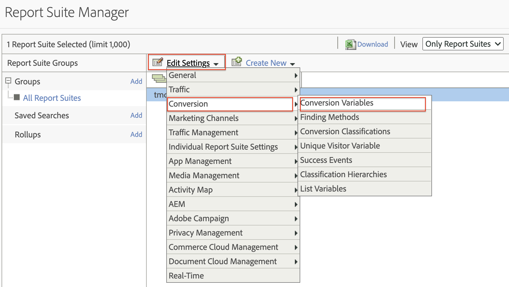
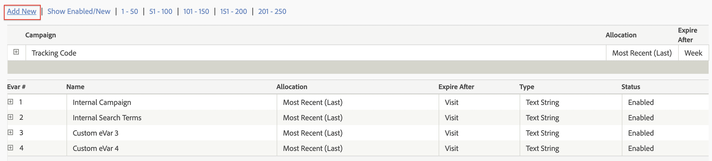
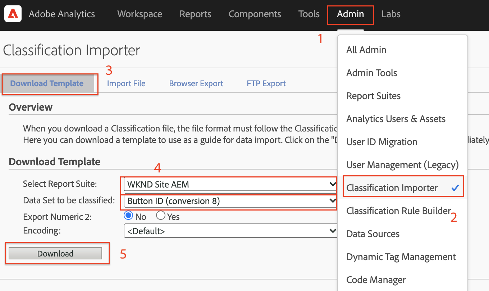
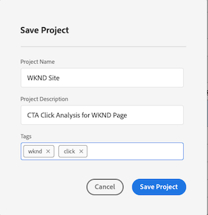

# Analisar dados com o Analysis Workspace

Saiba como mapear dados capturados de um site do Adobe Experience Manager para métricas e dimensões em conjuntos de relatórios do Adobe Analytics. Saiba como criar um painel de relatórios detalhado usando o recurso Analysis Workspace do Adobe Analytics.

## O que você vai criar {#what-build}

A equipe de marketing da WKND está interessada em saber quais `Call to Action (CTA)` Os botões do têm melhor desempenho na página inicial. Neste tutorial, crie um projeto no **Analysis Workspace** para visualizar o desempenho de diferentes botões do CTA e entender o comportamento do usuário no site. As informações a seguir são capturadas usando o Adobe Analytics quando um usuário clica em um botão de Chamada para ação (CTA) na página inicial da WKND.

**Variáveis do Analytics**

Abaixo estão as variáveis do Analytics que estão sendo rastreadas:

* `eVar5` -  `Page template`
* `eVar6` - `Page Id`
* `eVar7` - `Page last modified date`
* `eVar8` - `CTA Button Id`
* `eVar9` - `Page Name`
* `event8` - `CTA Button Click event`
* `prop8` - `CTA Button Id`

### Objetivos {#objective}

1. Crie um conjunto de relatórios ou use um existente.
1. Configurar [Variáveis de conversão (eVars)](https://experienceleague.adobe.com/docs/analytics/admin/admin-tools/manage-report-suites/edit-report-suite/conversion-variables/conversion-var-admin.html) e [Eventos bem-sucedidos (Eventos)](https://experienceleague.adobe.com/docs/analytics/admin/admin-tools/manage-report-suites/edit-report-suite/conversion-variables/success-events/success-event.html) no Conjunto de relatórios.
1. Criar um [Projeto do Analysis Workspace](https://experienceleague.adobe.com/docs/analytics/analyze/analysis-workspace/home.html) analisar dados com a ajuda de ferramentas que permitem criar, analisar e compartilhar insights rapidamente.
1. Compartilhar o projeto do Analysis Workspace com outros membros da equipe.

## Pré-requisitos

Este tutorial é uma continuação do [Rastrear componente clicado com o Adobe Analytics](./track-clicked-component.md) e o pressupõe que você tenha:

* A **Propriedade da tag** com o [Extensão do Adobe Analytics](https://experienceleague.adobe.com/docs/experience-platform/tags/extensions/client/analytics/overview.html) habilitado
* **Adobe Analytics** ID do conjunto de relatórios de teste/desenvolvimento e servidor de rastreamento. Consulte a documentação a seguir para [criação de um conjunto de relatórios](https://experienceleague.adobe.com/docs/analytics/admin/admin-tools/manage-report-suites/c-new-report-suite/new-report-suite.html).
* [Experience Platform Debugger](https://experienceleague.adobe.com/docs/platform-learn/data-collection/debugger/overview.html) extensão do navegador configurada com uma propriedade de tag carregada na [Site da WKND](https://wknd.site/us/en.html) ou um site AEM com a Camada de dados de Adobe ativada.

## Variáveis de conversão (eVars) e Eventos bem-sucedidos (evento)

A variável de conversão (ou eVar) do Custom Insight é colocada no código Adobe nas páginas da Web selecionadas do site. Seu objetivo principal é segmentar as métricas de sucesso de conversão em relatórios de marketing personalizados. Um eVar pode ser baseado em visitas e funciona de forma semelhante aos cookies. Os valores transmitidos para as variáveis de eVar seguem o usuário por um período predeterminado.

Quando um eVar é definido com o valor de um visitante, o Adobe lembra automaticamente desse valor até sua expiração. Quaisquer eventos bem-sucedidos que um visitante encontrar enquanto o valor do eVar estiver ativo serão contados para o valor do eVar.

As eVars são usadas com mais eficiência para medir causa e efeito, como:

* Quais campanhas internas influenciaram a receita
* Quais anúncios de banner resultaram em um registro
* O número de vezes que uma pesquisa interna foi usada antes de fazer um pedido

Eventos bem-sucedidos são ações que podem ser rastreadas. Você determina o que é um evento bem-sucedido. Por exemplo, se um visitante clicar em um botão CTA, o evento de clique pode ser considerado um evento bem-sucedido.

### Configurar eVars

1. Na página inicial do Adobe Experience Cloud, selecione sua organização e inicie o Adobe Analytics.

   

1. Na barra de ferramentas do Analytics, clique em **Admin** > **Conjuntos de relatórios** e encontre seu conjunto de relatórios.

   

1. Selecione o conjunto de relatórios > **Editar configurações** > **Conversão** > **Variáveis de conversão**

   

1. Usar o **Adicionar novo** vamos criar Variáveis de conversão para mapear o esquema conforme abaixo:

   * `eVar5` -  `Page Template`
   * `eVar6` - `Page ID`
   * `eVar7` - `Last Modified Date`
   * `eVar8` - `Button Id`
   * `eVar9` - `Page Name`

   

1. Forneça um nome e uma descrição apropriados para cada eVars e **Salvar** suas alterações. No projeto do Analysis Workspace, as eVars com nome apropriado são usadas, portanto, um nome amigável torna as variáveis facilmente detectáveis.

   

### Configurar eventos bem-sucedidos

Em seguida, vamos criar um evento para rastrear os cliques no botão CTA.

1. No **Gerenciador de conjunto de relatórios** selecione a **ID do conjunto de relatórios** e clique em **Editar configurações**.
1. Clique em **Conversão** > **Eventos bem-sucedidos**
1. Usar o **Adicionar novo** , crie um evento bem-sucedido personalizado para rastrear o clique no botão CTA e, em seguida, **Salvar** suas alterações.
   * `Event` : `event8`
   * `Name`:`CTA Click`
   * `Type`:`Counter`

   

## Criar um projeto no Analysis Workspace {#workspace-project}

O Analysis Workspace é uma ferramenta de navegador flexível que permite criar análises e compartilhar insights rapidamente. Usando a interface de arrastar e soltar, você pode criar a análise, adicionar visualizações para dar vida aos dados, preparar um conjunto de dados, compartilhar e agendar projetos com qualquer pessoa em sua organização.

Em seguida, crie um [projeto](https://experienceleague.adobe.com/docs/analytics/analyze/analysis-workspace/build-workspace-project/freeform-overview.html#analysis-workspace) para criar um painel para analisar o desempenho dos botões do CTA em todo o site.

1. Na barra de ferramentas do Analytics, selecione **Workspace** e clique em para **Criar um novo projeto**.

   

1. Optar por iniciar com um **projeto em branco** ou selecione um dos modelos pré-criados, fornecidos pelo Adobe ou modelos personalizados criados por sua organização. Vários modelos estão disponíveis, dependendo da análise ou caso de uso que você tenha em mente. [Saiba mais](https://experienceleague.adobe.com/docs/analytics/analyze/analysis-workspace/build-workspace-project/starter-projects.html) sobre as diferentes opções de modelo disponíveis.

   No projeto do Workspace, painéis, tabelas, visualizações e componentes são acessados pelo painel esquerdo. Eles formam os blocos de construção do seu projeto.

   * **[Componentes](https://experienceleague.adobe.com/docs/analytics/analyze/analysis-workspace/components/analysis-workspace-components.html)** - Componentes são dimensões, métricas, segmentos ou intervalos de datas que podem ser combinados em uma Tabela de forma livre para começar a responder às suas perguntas empresariais. Familiarize-se com cada tipo de componente antes de mergulhar na análise. Depois de dominar a terminologia do componente, você pode começar a arrastar e soltar para criar a análise em uma tabela de forma livre.
   * **[Visualizações](https://experienceleague.adobe.com/docs/analytics/analyze/analysis-workspace/visualizations/freeform-analysis-visualizations.html)** - Visualizações, como um gráfico de barras ou de linhas, são adicionadas sobre os dados para dar vida visualmente a eles. No painel à esquerda, selecione o ícone do meio de Visualizações para ver a lista completa de visualizações disponíveis.
   * **[Painéis](https://experienceleague.adobe.com/docs/analytics/analyze/analysis-workspace/panels/panels.html)** - Um painel é uma coleção de tabelas e visualizações. Você pode acessar os painéis por meio do ícone superior esquerdo no Espaço de trabalho. Os painéis são úteis quando você deseja organizar seus projetos de acordo com períodos, conjuntos de relatórios ou casos de uso de análise. Os seguintes tipos de painel estão disponíveis no Analysis Workspace:

   

### Adicionar visualização de dados com o Analysis Workspace

Em seguida, crie uma tabela para criar uma representação visual de como os usuários interagem com o `Call to Action (CTA)` botões na página inicial do Site WKND. Para criar essa representação, vamos usar os dados coletados na [Rastrear componente clicado com o Adobe Analytics](./track-clicked-component.md). Abaixo está um resumo rápido dos dados rastreados para interações do usuário com os botões de Chamada para ação do site WKND.

* `eVar5` -  `Page template`
* `eVar6` - `Page Id`
* `eVar7` - `Page last modified date`
* `eVar8` - `CTA Button Id`
* `eVar9` - `Page Name`
* `event8` - `CTA Button Click event`
* `prop8` - `CTA Button Id`

1. Arraste e solte a **Página** na Tabela de forma livre. Agora é possível exibir uma visualização que mostra o Nome da página (eVar 9) e as Exibições de página correspondentes (Ocorrências) exibidas na tabela.

   

1. Arraste e solte a **Clique em CTA** (event8) na métrica de ocorrências e substitua-a. Agora é possível exibir uma visualização que exibe o Nome da página (eVar 9) e uma contagem correspondente de eventos de Clique em CTA em uma página.

   

1. Vamos analisar a página por seu tipo de modelo. Selecione a métrica de modelo de página dos componentes e arraste e solte a métrica Modelo de página na dimensão Nome da página. Agora é possível exibir o nome da página detalhado por seu tipo de modelo.

   * **Antes**
     

   * **Depois**
     

1. Para entender como os usuários interagem com os botões CTA quando estão nas páginas do site WKND, é necessário detalhar ainda mais adicionando a métrica ID de botão (eVar8).

   

1. Abaixo você pode ver uma representação visual do Site WKND detalhada por seu modelo de página e detalhada ainda mais por interação do usuário com os botões Clique para ação (CTA) do Site WKND.

   

1. Você pode substituir o valor ID do botão por um nome mais amigável usando as Classificações do Adobe Analytics. Você pode ler mais sobre como criar uma classificação para uma métrica específica [aqui](https://experienceleague.adobe.com/docs/analytics/components/classifications/c-classifications.html). Nesse caso, temos uma métrica de classificação `Button Section (Button ID)` configurar para `eVar8` que mapeia a id do botão para um nome amigável.

   

## Adicionar classificação a uma variável analítica

### Classificações de conversão

A Classificação do Analytics é uma maneira de categorizar os dados de variáveis do Analytics e, em seguida, exibir os dados de diferentes maneiras ao gerar relatórios. Para melhorar como a ID do botão é exibida no relatório do Analytics Workspace, vamos criar uma variável de classificação para a ID do botão (eVar 8). Ao classificar, você está estabelecendo uma relação entre a variável e os metadados relacionados a essa variável.

Em seguida, vamos criar uma Classificação para a variável do Analytics.

1. No **Admin** menu da barra de ferramentas, selecione **Conjuntos de relatórios**
1. Selecione o **ID do conjunto de relatórios** do **Gerenciador de conjunto de relatórios** e clique em **Editar configurações** > **Conversão** > **Classificações de conversão**

   

1. No **Selecionar tipo de classificação** , selecione a variável (ID do botão eVar8) para adicionar uma classificação.
1. Clique na seta à direita ao lado da variável de classificação listada na seção Classificações para adicionar uma nova classificação.

   

1. No **Editar uma classificação** , forneça um nome adequado para a Classificação de texto. Um componente de dimensão com o nome de Classificação de texto é criado.

   

1. **Salvar** suas alterações.

### Importador de classificação

Use o importador para carregar classificações no Adobe Analytics. Você também pode exportar os dados para atualização antes de uma importação. Os dados importados com a ferramenta de importação devem estar em um formato específico. O Adobe oferece a opção de baixar um modelo de dados com todos os detalhes do cabeçalho adequados em um arquivo de dados delimitado por tabulação. Você pode adicionar seus novos dados a esse modelo e, em seguida, importar o arquivo de dados no navegador usando FTP.

#### Modelo de classificação

Antes de importar classificações para relatórios de marketing, você pode baixar um modelo que ajuda a criar um arquivo de dados de classificações. O arquivo de dados usa suas classificações desejadas como cabeçalhos de coluna e, em seguida, organiza o conjunto de dados do relatório nos cabeçalhos de classificação apropriados.

Em seguida, baixemos o Modelo de classificação da variável ID de botão (eVar 8)

1. Navegue até **Admin** > **Importador de classificação**
1. Baixemos um modelo de classificação para a variável de conversão da **Baixar modelo** Guia.
   

1. Na guia Download de modelo, especifique a configuração do modelo de dados.
   * **Selecionar conjunto de relatórios** : selecione o conjunto de relatórios que será usado no template. O conjunto de relatórios e o conjunto de dados devem corresponder.
   * **Conjunto de dados a ser classificado** : selecione o tipo de dados para o arquivo de dados. O menu inclui todos os relatórios em seus conjuntos de relatórios configurados para classificações.
   * **Codificação** : selecione a codificação de caracteres para o arquivo de dados. O formato de codificação padrão é UTF-8.

1. Clique em **Baixar** e salve o arquivo de modelo no sistema local. O arquivo de modelo é um arquivo de dados delimitado por tabulação (extensão de arquivo .tab) que a maioria dos aplicativos de planilha eletrônica suporta.
1. Abra o arquivo de dados delimitado por tabulação usando um editor de sua escolha.
1. Adicione a ID do Botão (eVar 9) e um nome de botão correspondente ao arquivo delimitado por tabulação para cada valor de eVar 9 da Etapa 9 na seção.

   

1. **Salvar** o arquivo delimitado por tabulação.
1. Navegue até a **Importar arquivo** guia.
1. Configure o Destino da importação de arquivo.
   * **Selecionar conjunto de relatórios** : AEM do site WKND (conjunto de relatórios)
   * **Conjunto de dados a ser classificado** : Id Do Botão (Variável De Conversão eVar8)
1. Clique em **Escolher arquivo** opção para fazer upload do arquivo delimitado por tabulação do sistema e, em seguida, clique em **Importar arquivo**

   

   >[!NOTE]
   >
   > Uma importação bem-sucedida exibe imediatamente as alterações apropriadas em uma exportação. No entanto, as alterações de dados em relatórios demoram até quatro horas ao usar uma importação de navegador e até 24 horas ao usar uma importação de FTP.

#### Substituir variável de conversão pela variável de classificação

1. Na barra de ferramentas do Analytics, selecione **Workspace** e abra o espaço de trabalho criado na variável [Criar um projeto no Analysis Workspace](#create-a-project-in-analysis-workspace) deste tutorial.

   

1. Em seguida, substitua o **ID do botão** métrica no espaço de trabalho que exibe a ID de um botão de Chamada para ação (CTA) com o nome de classificação criado na etapa anterior.

1. No localizador de componentes, procure por **Botões WKND CTA** e arraste e solte a **Botões CTA do WKND (ID do botão)** dimensão na métrica ID de botão e substitua-a.

   * **Antes**
     
   * **Depois**
     

1. É possível observar que a métrica da ID do botão que continha a ID do botão de um botão de Chamada para ação (CTA) agora é substituída por um nome correspondente fornecido no modelo de classificação.
1. Vamos comparar a tabela do Analytics Workspace com a página inicial da WKND e entender a contagem de cliques do botão CTA e sua análise. Com base nos dados da tabela de forma livre do espaço de trabalho, está claro que 22 vezes os usuários clicaram no **SKI AGORA** e quatro vezes para a Camping da página inicial do WKND na Austrália Ocidental **Leia mais** botão.

   

1. Salve seu projeto do Adobe Analytics Workspace e forneça um nome e uma descrição apropriados. Como opção, você pode adicionar tags a um projeto do Workspace.

   

1. Depois de salvar o projeto com êxito, você pode compartilhar o projeto do espaço de trabalho com outros colegas de trabalho ou de equipe usando a opção Compartilhar.

   

## Parabéns.

Você acabou de aprender a mapear dados capturados de um site do Adobe Experience Manager para métricas e dimensões em conjuntos de relatórios do Adobe Analytics. Além disso, o executou uma Classificação para as métricas e criou um painel de relatórios detalhado usando o recurso Analysis Workspace do Adobe Analytics.
