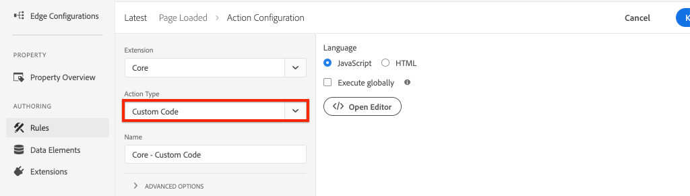
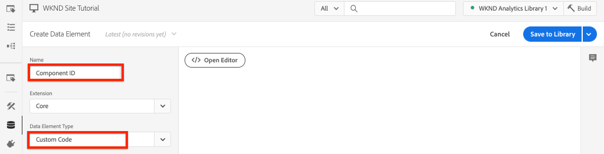
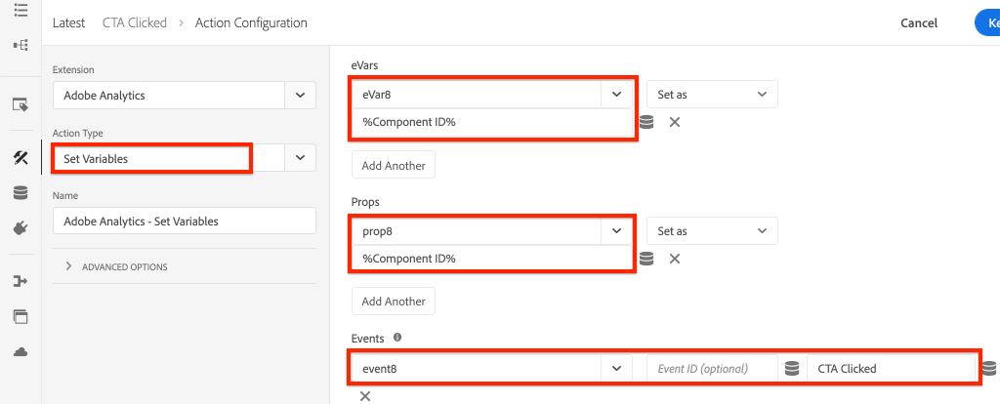

# Rastrear componente clicado com o Adobe Analytics

Use a [Camada de dados do cliente da Adobe orientada por eventos com os Componentes principais do AEM](https://docs.adobe.com/content/help/pt-BR/experience-manager-core-components/using/developing/data-layer/overview.html) para rastrear cliques de componentes específicos em um site do Adobe Experience Manager. Saiba como usar regras no Experience Platform Launch para acompanhar eventos de clique, filtrar por componente e enviar os dados para um Adobe Analytics com um beacon de rastreamento de link.

## O que você vai criar

A equipe de marketing da WKND quer entender quais botões de Chamada para Ação (CTA) estão tendo o melhor desempenho na página inicial. Neste tutorial, adicionaremos uma nova regra no Experience Platform Launch que escuta eventos `cmp:click` dos componentes **Teaser** e **Botão** e envia a ID do componente e um novo evento para o Adobe Analytics ao lado do beacon de rastreamento de link.


### Objetivos {#objective}

1. Crie uma regra orientada por eventos no Launch com base no evento `cmp:click`.
1. Filtre os diferentes eventos por tipo de recurso de componente.
1. Defina a ID do componente clicada e envie o evento do Adobe Analytics com o sinal de rastreamento de link.

## Pré-requisitos

Este tutorial é uma continuação de [Coletar dados de página com o Adobe Analytics](./collect-data-analytics.md) e presume que você tenha:

* Uma **Propriedade do Launch** com a [extensão do Adobe Analytics](https://docs.adobe.com/content/help/en/launch/using/extensions-ref/adobe-extension/analytics-extension/overview.html) ativada
* **ID do conjunto de relatórios do Adobe** Analytics/dev e do servidor de rastreamento. Consulte a documentação a seguir para [criar um novo conjunto de relatórios](https://docs.adobe.com/content/help/en/analytics/admin/manage-report-suites/new-report-suite/new-report-suite.html).
* [Extensão de navegador do Experience Platform ](https://docs.adobe.com/content/help/en/platform-learn/tutorials/data-ingestion/web-sdk/introduction-to-the-experience-platform-debugger.html) Debugger configurada com sua propriedade do Launch carregada em  [https://wknd.site/us/en.](https://wknd.site/us/en.html) html ou em um site do AEM com a Camada de dados da Adobe ativada.

## Inspecione o botão e o esquema do teaser

Antes de criar regras no Launch, é útil revisar o esquema [do Botão e Teaser](https://docs.adobe.com/content/help/en/experience-manager-core-components/using/developing/data-layer/overview.html#item) e inspecioná-los na implementação da camada de dados.

1. Navegue até [https://wknd.site/us/en.html](https://wknd.site/us/en.html)
1. Abra as ferramentas do desenvolvedor do navegador e navegue até **Console**. Execute o seguinte comando:

   ```js
   adobeDataLayer.getState();
   ```

   Isso retorna o estado atual da Camada de dados do cliente da Adobe.

   

1. Expanda a resposta e localize as entradas com o prefixo `button-` e `teaser-xyz-cta`. Você deve ver um schema de dados como o seguinte:

   Esquema do botão:

   ```json
   button-2e6d32893a:
       @type: "wknd/components/button"
       dc:title: "View All"
       parentId: "page-2eee4f8914"
       repo:modifyDate: "2020-07-11T22:17:55Z"
       xdm:linkURL: "/content/wknd/us/en/magazine.html"
   ```

   Esquema do Teaser:

   ```json
   teaser-da32481ec8-cta-adf3c09db9:
       @type: "wknd/components/teaser/cta"
       dc:title: "Surf's Up"
       parentId: "teaser-da32481ec8"
       xdm:linkURL: "/content/wknd/us/en/magazine/san-diego-surf.html"
   ```

   Elas são baseadas no [Component/Container Item Schema](https://docs.adobe.com/content/help/en/experience-manager-core-components/using/developing/data-layer/overview.html#item). A regra que criaremos no Launch usará esse schema.

## Criar uma regra CTA clicada

A Camada de dados do cliente da Adobe é uma camada de dados orientada por **evento**. Quando qualquer Componente principal é clicado, um evento `cmp:click` será despachado por meio da camada de dados. Em seguida, crie uma regra para acompanhar o evento `cmp:click` .

1. Navegue até o Experience Platform Launch e acesse a propriedade da Web integrada ao site do AEM.
1. Navegue até a seção **Rules** na interface do usuário do Launch e clique em **Adicionar regra**.
1. Nomeie a regra **CTA Clicado**.
1. Clique em **Eventos** > **Adicionar** para abrir o assistente de **Configuração de Evento**.
1. Em **Tipo de evento** selecione **Código personalizado**.

   

1. Clique em **Abrir editor** no painel principal e insira o seguinte trecho de código:

   ```js
   var componentClickedHandler = function(evt) {
      // defensive coding to avoid a null pointer exception
      if(evt.hasOwnProperty("eventInfo") && evt.eventInfo.hasOwnProperty("path")) {
         //trigger Launch Rule and pass event
         console.debug("cmp:click event: " + evt.eventInfo.path);
         var event = {
            //include the path of the component that triggered the event
            path: evt.eventInfo.path,
            //get the state of the component that triggered the event
            component: window.adobeDataLayer.getState(evt.eventInfo.path)
         };
   
         //Trigger the Launch Rule, passing in the new `event` object
         // the `event` obj can now be referenced by the reserved name `event` by other Launch data elements
         // i.e `event.component['someKey']`
         trigger(event);
      }
   }
   
   //set the namespace to avoid a potential race condition
   window.adobeDataLayer = window.adobeDataLayer || [];
   //push the event listener for cmp:click into the data layer
   window.adobeDataLayer.push(function (dl) {
      //add event listener for `cmp:click` and callback to the `componentClickedHandler` function
      dl.addEventListener("cmp:click", componentClickedHandler);
   });
   ```

   O trecho de código acima adicionará um ouvinte de evento ao [enviar uma função](https://github.com/adobe/adobe-client-data-layer/wiki#pushing-a-function) para a camada de dados. Quando o evento `cmp:click` é acionado, a função `componentClickedHandler` é chamada. Nesta função, algumas verificações de integridade são adicionadas e um novo objeto `event` é construído com o estado mais recente [da camada de dados](https://github.com/adobe/adobe-client-data-layer/wiki#getstate) para o componente que acionou o evento.

   Depois que `trigger(event)` for chamado. `trigger()` é um nome reservado no Launch e &quot;acionará&quot; a Regra do Launch. Passamos o objeto `event` como um parâmetro que, por sua vez, será exposto por outro nome reservado no Launch chamado `event`. Os elementos de dados no Launch agora podem fazer referência a várias propriedades da seguinte maneira: `event.component['someKey']`.

1. Salve as alterações.
1. Em seguida, em **Actions** clique em **Add** para abrir o assistente **Action Configuration**.
1. Em **Tipo de ação** escolha **Código personalizado**.

   

1. Clique em **Abrir editor** no painel principal e insira o seguinte trecho de código:

   ```js
   console.debug("Component Clicked");
   console.debug("Component Path: " + event.path);
   console.debug("Component type: " + event.component['@type']);
   console.debug("Component text: " + event.component['dc:title']);
   ```

   O objeto `event` é transmitido do método `trigger()` chamado no evento personalizado. `component` é o estado atual do componente derivado da camada de dados  `getState` que acionou o clique.

1. Salve as alterações e execute uma [build](https://docs.adobe.com/content/help/en/launch/using/reference/publish/builds.html) no Launch para promover o código para o [ambiente](https://docs.adobe.com/content/help/en/launch/using/reference/publish/environments.html) usado em seu site do AEM.

   >[!NOTE]
   >
   > Pode ser muito útil usar o [Adobe Experience Platform Debugger](https://docs.adobe.com/content/help/en/platform-learn/tutorials/data-ingestion/web-sdk/introduction-to-the-experience-platform-debugger.html) para alternar o código incorporado para um ambiente **de desenvolvimento**.

1. Navegue até [Site WKND](https://wknd.site/us/en.html) e abra as ferramentas do desenvolvedor para visualizar o console. Selecione **Preservar log**.

1. Clique em um dos botões **Teaser** ou **Botão** CTA para navegar para outra página.

   

1. Observe no console do desenvolvedor que a regra **CTA Clicked** foi acionada:

   

## Criar elementos de dados

Em seguida, crie um Elemento de dados para capturar a ID do componente e o título clicados. Lembre-se que no exercício anterior a saída de `event.path` era algo parecido com `component.button-b6562c963d` e o valor de `event.component['dc:title']` era algo como &quot;View Trips&quot;.

### ID do componente

1. Navegue até o Experience Platform Launch e acesse a propriedade da Web integrada ao site do AEM.
1. Navegue até a seção **Elementos de Dados** e clique em **Adicionar Novo Elemento de Dados**.
1. Para **Nome**, digite **ID do componente**.
1. Para **Tipo de elemento de dados** selecione **Código personalizado**.

   

1. Clique em **Abrir editor** e insira o seguinte no editor de código personalizado:

   ```js
   if(event && event.path && event.path.includes('.')) {
       // split on the `.` to return just the component ID
       return event.path.split('.')[1];
   }
   ```

   Salve as alterações.

   >[!NOTE]
   >
   > Lembre-se de que o objeto `event` é disponibilizado e com escopo com base no evento que acionou a **Regra** no Launch. O valor de um Elemento de dados não é definido até que o Elemento de dados seja *referenciado* em uma Regra. Portanto, é seguro usar esse Elemento de dados dentro de uma Regra como a regra **CTA Clicked** criada no exercício anterior *mas* não seria segura para usar em outros contextos.

### Título do componente

1. Navegue até a seção **Elementos de Dados** e clique em **Adicionar Novo Elemento de Dados**.
1. Para **Nome**, digite **Título do componente**.
1. Para **Tipo de elemento de dados** selecione **Código personalizado**.
1. Clique em **Abrir editor** e insira o seguinte no editor de código personalizado:

   ```js
   if(event && event.component && event.component.hasOwnProperty('dc:title')) {
       return event.component['dc:title'];
   }
   ```

   Salve as alterações.

## Adicionar uma condição à regra CTA clicado

Em seguida, atualize a regra **CTA Clicked** para garantir que a regra só seja acionada quando o evento `cmp:click` for acionado para um **Teaser** ou um **Button**. Como o CTA do Teaser é considerado um objeto separado na camada de dados, é importante verificar se o pai veio de um Teaser.

1. Na interface do usuário do Launch, navegue até a regra **CTA Clicked** criada anteriormente.
1. Em **Conditions** clique em **Add** para abrir o assistente **Condition Configuration**.
1. Para **Tipo de condição** selecione **Código personalizado**.

   

1. Clique em **Abrir editor** e insira o seguinte no editor de código personalizado:

   ```js
   if(event && event.component && event.component.hasOwnProperty('@type')) {
       // console.log("Event Type: " + event.component['@type']);
       //Check for Button Type OR Teaser CTA type
       if(event.component['@type'] === 'wknd/components/button' ||
          event.component['@type'] === 'wknd/components/teaser/cta') {
           return true;
       }
   }
   
   // none of the conditions are met, return false
   return false;
   ```

   O código acima verifica primeiro se o tipo de recurso era de um **Botão** e, em seguida, verifica se o tipo de recurso era de um CTA em um **Teaser**.

1. Salve as alterações.

## Definir variáveis do Analytics e acionar o beacon de rastreamento de link

Atualmente, a regra **CTA Clicada** simplesmente gera uma instrução de console. Em seguida, use os elementos de dados e a extensão do Analytics para definir as variáveis do Analytics como um **action**. Também definiremos uma ação adicional para acionar o **Rastrear link** e enviar os dados coletados para o Adobe Analytics.

1. Na regra **CTA Clicado** **remover** a ação **Principal - Código Personalizado** (as instruções do console):

   

1. Em Ações, clique em **Adicionar** para adicionar uma nova ação.
1. Defina o tipo **Extension** como **Adobe Analytics** e defina o **Action Type** como **Definir variáveis**.

1. Defina os seguintes valores para **eVars**, **Props** e **Events**:

   * `evar8` - `%Component ID%`
   * `prop8` -  `%Component ID%`
   * `event8`

   

   >[!NOTE]
   >
   > Aqui `%Component ID%` é usado, pois garantirá um identificador exclusivo para o CTA que foi clicado. Um possível lado negativo do uso de `%Component ID%` é que o relatório do Analytics conterá valores como `button-2e6d32893a`. Usar `%Component Title%` daria um nome mais amigável, mas o valor pode não ser exclusivo.

1. Em seguida, adicione uma Ação adicional à direita do **Adobe Analytics - Definir variáveis** tocando no ícone **mais**:

   

1. Defina o tipo **Extension** como **Adobe Analytics** e defina o **Action Type** como **Send Beacon**.
1. Em **Rastreamento**, defina o botão de opção como **`s.tl()`**.
1. Para **Tipo de Link** escolha **Link Personalizado** e para **Nome do Link** defina o valor como: **`%Component Title%: CTA Clicked`**:

   

   Isso combinará a variável dinâmica do elemento de dados **Título do componente** e a sequência de caracteres estática **CTA Clicado**.

1. Salve as alterações. A regra **CTA Clicada** agora deve ter a seguinte configuração:

   

   * **1.** Escute o  `cmp:click` evento.
   * **2.** Verifique se o evento foi acionado por um  **** Botão ou  **Teaser**.
   * **3.** Defina variáveis do Analytics para rastrear a  **ID de componente** como uma  **eVar**,  **prop** e um  **evento**.
   * **4.** Envie o sinal de rastreamento de link do Analytics (e  **** não o trate como uma exibição de página).

1. Salve todas as alterações e crie a biblioteca do Launch, promovendo para o ambiente apropriado.

## Validar o sinal de rastreamento de link e a chamada do Analytics

Agora que a regra **CTA Clicada** envia o sinal do Analytics, você deve conseguir ver as variáveis de rastreamento do Analytics usando o Experience Platform Debugger.

1. Abra o [Site WKND](https://wknd.site/us/en.html) no seu navegador.
1. Clique no ícone do Debugger  para abrir o Experience Platform Debugger.
1. Certifique-se de que o Debugger esteja mapeando a propriedade do Launch para o *ambiente de desenvolvimento*, conforme descrito anteriormente, e **Logon do console** estiver marcado.
1. Abra o menu do Analytics e verifique se o conjunto de relatórios está definido como *seu* conjunto de relatórios.

   

1. No navegador, clique em um dos botões **Teaser** ou **Botão** CTA para navegar para outra página.

   

1. Retorne ao Experience Platform Debugger e role para baixo e expanda **Solicitações de rede** > *Seu conjunto de relatórios*. Você deve conseguir encontrar o conjunto **eVar**, **prop** e **event**.

   

1. Retorne ao navegador e abra o console do desenvolvedor. Navegue até o rodapé do site e clique em um dos links de navegação:

   

1. Observe no console do navegador a mensagem *&quot;Código personalizado&quot; para a regra &quot;CTA clicado&quot; não foi atendida*.

   Isso ocorre porque o componente de Navegação aciona um evento `cmp:click` *mas* devido à verificação do recurso em relação ao tipo de recurso, nenhuma ação é executada.

   >[!NOTE]
   >
   > Se você não vir nenhum log de console, verifique se **Logon do console** está marcado em **Launch** no Experience Platform Debugger.

## Parabéns!

Você acabou de usar a Camada de dados do cliente da Adobe orientada por eventos e o Experience Platform Launch para rastrear cliques de componentes específicos em um site do Adobe Experience Manager.