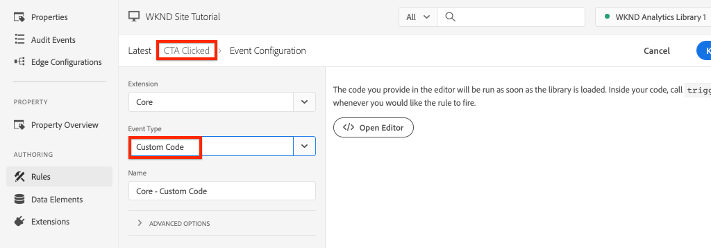

# Rastrear componente clicado com o Adobe Analytics

Use a [Camada de Dados de Clientes Adobe com Componentes Principais do AEM](https://experienceleague.adobe.com/docs/experience-manager-core-components/using/developing/data-layer/overview.html?lang=pt-BR) orientada por eventos para rastrear cliques de componentes específicos em um site do Adobe Experience Manager. Saiba como usar regras na propriedade de tag para acompanhar eventos de clique, filtrar por componente e enviar os dados para uma Adobe Analytics com um beacon de rastreamento de link.

## O que você vai criar {#what-build}

A equipe de marketing da WKND está interessada em saber quais botões do `Call to Action (CTA)` estão tendo o melhor desempenho na página inicial. Neste tutorial, vamos adicionar uma regra à propriedade de tag que escuta os eventos `cmp:click` de componentes de **Teaser** e **Botão**. Em seguida, envie a ID do componente e um novo evento para a Adobe Analytics junto com o beacon de rastreamento de link.


### Objetivos {#objective}

1. Crie uma regra orientada por eventos na propriedade de marca que capture o evento `cmp:click`.
1. Filtre os diferentes eventos por tipo de recurso do componente.
1. Defina a ID do componente e envie um evento para a Adobe Analytics com o sinal de rastreamento de link.

## Pré-requisitos

Este tutorial é uma continuação do [Coletar dados de página com o Adobe Analytics](./collect-data-analytics.md) e presume que você tenha:

* Uma **propriedade de marca** com a [extensão do Adobe Analytics](https://experienceleague.adobe.com/docs/experience-platform/tags/extensions/client/analytics/overview.html) habilitada
* Servidor de rastreamento e ID do conjunto de relatórios de teste/desenvolvimento do **Adobe Analytics**. Consulte a documentação a seguir para [criar um conjunto de relatórios](https://experienceleague.adobe.com/docs/analytics/admin/admin-tools/manage-report-suites/c-new-report-suite/new-report-suite.html).
* Extensão do navegador do [Experience Platform Debugger](https://experienceleague.adobe.com/docs/platform-learn/data-collection/debugger/overview.html) configurada com a propriedade da marca carregada no [site WKND](https://wknd.site/us/en.html) ou em um site AEM com a Camada de Dados do Adobe habilitada.

## Inspecionar o botão e o esquema de teaser

Antes de criar regras na propriedade da tag, é útil revisar o esquema [para o Botão e o Teaser](https://experienceleague.adobe.com/docs/experience-manager-core-components/using/developing/data-layer/overview.html#item) e inspecioná-los na implementação da camada de dados.

1. Navegue até a [Página inicial da WKND](https://wknd.site/us/en.html)
1. Abra as ferramentas de desenvolvedor do navegador e navegue até o **Console**. Execute o seguinte comando:

   ```js
   adobeDataLayer.getState();
   ```

   O código acima retorna o estado atual da Camada de dados de clientes Adobe.

   

1. Expanda a resposta e localize as entradas com prefixo `button-` e `teaser-xyz-cta`. Você deve ver um schema de dados como o seguinte:

   Esquema do botão:

   ```json
   button-2e6d32893a:
       @type: "wknd/components/button"
       dc:title: "View All"
       parentId: "page-2eee4f8914"
       repo:modifyDate: "2020-07-11T22:17:55Z"
       xdm:linkURL: "/content/wknd/us/en/magazine.html"
   ```

   Esquema de teaser:

   ```json
   teaser-da32481ec8-cta-adf3c09db9:
       @type: "wknd/components/teaser/cta"
       dc:title: "Surf's Up"
       parentId: "teaser-da32481ec8"
       xdm:linkURL: "/content/wknd/us/en/magazine/san-diego-surf.html"
   ```

   Os detalhes de dados acima se baseiam no [Esquema de itens de Componentes/Contêineres](https://experienceleague.adobe.com/docs/experience-manager-core-components/using/developing/data-layer/overview.html#item). A nova regra de tag usa esse esquema.

## Criar uma regra clicada do CTA

A Camada de Dados de Clientes Adobe é uma camada de dados orientada por **evento**. Sempre que qualquer Componente principal é clicado, um evento `cmp:click` é despachado por meio da camada de dados. Para ouvir o evento `cmp:click`, vamos criar uma regra.

1. Navegue até o Experience Platform e para a propriedade de tag integrada ao site do AEM.
1. Navegue até a seção **Regras** na interface do usuário da Propriedade de Marca e clique em **Adicionar Regra**.
1. Nomeie a regra **Em que o CTA clicou**.
1. Clique em **Eventos** > **Adicionar** para abrir o assistente de **Configuração de Evento**.
1. Para o campo **Tipo de evento**, selecione **Código personalizado**.

   

1. Clique em **Abrir editor** no painel principal e insira o seguinte trecho de código:

   ```js
   var componentClickedHandler = function(evt) {
      // defensive coding to avoid a null pointer exception
      if(evt.hasOwnProperty("eventInfo") && evt.eventInfo.hasOwnProperty("path")) {
         //trigger Tag Rule and pass event
         console.debug("cmp:click event: " + evt.eventInfo.path);
         var event = {
            //include the path of the component that triggered the event
            path: evt.eventInfo.path,
            //get the state of the component that triggered the event
            component: window.adobeDataLayer.getState(evt.eventInfo.path)
         };
   
         //Trigger the Tag Rule, passing in the new `event` object
         // the `event` obj can now be referenced by the reserved name `event` by other Tag Property data elements
         // i.e `event.component['someKey']`
         trigger(event);
      }
   }
   
   //set the namespace to avoid a potential race condition
   window.adobeDataLayer = window.adobeDataLayer || [];
   //push the event listener for cmp:click into the data layer
   window.adobeDataLayer.push(function (dl) {
      //add event listener for `cmp:click` and callback to the `componentClickedHandler` function
      dl.addEventListener("cmp:click", componentClickedHandler);
   });
   ```

   O trecho de código acima adiciona um ouvinte de eventos ao [enviar uma função](https://github.com/adobe/adobe-client-data-layer/wiki#pushing-a-function) para a camada de dados. Sempre que o evento `cmp:click` for acionado, a função `componentClickedHandler` será chamada. Nesta função, algumas verificações de integridade são adicionadas e um novo objeto `event` é construído com o [estado mais recente da camada de dados](https://github.com/adobe/adobe-client-data-layer/wiki#getstate) para o componente que acionou o evento.

   Finalmente, a função `trigger(event)` é chamada. A função `trigger()` é um nome reservado na propriedade de marca e **aciona** a regra. O objeto `event` é passado como um parâmetro que, por sua vez, é exposto por outro nome reservado na propriedade de marca. Os elementos de dados na propriedade da marca agora podem fazer referência a várias propriedades usando o trecho de código como `event.component['someKey']`.

1. Salve as alterações.
1. Em seguida, em **Ações**, clique em **Adicionar** para abrir o assistente de **Configuração de Ação**.
1. Para o campo **Tipo de ação**, escolha **Código personalizado**.

   

1. Clique em **Abrir editor** no painel principal e insira o seguinte trecho de código:

   ```js
   console.debug("Component Clicked");
   console.debug("Component Path: " + event.path);
   console.debug("Component type: " + event.component['@type']);
   console.debug("Component text: " + event.component['dc:title']);
   ```

   O objeto `event` é passado do método `trigger()` chamado no evento personalizado. O objeto `component` é o estado atual do componente derivado do método `getState()` da camada de dados e é o elemento que provocou o clique.

1. Salve as alterações e execute uma [compilação](https://experienceleague.adobe.com/docs/experience-platform/tags/publish/builds.html) na propriedade da marca para promover o código ao [ambiente](https://experienceleague.adobe.com/docs/experience-platform/tags/publish/environments/environments.html?lang=pt-BR) usado no site do AEM.

   >[!NOTE]
   >
   > Pode ser útil usar o [Adobe Experience Platform Debugger](https://experienceleague.adobe.com/docs/platform-learn/data-collection/debugger/overview.html) para alternar o código de inserção para um ambiente de **Desenvolvimento**.

1. Navegue até o [Site WKND](https://wknd.site/us/en.html) e abra as ferramentas do desenvolvedor para exibir o console. Além disso, marque a caixa de seleção **Preservar log**.

1. Clique em um dos botões CTA **Teaser** ou **Button** para navegar para outra página.

   

1. Observe no console do desenvolvedor que a regra **CTA Clicados** foi acionada:

   

## Criar elementos de dados

Em seguida, crie um Elemento de dados para capturar a ID do componente e o título que foi clicado. Lembre-se que no exercício anterior, a saída de `event.path` era algo semelhante a `component.button-b6562c963d` e o valor de `event.component['dc:title']` era algo como &quot;Exibir Percursos&quot;.

### ID de componente

1. Navegue até o Experience Platform e para a propriedade de tag integrada ao site do AEM.
1. Navegue até a seção **Elementos de Dados** e clique em **Adicionar Novo Elemento de Dados**.
1. Para o campo **Nome**, insira **ID do Componente**.
1. Para o campo **Tipo de elemento de dados**, selecione **Código personalizado**.

   

1. Clique no botão **Abrir editor** e insira o seguinte no editor de código personalizado:

   ```js
   if(event && event.path && event.path.includes('.')) {
       // split on the `.` to return just the component ID
       return event.path.split('.')[1];
   }
   ```

1. Salve as alterações.

   >[!NOTE]
   >
   > Lembre-se de que o objeto `event` está disponível e com escopo baseado no evento que acionou a **Regra** na propriedade de marca. O valor de um Elemento de Dados não é definido até que o Elemento de Dados seja *referenciado* em uma Regra. Portanto, é seguro usar este Elemento de Dados dentro de uma Regra como a regra **Página Carregada** criada na etapa anterior *mas* não seria segura para uso em outros contextos.


### Título do componente

1. Navegue até a seção **Elementos de Dados** e clique em **Adicionar Novo Elemento de Dados**.
1. Para o campo **Nome**, insira **Título do Componente**.
1. Para o campo **Tipo de elemento de dados**, selecione **Código personalizado**.
1. Clique no botão **Abrir editor** e insira o seguinte no editor de código personalizado:

   ```js
   if(event && event.component && event.component.hasOwnProperty('dc:title')) {
       return event.component['dc:title'];
   }
   ```

1. Salve as alterações.

## Adicionar uma condição à regra Clicada no CTA

Em seguida, atualize a regra **CTA Clicados** para garantir que a regra só seja acionada quando o evento `cmp:click` for acionado para um **Teaser** ou um **Botão**. Como o CTA do Teaser é considerado um objeto separado na camada de dados, é importante verificar se o pai veio de um Teaser.

1. Na interface da Propriedade de Marca, navegue até a regra **CTA Clicado** criada anteriormente.
1. Em **Condições**, clique em **Adicionar** para abrir o assistente de **Configuração de Condição**.
1. Para o campo **Tipo de Condição**, selecione **Código Personalizado**.

   

1. Clique em **Abrir editor** e insira o seguinte no editor de código personalizado:

   ```js
   if(event && event.component && event.component.hasOwnProperty('@type')) {
       // console.log("Event Type: " + event.component['@type']);
       //Check for Button Type OR Teaser CTA type
       if(event.component['@type'] === 'wknd/components/button' ||
          event.component['@type'] === 'wknd/components/teaser/cta') {
           return true;
       }
   }
   
   // none of the conditions are met, return false
   return false;
   ```

   O código acima verifica primeiro se o tipo de recurso era de um **Botão** ou se era de um CTA em um **Teaser**.

1. Salve as alterações.

## Definir variáveis do Analytics e acionar o beacon de rastreamento de link

Atualmente, a regra **CTA Clicados** simplesmente gera uma instrução de console. Em seguida, use os elementos de dados e a extensão do Analytics para definir as variáveis do Analytics como uma **ação**. Também vamos definir uma ação extra para acionar o **Rastrear link** e enviar os dados coletados para a Adobe Analytics.

1. Na regra **CTA Clicado**, **remova** a ação **Núcleo - Código Personalizado** (as instruções do console):

   

1. Em Ações, clique em **Adicionar** para criar uma ação.
1. Defina o tipo **Extensão** como **Adobe Analytics** e defina o **Tipo de Ação** como **Definir Variáveis**.

1. Defina os seguintes valores para **eVars**, **Props** e **Events**:

   * `evar8` - `%Component ID%`
   * `prop8` - `%Component ID%`
   * `event8`

   

   >[!NOTE]
   >
   > Aqui, `%Component ID%` é usado, pois garante um identificador exclusivo para o CTA que foi clicado. Uma possível desvantagem de usar `%Component ID%` é que o relatório do Analytics contém valores como `button-2e6d32893a`. O uso de `%Component Title%` daria um nome mais amigável, mas o valor pode não ser exclusivo.

1. Em seguida, adicione uma Ação extra à direita de **Adobe Analytics - Definir Variáveis** tocando no ícone **mais**:

   

1. Defina o tipo **Extensão** como **Adobe Analytics** e defina o **Tipo de Ação** como **Enviar Beacon**.
1. Em **Tracking**, defina o botão de opção como **`s.tl()`**.
1. Para o campo **Tipo de Link**, escolha **Link Personalizado** e, para o **Nome do Link**, defina o valor como: **`%Component Title%: CTA Clicked`**:

   

   A configuração acima combina a variável dinâmica do elemento de dados **Título do Componente** e a cadeia de caracteres estática **CTA Clicked**.

1. Salve as alterações. A regra **CTA Clicado** agora deve ter a seguinte configuração:

   

   * **1.** Ouça o evento `cmp:click`.
   * **2.** Verifique se o evento foi acionado por um **Botão** ou **Teaser**.
   * **3.** Defina as variáveis do Analytics para rastrear a **ID do Componente** como um **eVar**, **prop** e um **evento**.
   * **4.** Enviar o sinal de rastreamento de link do Analytics (e **não** tratá-lo como uma exibição de página).

1. Salve todas as alterações e crie sua biblioteca de tags, promovendo para o ambiente apropriado.

## Validar o beacon de rastreamento de link e a chamada do Analytics

Agora que a regra **CTA clicado** envia o beacon do Analytics, você poderá ver as variáveis de rastreamento do Analytics usando o Experience Platform Debugger.

1. Abra o [Site WKND](https://wknd.site/us/en.html) em seu navegador.
1. Clique no ícone Depurador  para abrir o Experience Platform Debugger.
1. Verifique se o Depurador está mapeando a propriedade da tag para o *seu* ambiente de desenvolvimento, conforme descrito anteriormente, e se o **Log do console** está marcado.
1. Abra o menu do Analytics e verifique se o conjunto de relatórios está definido como *seu* conjunto de relatórios.

   

1. No navegador, clique em um dos botões CTA **Teaser** ou **Botão** para navegar para outra página.

   

1. Retorne ao Experience Platform Debugger, role para baixo e expanda **Solicitações de rede** > *Seu conjunto de relatórios*. Você deve encontrar o conjunto **eVar**, **prop** e **event**.

   

1. Retorne ao navegador e abra o console do desenvolvedor. Navegue até o rodapé do site e clique em um dos links de navegação:

   

1. Observe que no console do navegador a mensagem *&quot;Código personalizado&quot; para a regra &quot;CTA clicado&quot; não foi atendida*.

   A mensagem acima ocorre porque o componente de Navegação não dispara um evento `cmp:click` *but* devido à [Condição para a regra](#add-a-condition-to-the-cta-clicked-rule) que verifica o tipo de recurso em que nenhuma ação é executada.

   >[!NOTE]
   >
   > Se você não visualizar nenhum log de console, verifique se a opção **Log de console** está marcada em **Tags do Experience Platform** no Experience Platform Debugger.

## Parabéns.

Você acabou de usar a Camada de dados de clientes Adobe orientada por eventos e a Tag no Experience Platform para rastrear os cliques de componentes específicos em um site do AEM.
