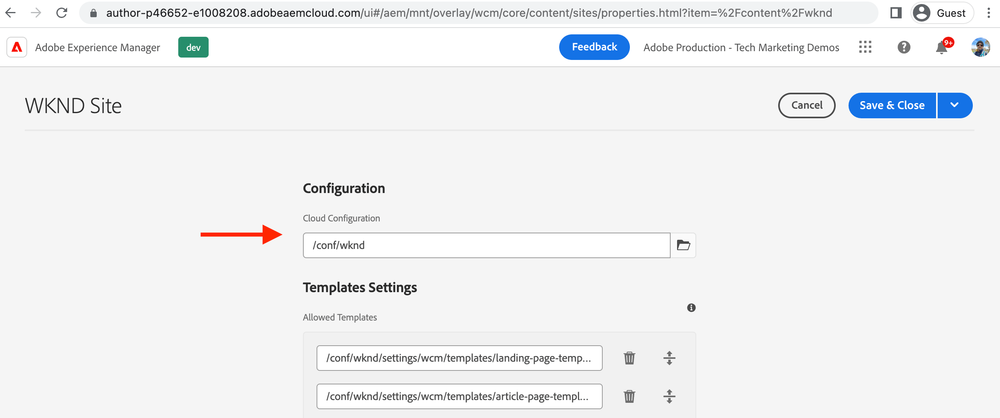

# Criar uma configuração de Cloud Service de tags no AEM {#create-launch-cloud-service}

Saiba como criar uma configuração de Cloud Service de tags no Adobe Experience Manager. A configuração de Cloud Service das tags do AEM pode ser aplicada a um site existente, e as bibliotecas de tags podem ser observadas nos ambientes Autor e Publish.

## Criar serviço de nuvem de tags

Crie a configuração do serviço de nuvem de tags usando as etapas abaixo.

1. No menu **Ferramentas**, selecione a seção **Cloud Service** e clique em **Configurações do Adobe Launch**
1. Selecione a pasta de configuração do seu site ou selecione **Site WKND** (se estiver usando o projeto do guia WKND) e clique em **Criar**
1. Na guia _Geral_, nomeie sua configuração usando o campo **Título** e selecione **Adobe Launch** na lista suspensa _Configuração de Adobe IMS associada_. Em seguida, selecione o nome da sua empresa na lista suspensa _Empresa_ e selecione a propriedade criada anteriormente na lista suspensa _Propriedade_.
1. Na guia _Preparo_ e _Produção_, mantenha as configurações padrão. No entanto, é recomendável revisar e alterar as configurações para a configuração de produção real, especificamente a opção _Carregar biblioteca de forma assíncrona_, com base em seus requisitos de desempenho e otimização. Observe também que o valor do _URI da biblioteca_ é diferente para Preparo e Produção.
1. Finalmente, clique em **Criar** para concluir os serviços de nuvem de tags.

   

## Aplicar serviço de nuvem de tags ao site

Para carregar a propriedade Tag e suas bibliotecas no site AEM, a configuração do serviço de nuvem de tags é aplicada ao site. Na etapa anterior, a configuração do serviço de nuvem é criada na pasta de nome do site (Site WKND), para que seja aplicada automaticamente, vamos verificá-la.

1. No menu **Navegação**, selecione o ícone **Sites**.

1. Selecione a página raiz do site AEM e clique em **Propriedades**. Em seguida, navegue até a guia **Avançado** e, na seção **Configuração**, verifique se o valor da Configuração na Nuvem aponta para a pasta `conf` específica do site.

   

## Verificar o carregamento da propriedade Tag nas páginas Autor e Publish

Agora é hora de verificar se a propriedade Tag e suas bibliotecas estão carregadas na página do site AEM.

1. Abra a página de seu site favorito no modo **Exibir como Publicado**. No console do navegador, você deverá ver a mensagem de log. É a mesma mensagem do trecho de código JavaScript da Regra de propriedade de Marca que é acionada quando o evento _Biblioteca carregada (Início da Página)_ é acionado.

1. Para verificar no Publish, primeiro publique a configuração do **serviço de nuvem de tags** e abra a página do site na instância do Publish.

   

Parabéns! Você concluiu a integração do AEM e da tag de coleta de dados que injeta o código do JavaScript no site do AEM sem atualizar o código do projeto do AEM.

## Desafio - atualizar e publicar regra na propriedade Tag

Use as lições aprendidas com a [Criar uma Propriedade de Marca](./create-tag-property.md) anterior para concluir o desafio simples, atualizar a Regra existente para adicionar uma instrução de console adicional e usar o _Fluxo de Publicação_ para implantá-lo no site do AEM.

## Próximas etapas

[Depuração de uma implementação de tags](debug-tags-implementation.md)
