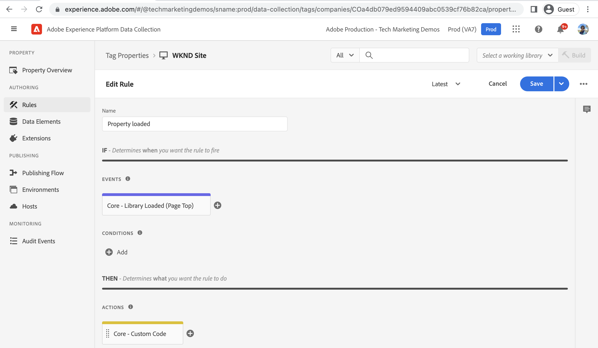

# Criar uma propriedade de tag {#create-tag-property}

Saiba como criar uma propriedade de tag com a configuração mínima para integrar com o Adobe Experience Manager. Os usuários são introduzidos na interface do usuário da tag e sabem mais sobre extensões, regras e fluxos de trabalho de publicação.

>[!VIDEO](https://video.tv.adobe.com/v/38553?quality=12&learn=on)

## Criação de propriedade de tag

Para criar uma propriedade de tag, conclua as etapas a seguir.

1. No navegador, navegue até a janela [Página inicial do Adobe Experience Cloud](https://experience.adobe.com/) e faça logon usando sua Adobe ID.

1. Clique em **Coleta de dados** aplicação a partir do _Acesso rápido_ seção da página inicial do Adobe Experience Cloud.

1. Clique em **Tags** item de menu no painel de navegação esquerdo e clique em **Nova propriedade** do canto superior direito.

1. Nomeie a propriedade Tag usando o **Nome** campo obrigatório. No campo Domínios, digite o nome do domínio ou, se estiver usando o ambiente AEM as a Cloud Service, digite `adobeaemcloud.com` e clique em **Salvar**.

   

## Criar uma nova regra

Abra a propriedade de tag recém-criada clicando no nome na tag **Propriedades da tag** exibição. Também em _Minha atividade recente_ você deve ver que a extensão principal foi adicionada a ele. A extensão de tag principal é a extensão padrão e fornece tipos de evento fundamentais, como carregamento de página, navegador, formulário e outros tipos de evento. Consulte [Visão geral da extensão principal](https://experienceleague.adobe.com/docs/experience-platform/tags/extensions/client/core/overview.html) para obter mais informações.

As regras permitem especificar o que deve acontecer quando o visitante interagir com o site AEM. Para simplificar, vamos registrar duas mensagens no console do navegador para demonstrar como a integração de tags de coleta de dados pode injetar código JavaScript no site AEM sem atualizar o código do projeto AEM.

Para criar uma regra, conclua as etapas a seguir.

1. Clique em **Regras** do _CRIAÇÃO_ da navegação à esquerda e clique em **Criar nova regra**

1. Nomeie a regra usando o **Nome** campo obrigatório.

1. Clique em **Adicionar** do _EVENTOS_ , depois no campo _Configuração de evento_ formulário, no campo **Tipo de evento** seleção suspensa _Biblioteca carregada (início da página)_ e clique em **Manter alterações**.

1. Clique em **Adicionar** do _AÇÕES_ , depois no campo _Configuração de ação_ formulário, no campo **Tipo de ação** seleção suspensa _Custom Code_ e clique em **Abrir editor**.

1. No _Editar código_ modal, insira o seguinte trecho de código JavaScript e clique em **Salvar** e, por fim, clique em **Manter alterações**.

   ```javascript
   console.log('Tags Property loaded, all set for...');
   console.log('capabilities such as capturing data, conversion tracking and delivering unique and personalized experiences');
   ```

1. Clique em **Salvar** para concluir o processo de criação da regra.

   

## Adicionar biblioteca e publicá-la

A propriedade Tag _Regras_ forem ativados usando uma biblioteca, considere a biblioteca como um pacote que contém o código JavaScript. Ative a regra recém-criada seguindo as etapas.

1. Clique em **Fluxo de publicação** do _PUBLICAÇÃO_ da navegação à esquerda e clique em **Adicionar biblioteca**

1. Nomeie sua biblioteca usando o **Nome** e selecione _Desenvolvimento (desenvolvimento)_ opção para **Ambiente** lista suspensa.

1. Para selecionar todos os recursos alterados desde a criação da propriedade Tag, clique em **+ Adicionar todos os recursos alterados**. Essa ação adiciona a regra recém-criada e o recurso da extensão principal à biblioteca. Por fim, clique em **Salvar e criar no desenvolvimento**.

1. Depois que a biblioteca for criada para o **Desenvolvimento** pista de natação, uso _reticências_ selecione o **Enviar para aprovação**

1. Em seguida, no **Enviado** pista de natação usando _reticências_ selecione o **Aprovar para publicação**, da mesma forma **Criar e publicar na produção** no **Aprovado** pista de natação.


A etapa acima conclui a criação da propriedade Tag simples, que tem uma regra para registrar uma mensagem no console do navegador quando a página é carregada. Além disso, a regra e a extensão principal são publicadas ao criar uma biblioteca.

## Próximas etapas

[Conectar o AEM com a propriedade de tag usando IMS](connect-aem-tag-property-using-ims.md)


## Recursos adicionais {#additional-resources}

* [Criar uma propriedade de tag](https://experienceleague.adobe.com/docs/platform-learn/implement-in-websites/configure-tags/create-a-property.html)
