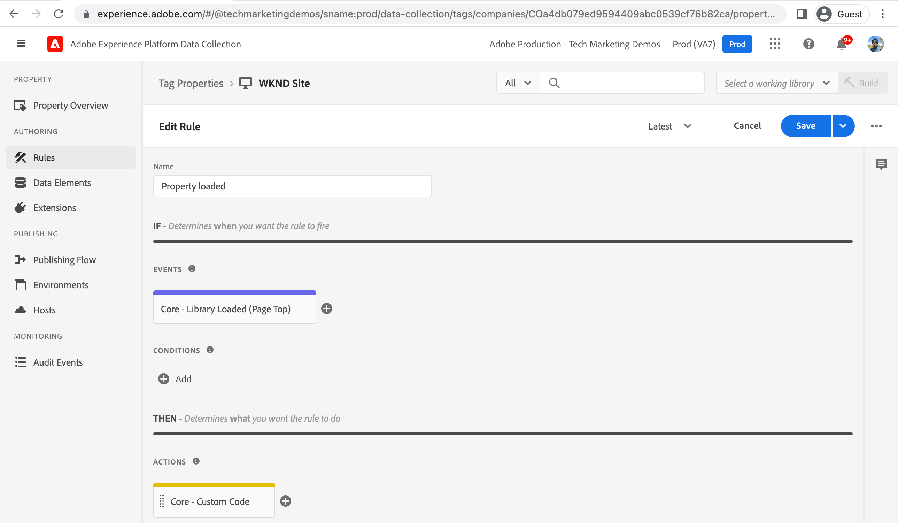

# Criar uma propriedade de tag {#create-tag-property}

Saiba como criar uma propriedade de tag com a configuração mínima a ser integrada ao Adobe Experience Manager. Os usuários são introduzidos na interface do usuário de tags e aprendem sobre extensões, regras e fluxos de trabalho de publicação.

>[!VIDEO](https://video.tv.adobe.com/v/38553?quality=12&learn=on)

## Criação da propriedade tag

Para criar uma propriedade Tag , conclua as seguintes etapas.

1. No navegador, navegue até o [Página inicial do Adobe Experience Cloud](https://experience.adobe.com/) e faça logon usando sua Adobe ID.

1. Clique no botão **Coleta de dados** do _Acesso rápido_ da página inicial do Adobe Experience Cloud.

1. Clique no botão **Tags** item de menu na navegação à esquerda e clique em **Nova propriedade** do canto superior direito.

1. Nomeie sua propriedade da Tag usando o **Nome** campo obrigatório. No campo Domínios , insira o nome de domínio ou, se estiver usando AEM ambiente as a Cloud Service, insira `adobeaemcloud.com` e clique em **Salvar**.

   

## Criar uma nova regra

Abra a propriedade Tag recém-criada clicando no nome na guia **Propriedades da tag** exibir. Também em _Minha Atividade Recente_ deve ver que a extensão principal foi adicionada a ele. A extensão de tag principal é a extensão padrão e fornece tipos de evento essenciais, como carregamento de página, navegador, formulário e outros tipos de evento, consulte [Visão geral da extensão principal](https://experienceleague.adobe.com/docs/experience-platform/tags/extensions/client/core/overview.html) para obter mais informações.

As regras permitem especificar o que deve ocorrer quando o visitante interagir com o site de AEM. Para simplificar as coisas, vamos registrar duas mensagens no console do navegador para demonstrar como a integração da tag de coleta de dados pode injetar código JavaScript no seu site AEM sem atualizar AEM código do projeto.

Para criar uma regra, conclua as etapas a seguir.

1. Clique em **Regras** do _CRIAÇÃO_ seção da navegação à esquerda e clique em **Criar nova regra**

1. Nomeie sua regra usando o **Nome** campo obrigatório.

1. Clique em **Adicionar** do _EVENTOS_ em seguida, na seção _Configuração de evento_ , no **Tipo de evento** seleção suspensa _Biblioteca carregada (início da página)_ e clique em **Manter alterações**.

1. Clique em **Adicionar** do _AÇÕES_ em seguida, na seção _Configuração de ação_ , no **Tipo de ação** seleção suspensa _Código personalizado_ e clique em **Abrir editor**.

1. No _Editar código_ modal, insira o trecho de código JavaScript a seguir e clique em **Salvar** e, por fim, clique em **Manter alterações**.

   ```javascript
   console.log('Tags Property loaded, all set for...');
   console.log('capabilities such as capturing data, conversion tracking and delivering unique and personalized experiences');
   ```

1. Clique em **Salvar** para concluir o processo de criação da regra.

   

## Adicionar biblioteca e publicá-la

A propriedade Tag _Regras_ forem ativados usando uma biblioteca, considere a biblioteca como um pacote contendo código JavaScript. Ative a regra recém-criada seguindo as etapas.

1. Clique em **Fluxo de publicação** do _PUBLICAÇÃO_ seção da navegação à esquerda e clique em **Adicionar biblioteca**

1. Dê um nome à biblioteca usando o **Nome** e selecione _Desenvolvimento (desenvolvimento)_ opção para **Ambiente** lista suspensa.

1. Para selecionar todos os recursos alterados desde a criação da propriedade Tag , clique em **+ Adicionar todos os recursos alterados**. Essa ação adiciona a regra recém-criada e o recurso de extensão principal à biblioteca. Clique finalmente **Salvar e criar no desenvolvimento**.

1. Depois que a biblioteca for criada para a variável **Desenvolvimento** faixa de natação, usando _elipses_ selecione o **Enviar para aprovação**

1. Em seguida, na **Enviado** faixa de natação usando _elipses_ selecione o **Aprovar para publicação**, igualmente **Criar e publicar na produção** no **Aprovado** faixa natatória.


A etapa acima conclui a criação de uma propriedade de tag simples que tem uma regra para registrar uma mensagem no console do navegador quando a página é carregada. Além disso, a regra e a extensão principal são publicadas criando uma biblioteca do .

## Próximas etapas

[Conectar AEM com propriedade de tag usando IMS](connect-aem-tag-property-using-ims.md)


## Recursos adicionais {#additional-resources}

* [Criar uma propriedade de tag](https://experienceleague.adobe.com/docs/platform-learn/implement-in-websites/configure-tags/create-a-property.html)
