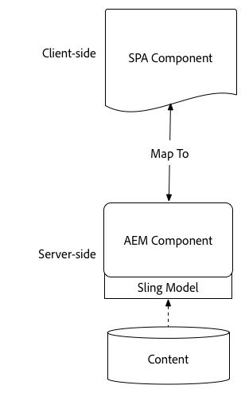
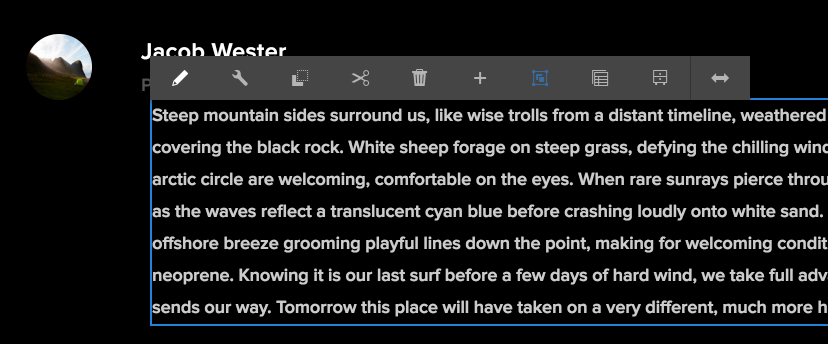

# Desenvolvimento com o Editor SPA AEM - Tutorial Hello World {#developing-with-the-aem-spa-editor-hello-world-tutorial}

>[!WARNING]
>
> Este tutorial está **obsoleto**. É recomendável seguir: [Introdução ao Editor SPA AEM e Angular](https://docs.adobe.com/content/help/en/experience-manager-learn/spa-angular-tutorial/overview.html) ou [Introdução ao Editor SPA AEM e Reação](https://docs.adobe.com/content/help/en/experience-manager-learn/spa-react-tutorial/overview.html)

AEM Editor SPA fornece suporte para a edição no contexto de um aplicativo de página única ou SPA. Este tutorial é uma introdução ao desenvolvimento SPA a ser usado com AEM SDK JS do Editor SPA. O tutorial estenderá o aplicativo Journal We.Retail adicionando um componente personalizado Hello World. Os usuários podem concluir o tutorial usando estruturas React ou Angular.

>[!NOTE]
>
> O recurso Editor de aplicativo de página única (SPA) requer AEM 6.4 service pack 2 ou mais recente.
>
> O Editor SPA é a solução recomendada para projetos que exigem renderização do lado do cliente baseada em estrutura SPA (por exemplo, Reagir ou Angular).

## Leitura de pré-requisito {#prereq}

Este tutorial destina-se a destacar as etapas necessárias para mapear um componente SPA para um componente AEM para permitir a edição no contexto. Os usuários que iniciarem este tutorial devem conhecer conceitos básicos de desenvolvimento com a Adobe Experience Manager, AEM, bem como desenvolver o React of Angular frameworks. O tutorial cobre tarefas de desenvolvimento tanto de backend quanto de front-end.

Recomenda-se que os seguintes recursos sejam revisados antes de iniciar este tutorial:

* [Vídeo](spa-editor-framework-feature-video-use.md) de recurso do editor SPA - Uma visão geral em vídeo do editor SPA e do aplicativo de Journal We.Retail.
* [Tutorial](https://reactjs.org/tutorial/tutorial.html) React.js - uma introdução ao desenvolvimento com a estrutura React.
* [Tutorial](https://angular.io/tutorial) Angular - Uma introdução ao desenvolvimento com o Angular

## Ambiente de desenvolvimento local {#local-dev}

Este tutorial foi projetado para:

[Adobe Experience Manager 6.5](https://helpx.adobe.com/experience-manager/6-5/release-notes.html) ou [Adobe Experience Manager 6.4](https://helpx.adobe.com/experience-manager/6-4/sites/deploying/using/technical-requirements.html) + [Service Pack 5](https://helpx.adobe.com/experience-manager/6-4/release-notes/sp-release-notes.html)

Neste tutorial, as seguintes tecnologias e ferramentas devem ser instaladas:

1. [Java 11](https://downloads.experiencecloud.adobe.com/content/software-distribution/en/general.html)
2. [Apache Maven - 3.3.1+](https://maven.apache.org/)
3. [Node.js - 8.11.1+](https://nodejs.org/en/) e npm 5.6.0+ (npm é instalado com node.js)

O duplo verifica a instalação das ferramentas acima, abrindo um novo terminal e executando o seguinte:

```shell
$ java -version
java version "11 +"

$ mvn -version
Apache Maven 3.3.9

$ node --version
v8.11.1

$ npm --version
6.1.0
```

## Visão geral {#overview}

O conceito básico é mapear um componente SPA para um componente AEM. AEM componentes, executando o lado do servidor, exporte conteúdo na forma de JSON. O conteúdo JSON é consumido pelo SPA, executando o lado do cliente no navegador. Um mapeamento 1:1 entre componentes SPA e um componente AEM é criado.



Estruturas populares [Reage JS](https://reactjs.org/) e [Angular](https://angular.io/) são suportados prontamente. Os usuários podem concluir este tutorial em Angular ou Reagir, qualquer estrutura com a qual estejam mais confortáveis.

## Configuração do projeto {#project-setup}

O desenvolvimento da ZPE tem um pé no desenvolvimento AEM e o outro fora. O objetivo é permitir que o desenvolvimento de SPA ocorra de forma independente e (principalmente) agnóstico à AEM.

* Os projetos SPA podem operar independentemente do projeto AEM durante o desenvolvimento de front-end.
* Ferramentas e tecnologias de criação de front-end como Webpack, NPM [!DNL Grunt] e [!DNL Gulp]continuar a ser usadas.
* Para criar para AEM, o projeto SPA é compilado e automaticamente incluído no projeto AEM.
* Pacotes de AEM padrão usados para implantar o SPA em AEM.


*O desenvolvimento da ZPE tem um pé no desenvolvimento AEM e o outro fora - permitindo que o desenvolvimento da ZPE ocorra de forma independente e (principalmente) agnóstico à AEM.*

O objetivo deste tutorial é estender o aplicativo de Journal We.Retail com um novo componente. Start baixando o código fonte do aplicativo de Journal We.Retail e implantando em um AEM local.

1. **Baixe** o código de Journal [We.Retail mais recente do GitHub](https://github.com/adobe/aem-sample-we-retail-journal).

   Ou clone o repositório na linha de comando:

   ```shell
   $ git clone git@github.com:adobe/aem-sample-we-retail-journal.git
   ```

   >[!NOTE]
   >
   >O tutorial estará trabalhando em relação à ramificação **principal** com a versão **1.2.1-SNAPSHOT** do projeto.

1. A seguinte estrutura deve ser visível:

   

   O projeto contém os seguintes módulos maven:

   * `all`: Incorpora e instala o projeto inteiro em um único pacote.
   * `bundles`: Contém dois pacotes OSGi: commons e core que contêm [!DNL Sling Models] e outros códigos Java.
   * `ui.apps`: contém as partes /apps do projeto, ou seja, clientes JS e CSS, componentes, configurações específicas do modo de execução.
   * `ui.content`: contém conteúdo estrutural e configurações (`/content`, `/conf`)
   * `react-app`: Aplicativo de Reação de Journal We.Retail. Este é um módulo Maven e um projeto de webpack.
   * `angular-app`: Aplicação Angular de Journal We.Retail. Este é um [!DNL Maven] módulo e um projeto de webpack.

1. Abra uma nova janela de terminal e execute o seguinte comando para criar e implantar o aplicativo inteiro em uma instância AEM local em execução em [http://localhost:4502](http://localhost:4502).

   ```shell
   $ cd <src>/aem-sample-we-retail-journal
   $ mvn -PautoInstallSinglePackage clean install
   ```

   >[!NOTE]
   >
   > Neste projeto, o perfil Maven para criar e disponibilizar o projeto inteiro é `autoInstallSinglePackage`

   >[!CAUTION]
   >
   > Se você receber um erro durante a compilação, [verifique se o arquivo Maven settings.xml inclui o repositório de artefatos Maven](https://helpx.adobe.com/experience-manager/kb/SetUpTheAdobeMavenRepository.html).

1. Vá até:

   * [http://localhost:4502/editor.html/content/we-retail-journal/react/en/home.html](http://localhost:4502/editor.html/content/we-retail-journal/react/en/home.html)
   * [http://localhost:4502/editor.html/content/we-retail-journal/angular/en/home.html](http://localhost:4502/editor.html/content/we-retail-journal/angular/en/home.html)

   O aplicativo de Journal We.Retail deve ser exibido no editor do AEM Sites.

1. No modo [!UICONTROL Editar] , selecione um componente para editar e fazer uma atualização do conteúdo.

   

1. Selecione o ícone Propriedades [!UICONTROL da] página para abrir Propriedades [!UICONTROL da]página. Selecione [!UICONTROL Editar modelo] para abrir o modelo da página.

   

1. Na versão mais recente do Editor SPA, os modelos [](https://helpx.adobe.com/experience-manager/6-5/sites/developing/using/page-templates-editable.html) editáveis podem ser usados da mesma forma que nas implementações tradicionais de Sites. Isso será revisitado posteriormente com nosso componente personalizado.

   >[!NOTE]
   >
   > Somente AEM 6.5 e AEM 6.4 + **Service Pack 5** suportam modelos editáveis.

## Visão geral do desenvolvimento {#development-overview}


As iterações de desenvolvimento de SPA ocorrem independentemente da AEM. Quando o SPA estiver pronto para ser implantado AEM as seguintes etapas de alto nível ocorrem (conforme ilustrado acima).

1. A construção do projeto AEM é chamada, o que, por sua vez, aciona uma criação do projeto SPA. O Journal We.Retail usa o plug-in [**frontende-maven-maven**](https://github.com/eirslett/frontend-maven-plugin).
1. O gerador aem-clientlib [****](https://www.npmjs.com/package/aem-clientlib-generator) do projeto do SPA incorpora o SPA compilado como uma Biblioteca de clientes AEM no projeto AEM.
1. O projeto AEM gera um pacote AEM, incluindo o SPA compilado, além de qualquer outro código AEM de suporte.

## Criar componente AEM {#aem-component}

**Persona: Desenvolvedor AEM**

Um componente AEM será criado primeiro. O componente AEM é responsável pela renderização das propriedades JSON que são lidas pelo componente React. O componente AEM também é responsável por fornecer uma caixa de diálogo para quaisquer propriedades editáveis do componente.

Usando [!DNL Eclipse], ou outro, [!DNL IDE]importe o projeto We.Retail Journal Maven.

1. Atualize o reator **pom.xml** para remover o [!DNL Apache Rat] plug-in. Este plug-in verifica cada arquivo para garantir que haja um cabeçalho de licença. Para nossos propósitos, não precisamos nos preocupar com essa funcionalidade.

   Em **aem-sample-we-retail-journal/pom.xml** remova o plug-in **apache-rate**:

   ```xml
   <!-- Remove apache-rat-plugin -->
   <plugin>
           <groupId>org.apache.rat</groupId>
           <artifactId>apache-rat-plugin</artifactId>
           <configuration>
               <excludes combine.children="append">
                   <exclude>*</exclude>
                       ...
               </excludes>
           </configuration>
           <executions>
                   <execution>
                       <phase>verify</phase>
                       <goals>
                           <goal>check</goal>
                       </goals>
               </execution>
           </executions>
       </plugin>
   ```

1. No módulo **we-retail-journal-content** (`<src>/aem-sample-we-retail-journal/ui.apps`), crie um novo nó `ui.apps/jcr_root/apps/we-retail-journal/components` chamado **helloworld** do tipo **cq:Component**.
1. Adicione as seguintes propriedades ao componente **helloworld** , representado no XML (`/helloworld/.content.xml`) abaixo:

   ```xml
   <?xml version="1.0" encoding="UTF-8"?>
   <jcr:root xmlns:cq="http://www.day.com/jcr/cq/1.0" xmlns:jcr="http://www.jcp.org/jcr/1.0"
       jcr:description="Hello World Component for We.Retail Journal"
       jcr:primaryType="cq:Component"
       jcr:title="Hello World"
       componentGroup="We.Retail Journal" />
   ```

   

   >[!NOTE]
   >
   > Para ilustrar o recurso Modelos editáveis, definimos o `componentGroup="Custom Components"`. Em um projeto real, é melhor minimizar o número de grupos de componentes, de modo que um grupo melhor seria &quot;[!DNL We.Retail Journal]&quot; para corresponder aos outros componentes de conteúdo.
   >
   > Somente AEM 6.5 e AEM 6.4 + **Service Pack 5** suportam modelos editáveis.

1. Em seguida, uma caixa de diálogo será criada para permitir que uma mensagem personalizada seja configurada para o componente **Hello World** . Abaixo, `/apps/we-retail-journal/components/helloworld` adicione um nome de nó **cq:dialog** de **nt:unstructed**.
1. A caixa de diálogo **** cq:exibirá um único campo de texto que persiste o texto em uma propriedade chamada **[!DNL message]**. Abaixo do **cq:dialog** recém-criado, adicione os seguintes nós e propriedades, representados em XML abaixo (`helloworld/_cq_dialog/.content.xml`):

   ```xml
   <?xml version="1.0" encoding="UTF-8"?>
   <jcr:root xmlns:sling="http://sling.apache.org/jcr/sling/1.0" xmlns:cq="http://www.day.com/jcr/cq/1.0" xmlns:jcr="http://www.jcp.org/jcr/1.0" xmlns:nt="http://www.jcp.org/jcr/nt/1.0"
       jcr:primaryType="nt:unstructured"
       jcr:title="We.Retail Journal - Hello World"
       sling:resourceType="cq/gui/components/authoring/dialog">
       <content
           jcr:primaryType="nt:unstructured"
           sling:resourceType="granite/ui/components/coral/foundation/container">
           <items jcr:primaryType="nt:unstructured">
               <tabs
                   jcr:primaryType="nt:unstructured"
                   sling:resourceType="granite/ui/components/coral/foundation/tabs"
                   maximized="{Boolean}true">
                   <items jcr:primaryType="nt:unstructured">
                       <properties
                           jcr:primaryType="nt:unstructured"
                           jcr:title="Properties"
                           sling:resourceType="granite/ui/components/coral/foundation/container"
                           margin="{Boolean}true">
                           <items jcr:primaryType="nt:unstructured">
                               <columns
                                   jcr:primaryType="nt:unstructured"
                                   sling:resourceType="granite/ui/components/coral/foundation/fixedcolumns"
                                   margin="{Boolean}true">
                                   <items jcr:primaryType="nt:unstructured">
                                       <column
                                           jcr:primaryType="nt:unstructured"
                                           sling:resourceType="granite/ui/components/coral/foundation/container">
                                           <items jcr:primaryType="nt:unstructured">
                                               <message
                                                   jcr:primaryType="nt:unstructured"
                                                   sling:resourceType="granite/ui/components/coral/foundation/form/textfield"
                                                   fieldLabel="Message"
                                                   name="./message"
                                                   required="{Boolean}true"/>
                                           </items>
                                       </column>
                                   </items>
                               </columns>
                           </items>
                       </properties>
                   </items>
               </tabs>
           </items>
       </content>
   </jcr:root>
   ```

   

   A definição do nó XML acima criará uma caixa de diálogo com um único campo de texto que permitirá que o usuário insira uma &quot;mensagem&quot;. Observe a propriedade `name="./message"` dentro do `<message />` nó. Esse é o nome da propriedade que será armazenada no JCR dentro do AEM.

1. Em seguida, uma caixa de diálogo de política vazia será criada (`cq:design_dialog`). A caixa de diálogo Política é necessária para ver o componente no Editor de modelos. Para este caso de uso simples, será uma caixa de diálogo vazia.

   Abaixo, `/apps/we-retail-journal/components/helloworld` adicione um nome `cq:design_dialog` de nó de `nt:unstructured`.

   A configuração é representada no XML abaixo (`helloworld/_cq_design_dialog/.content.xml`)

   ```xml
   <?xml version="1.0" encoding="UTF-8"?>
   <jcr:root xmlns:sling="http://sling.apache.org/jcr/sling/1.0" xmlns:cq="http://www.day.com/jcr/cq/1.0" xmlns:jcr="http://www.jcp.org/jcr/1.0" xmlns:nt="http://www.jcp.org/jcr/nt/1.0"
   jcr:primaryType="nt:unstructured" />
   ```

1. Implante a base de código para AEM da linha de comando:

   ```shell
   $ cd <src>/aem-sample-we-retail-journal/content
   $ mvn -PautoInstallPackage clean install
   ```

   No [CRXDE Lite](http://localhost:4502/crx/de/index.jsp#/apps/we-retail-journal/global/components/helloworld) , valide se o componente foi implantado inspecionando a pasta em `/apps/we-retail-journal/components:`

   

## Criar modelo Sling {#create-sling-model}

**Persona: Desenvolvedor AEM**

Em seguida, uma [!DNL Sling Model] é criada para fazer backup do [!DNL Hello World] componente. Em um caso de uso tradicional do WCM, o [!DNL Sling Model] implementa qualquer lógica comercial e um script de renderização do lado do servidor (HTL) fará uma chamada para o [!DNL Sling Model]. Isso mantém o script de renderização relativamente simples.

[!DNL Sling Models] também são usados no caso de uso do SPA para implementar a lógica comercial do lado do servidor. A diferença é que no caso de [!DNL SPA] uso, o [!DNL Sling Models] expõe seus métodos como JSON serializado.

>[!NOTE]
>
>Como prática recomendada, os desenvolvedores devem procurar usar [AEM componentes](https://docs.adobe.com/content/help/pt-BR/experience-manager-core-components/using/introduction.html) principais quando possível. Entre outros recursos, os Componentes principais fornecem saída JSON &quot;pronta para SPA&quot;, permitindo que os desenvolvedores se concentrem mais na apresentação de front-end. [!DNL Sling Models]

1. No editor de sua escolha, abra o projeto **we-retail-journal-commons** ( `<src>/aem-sample-we-retail-journal/bundles/commons`).
1. Na embalagem `com.adobe.cq.sample.spa.commons.impl.models`:
   * Crie uma nova classe chamada `HelloWorld`.
   * Adicionar uma interface de implementação para `com.adobe.cq.export.json.ComponentExporter.`

   

   A `ComponentExporter` interface deve ser implementada para que o [!DNL Sling Model] seja compatível com AEM Content Services.

   ```java
    package com.adobe.cq.sample.spa.commons.impl.models;
   
    import com.adobe.cq.export.json.ComponentExporter;
   
    public class HelloWorld implements ComponentExporter {
   
        @Override
        public String getExportedType() {
            return null;
        }
    }
   ```

1. Adicione uma variável estática nomeada `RESOURCE_TYPE` para identificar o tipo de recurso do [!DNL HelloWorld] componente:

   ```java
    ...
    public class HelloWorld implements ComponentExporter {
   
        static final String RESOURCE_TYPE = "we-retail-journal/components/helloworld";
   
        ...
    }
   ```

1. Adicione as anotações do OSGi para `@Model` e `@Exporter`. A `@Model` anotação registrará a classe como um [!DNL Sling Model]. A `@Exporter` anotação exporá os métodos como JSON serializado usando a [!DNL Jackson Exporter] estrutura.

   ```java
   import org.apache.sling.api.SlingHttpServletRequest;
   import org.apache.sling.models.annotations.Exporter;
   import org.apache.sling.models.annotations.Model;
   import com.adobe.cq.export.json.ExporterConstants;
   ...
   
   @Model(
           adaptables = SlingHttpServletRequest.class,
           adapters = {ComponentExporter.class},
           resourceType = HelloWorld.RESOURCE_TYPE
   )
   @Exporter(
           name = ExporterConstants.SLING_MODEL_EXPORTER_NAME, 
           extensions = ExporterConstants.SLING_MODEL_EXTENSION
   )
   public class HelloWorld implements ComponentExporter {
   
   ...
   ```

1. Implemente o método `getDisplayMessage()` para retornar a propriedade JCR `message`. Use a [!DNL Sling Model] anotação de `@ValueMapValue` para facilitar a recuperação da propriedade `message` armazenada abaixo do componente. A `@Optional` anotação é importante, pois quando o componente é adicionado à página pela primeira vez, não `message` será preenchido.

   Como parte da lógica de negócios, uma sequência, &quot;**Hello**&quot;, será anexada à mensagem.

   ```java
   import org.apache.sling.models.annotations.injectorspecific.ValueMapValue;
   import org.apache.sling.models.annotations.Optional;
   
   ...
   
   public class HelloWorld implements ComponentExporter {
   
      static final String RESOURCE_TYPE = "we-retail-journal/components/helloworld";
   
      private static final String PREPEND_MSG = "Hello";
   
       @ValueMapValue @Optional
       private String message;
   
       public String getDisplayMessage() {
           if(message != null && message.length() > 0) {
               return PREPEND_MSG + " "  + message;
           }
           return null;
       }
   
   ...
   ```

   >[!NOTE]
   >
   > O nome do método `getDisplayMessage` é importante. Quando [!DNL Sling Model] for serializado com o [!DNL Jackson Exporter] objeto, ele será exposto como uma propriedade JSON: `displayMessage`. O [!DNL Jackson Exporter] serializará e exporá todos os `getter` métodos que não utilizam um parâmetro (a menos que explicitamente marcados para ignorar). Mais tarde, no aplicativo Reagir / Angular, leremos esse valor de propriedade e o exibiremos como parte do aplicativo.

   O método também `getExportedType` é importante. O valor do componente `resourceType` será usado para &quot;mapear&quot; os dados JSON para o componente front-end (Angular / Reagir). Vamos explorar isso na próxima seção.

1. Implemente o método `getExportedType()` para retornar o tipo de recurso do `HelloWorld` componente.

   ```java
    @Override
       public String getExportedType() {
           return RESOURCE_TYPE;
       }
   ```

   O código completo para [**HelloWorld.java** pode ser encontrado aqui.](https://github.com/Adobe-Marketing-Cloud/aem-guides/blob/master/spa-helloworld-guide/src/bundles/commons/HelloWorld.java)

1. Implante o código para AEM usando o Apache Maven:

   ```shell
   $ cd <src>/sample-we-retail-spa-content/bundles/commons
   $ mvn -PautoInstallPackage clean install
   ```

   Verifique a implantação e o registro do navegador [!DNL Sling Model] navegando até [[!UICONTROL Status] > [!UICONTROL Sling Models]](http://localhost:4502/system/console/status-slingmodels) no console do OSGi.

   Você deve ver que o Modelo `HelloWorld` Sling está vinculado ao tipo de recurso `we-retail-journal/components/helloworld` Sling e está registrado como [!DNL Sling Model Exporter Servlet]:

   ```shell
   com.adobe.cq.sample.spa.commons.impl.models.HelloWorld - we-retail-journal/components/helloworld
   com.adobe.cq.sample.spa.commons.impl.models.HelloWorld exports 'we-retail-journal/components/helloworld' with selector 'model' and extension '[Ljava.lang.String;@6480f3e5' with exporter 'jackson'
   ```

## Criar componente de reação {#react-component}

**Persona: Desenvolvedor front-end**

Em seguida, o componente React será criado. Abra o módulo do aplicativo **de** reação ( `<src>/aem-sample-we-retail-journal/react-app`) usando o editor de sua escolha.

>[!NOTE]
>
> Sinta-se à vontade para ignorar esta seção se você só estiver interessado em desenvolvimento [](#angular-component)Angular.

1. Dentro da `react-app` pasta, navegue até a pasta src. Expanda a pasta de componentes para visualização dos arquivos de componentes React existentes.

   

1. Add a new file beneath the components folder named `HelloWorld.js`.
1. Abrir `HelloWorld.js`. Adicione uma declaração de importação para importar a biblioteca de componentes React. Adicione uma segunda declaração de importação para importar o `MapTo` auxiliar fornecido pelo Adobe. O `MapTo` auxiliar fornece um mapeamento do componente React para o JSON do componente AEM.

   ```js
   import React, {Component} from 'react';
   import {MapTo} from '@adobe/cq-react-editable-components';
   ```

1. Abaixo das importações, crie uma nova classe chamada `HelloWorld` que estende a interface React `Component` . Adicione o `render()` método necessário à `HelloWorld` classe.

   ```js
   import React, {Component} from 'react';
   import {MapTo} from '@adobe/cq-react-editable-components';
   
   class HelloWorld extends Component {
   
       render() {
   
       }
   }
   ```

1. O `MapTo` auxiliar inclui automaticamente um objeto nomeado `cqModel` como parte das props do componente React. O `cqModel` inclui todas as propriedades expostas pelo [!DNL Sling Model].

   Lembre-se de que o método [!DNL Sling Model] criado anteriormente contém um método `getDisplayMessage()`. `getDisplayMessage()` é traduzida como uma chave JSON chamada `displayMessage` durante a saída.

   Implemente o `render()` método para produzir uma `h1` tag que contenha o valor de `displayMessage`. [O JSX](https://reactjs.org/docs/introducing-jsx.html), uma extensão de sintaxe para JavaScript, é usado para retornar a marcação final do componente.

   ```js
   ...
   
   class HelloWorld extends Component {
       render() {
   
           if(this.props.displayMessage) {
               return (
                   <div className="cmp-helloworld">
                       <h1 className="cmp-helloworld_message">{this.props.displayMessage}</h1>
                   </div>
               );
           }
           return null;
       }
   }
   ```

1. Implemente um método de configuração de edição. Esse método é passado pelo `MapTo` auxiliar e fornece ao editor de AEM informações para exibir um espaço reservado no caso de o componente estar vazio. Isso ocorre quando o componente é adicionado ao SPA, mas ainda não foi criado. Adicione o seguinte abaixo da `HelloWorld` classe:

   ```js
   ...
   
   class HelloWorld extends Component {
       ...
   }
   
   const HelloWorldEditConfig = {
   
       emptyLabel: 'Hello World',
   
       isEmpty: function(props) {
           return !props || !props.displayMessage || props.displayMessage.trim().length < 1;
       }
   };
   
   ...
   ```

1. No final do arquivo, chame o `MapTo` ajudante, passando pela `HelloWorld` classe e pelo `HelloWorldEditConfig`. Isso mapeará o Componente de reação para o componente de AEM com base no tipo de recurso do Componente de AEM: `we-retail-journal/components/helloworld`.

   ```js
   MapTo('we-retail-journal/components/helloworld')(HelloWorld, HelloWorldEditConfig);
   ```

   O código completo para [**HelloWorld.js** pode ser encontrado aqui.](https://github.com/Adobe-Marketing-Cloud/aem-guides/blob/master/spa-helloworld-guide/src/react-app/components/HelloWorld.js)

1. Open the file `ImportComponents.js`. Pode ser encontrado no `<src>/aem-sample-we-retail-journal/react-app/src/ImportComponents.js`.

   Adicione uma linha para exigir o uso `HelloWorld.js` com os outros componentes no pacote JavaScript compilado:

   ```js
   ...
     require('./components/Text');
     require('./components/Image');
     require('./components/HelloWorld');
   ...
   ```

1. Na `components` pasta, crie um novo arquivo chamado `HelloWorld.css` de irmão de `HelloWorld.js.` Preencha o arquivo com o seguinte para criar um estilo básico para o `HelloWorld` componente:

   ```css
   /* HelloWorld.css to style HelloWorld component */
   
   .cmp-helloworld_message {
       text-align: center;
       color: #ff505e;
       text-transform: unset;
       letter-spacing: unset;
   }
   ```

1. Reabra `HelloWorld.js` e atualize abaixo das declarações de importação para exigir `HelloWorld.css`:

   ```js
   import React, {Component} from 'react';
   import {MapTo} from '@adobe/cq-react-editable-components';
   
   require('./HelloWorld.css');
   
   ...
   ```

1. Implante o código para AEM usando o Apache Maven:

   ```shell
   $ cd <src>/sample-we-retail-spa-content
   $ mvn -PautoInstallSinglePackage clean install
   ```

1. Em [CRXDE-Lite](http://localhost:4502/crx/de/index.jsp#/apps/we-retail-journal/react/clientlibs/we-retail-journal-react/js/app.js) aberto `/apps/we-retail-journal/react/clientlibs/we-retail-journal-react/js/app.js`. Execute uma pesquisa rápida para HelloWorld no app.js para verificar se o componente React foi incluído no aplicativo compilado.

   >[!NOTE]
   >
   > **app.js** é o aplicativo React fornecido. O código não é mais legível por humanos. O `npm run build` comando acionou uma compilação otimizada que gera JavaScript compilado que pode ser interpretado pelos navegadores modernos.


## Criar componente angular {#angular-component}

**Persona: Desenvolvedor front-end**

>[!NOTE]
>
> Sinta-se à vontade para pular esta seção se você estiver interessado apenas no desenvolvimento React.

Em seguida, o componente Angular será criado. Abra o módulo do aplicativo **** angular (`<src>/aem-sample-we-retail-journal/angular-app`) usando o editor de sua escolha.

1. Dentro da `angular-app` pasta, navegue até sua `src` pasta. Expanda a pasta de componentes para visualização dos arquivos de componentes angulares existentes.

   

1. Adicione uma nova pasta abaixo da pasta de componentes chamada `helloworld`. Beneath the `helloworld` folder add new files named `helloworld.component.css, helloworld.component.html, helloworld.component.ts`.

   ```plain
   /angular-app
       /src
           /app
               /components
   +                /helloworld
   +                    helloworld.component.css
   +                    helloworld.component.html
   +                    helloworld.component.ts
   ```

1. Abrir `helloworld.component.ts`. Adicione uma declaração de importação para importar as classes Angular `Component` e `Input` . Crie um novo componente, apontando para `styleUrls` e `templateUrl` para `helloworld.component.css` e `helloworld.component.html`. Por fim, exporte a classe `HelloWorldComponent` com a entrada esperada de `displayMessage`.

   ```js
   //helloworld.component.ts
   
   import { Component, Input } from '@angular/core';
   
   @Component({
     selector: 'app-helloworld',
     host: { 'class': 'cmp-helloworld' },
     styleUrls:['./helloworld.component.css'],
     templateUrl: './helloworld.component.html',
   })
   
   export class HelloWorldComponent {
     @Input() displayMessage: string;
   }
   ```

   >[!NOTE]
   >
   > Se você evocar o método [!DNL Sling Model] criado anteriormente, havia um método **getDisplayMessage()**. O JSON serializado deste método será **displayMessage**, que agora estamos lendo no aplicativo Angular.

1. Abra `helloworld.component.html` para incluir uma `h1` tag que imprimirá a `displayMessage` propriedade:

   ```html
   <h1 *ngIf="displayMessage" class="cmp-helloworld_message">
       {{displayMessage}}
   </h1>
   ```

1. Atualize `helloworld.component.css` para incluir alguns estilos básicos para o componente.

   ```css
   :host-context {
       display: block;
   };
   
   .cmp-helloworld {
       display:block;
   }
   .cmp-helloworld_message {
       text-align: center;
       color: #ff505e;
       text-transform: unset;
       letter-spacing: unset;
   }
   ```

1. Atualize `helloworld.component.spec.ts` com a seguinte base de teste:

   ```js
   import { async, ComponentFixture, TestBed } from '@angular/core/testing';
   
   import { HelloWorldComponent } from './helloworld.component';
   
       describe('HelloWorld', () => {
       let component: HelloWorldComponent;
       let fixture: ComponentFixture<HelloWorldComponent>;
   
       beforeEach(async(() => {
           TestBed.configureTestingModule({
           declarations: [ HelloWorldComponent ]
           })
           .compileComponents();
       }));
   
       beforeEach(() => {
           fixture = TestBed.createComponent(HelloWorldComponent);
           component = fixture.componentInstance;
           fixture.detectChanges();
       });
   
       it('should create', () => {
           expect(component).toBeTruthy();
       });
   });
   ```

1. Próxima atualização `src/components/mapping.ts` para incluir o `HelloWorldComponent`. Adicione um `HelloWorldEditConfig` que marcará o espaço reservado no editor de AEM antes que o componente seja configurado. Por fim, adicione uma linha para mapear o componente AEM para o componente Angular com o `MapTo` auxiliar.

   ```js
   // src/components/mapping.ts
   
   import { HelloWorldComponent } from "./helloworld/helloworld.component";
   
   ...
   
   const HelloWorldEditConfig = {
   
       emptyLabel: 'Hello World',
   
       isEmpty: function(props) {
           return !props || !props.displayMessage || props.displayMessage.trim().length < 1;
       }
   };
   
   ...
   
   MapTo('we-retail-journal/components/helloworld')(HelloWorldComponent, HelloWorldEditConfig);
   ```

   O código completo para [**mapeamento.ts** pode ser encontrado aqui.](https://github.com/Adobe-Marketing-Cloud/aem-guides/blob/master/spa-helloworld-guide/src/angular-app/mapping.ts)

1. Atualize `src/app.module.ts` para atualizar o **NgModule**. Adicione o **`HelloWorldComponent`** como uma **declaração** que pertence ao **AppModule**. Adicione também o `HelloWorldComponent` como um **entryComponent** para que seja compilado e incluído dinamicamente no aplicativo à medida que o modelo JSON é processado.

   ```js
   import { HelloWorldComponent } from './components/helloworld/helloworld.component';
   
   ...
   
   @NgModule({
     imports: [BrowserModule.withServerTransition({ appId: 'we-retail-sample-angular' }),
       SpaAngularEditableComponentsModule,
     AngularWeatherWidgetModule.forRoot({
       key: "37375c33ca925949d7ba331e52da661a",
       name: WeatherApiName.OPEN_WEATHER_MAP,
       baseUrl: 'http://api.openweathermap.org/data/2.5'
     }),
       AppRoutingModule,
       BrowserTransferStateModule],
     providers: [ModelManagerService,
       { provide: APP_BASE_HREF, useValue: '/' }],
     declarations: [AppComponent,
       TextComponent,
       ImageComponent,
       WeatherComponent,
       NavigationComponent,
       MenuComponent,
       MainContentComponent,
       HelloWorldComponent],
     entryComponents: [TextComponent,
       ImageComponent,
       WeatherComponent,
       NavigationComponent,
       MainContentComponent,
       HelloWorldComponent],
     bootstrap: [AppComponent]
    })
   ```

   O código concluído para [**app.module.ts** pode ser encontrado aqui.](https://github.com/Adobe-Marketing-Cloud/aem-guides/blob/master/spa-helloworld-guide/src/angular-app/app.module.ts)

1. Implante o código para AEM usando o Maven:

   ```shell
   $ cd <src>/sample-we-retail-spa-content
   $ mvn -PautoInstallSinglePackage clean install
   ```

1. Em [CRXDE-Lite](http://localhost:4502/crx/de/index.jsp#/apps/we-retail-journal/angular/clientlibs/we-retail-journal-angular/js/main.js) aberto `/apps/we-retail-journal/angular/clientlibs/we-retail-journal-angular/js/main.js`. Execute uma pesquisa rápida por **HelloWorld** em `main.js` para verificar se o componente Angular foi incluído.

   >[!NOTE]
   >
   > **main.js** é o aplicativo Angular fornecido. O código não é mais legível por humanos. O comando npm run build acionou uma compilação otimizada que gera o JavaScript compilado que pode ser interpretado pelos navegadores modernos.

## Atualização do modelo {#template-update}

1. Navegue até Modelo editável para as versões Reata e/ou Angular:

   * (Angular) [http://localhost:4502/editor.html/conf/we-retail-journal/angular/settings/wcm/templates/we-retail-angular-weather-template/structure.html](http://localhost:4502/editor.html/conf/we-retail-journal/angular/settings/wcm/templates/we-retail-angular-weather-template/structure.html)
   * (Reagir) [http://localhost:4502/editor.html/conf/we-retail-journal/react/settings/wcm/templates/we-retail-react-weather-template/structure.html](http://localhost:4502/editor.html/conf/we-retail-journal/react/settings/wcm/templates/we-retail-react-weather-template/structure.html)

1. Selecione o Container [!UICONTROL principal] Layout e selecione o ícone [!UICONTROL Política] para abrir sua política:

   

   Em **[!UICONTROL Propriedades]** > Componentes **** permitidos, procure por **[!DNL Custom Components]**. Você deve ver o **[!DNL Hello World]** componente e selecioná-lo. Salve as alterações clicando na caixa de seleção no canto superior direito.

   

1. Depois de salvar, você deve ver o **[!DNL HelloWorld]** componente como um componente permitido no Container [!UICONTROL Layout].

   

   >[!NOTE]
   >
   > Somente AEM 6.5 e AEM 6.4.5 oferecem suporte ao recurso Modelo editável do Editor SPA. Se estiver usando o AEM 6.4, será necessário configurar manualmente a política para os Componentes permitidos via CRXDE Lite: `/conf/we-retail-journal/react/settings/wcm/policies/wcm/foundation/components/responsivegrid/default` ou `/conf/we-retail-journal/angular/settings/wcm/policies/wcm/foundation/components/responsivegrid/default`

   CRXDE Lite mostrando as configurações de política atualizadas para Componentes  permitidos no Container Layout:

   

## Juntando tudo {#putting-together}

1. Navegue até as páginas Angular ou Reagir:

   * [http://localhost:4502/editor.html/content/we-retail-journal/react/en/home.html](http://localhost:4502/editor.html/content/we-retail-journal/react/en/home.html)
   * [http://localhost:4502/editor.html/content/we-retail-journal/angular/en/home.html](http://localhost:4502/editor.html/content/we-retail-journal/angular/en/home.html)

1. Localize o **[!DNL Hello World]** componente e arraste e solte o **[!DNL Hello World]** componente na página.

   

   O espaço reservado deve aparecer.

   

1. Selecione o componente e adicione uma mensagem na caixa de diálogo, ou seja, &quot;Mundo&quot; ou &quot;Seu Nome&quot;. Salve as alterações.

   

   Observe que a string &quot;Hello&quot; está sempre anexada à mensagem. Isso é resultado da lógica no `HelloWorld.java`[!DNL Sling Model].

## Próximas etapas {#next-steps}

[Solução concluída para o componente HelloWorld](assets/spa-editor-helloworld-tutorial-use/aem-sample-we-retail-journal-HelloWorldSolution.zip)

* Código fonte completo para [[!DNL We.Retail Journal] no GitHub](https://github.com/adobe/aem-sample-we-retail-journal)
* Veja um tutorial mais detalhado sobre como desenvolver React with [[!DNL Getting Started with the AEM SPA Editor - WKND Tutorial]](https://helpx.adobe.com/experience-manager/kt/sites/using/getting-started-spa-wknd-tutorial-develop.html)

## Resolução de problemas {#troubleshooting}

### Não é possível criar o projeto no Eclipse {#unable-to-build-project-in-eclipse}

**Erro:** Erro ao importar o [!DNL We.Retail Journal] projeto para o Eclipse para execuções de objetivo não reconhecidas:

`Execution npm install, Execution npm run build, Execution default-analyze-classes*`


**Resolução**: Clique em Finish (Concluir) para resolvê-los posteriormente. Isso não deve impedir a conclusão do tutorial.

**Erro**: O módulo React, `react-app`, não é compilado com êxito durante uma compilação Maven.

**Resolução:** Tente excluir a `node_modules` pasta abaixo do aplicativo **reage**. Execute novamente o comando Apache Maven `mvn  clean install -PautoInstallSinglePackage` da raiz do projeto.

### Dependências não satisfeitas em AEM {#unsatisfied-dependencies-in-aem}


Se uma dependência AEM não for atendida, no Gerenciador **[!UICONTROL de pacotes de]** AEM ou no Console **[!UICONTROL Web de]** AEM (Console Felix), isso indica que o recurso Editor de SPA não está disponível.

### O componente não é exibido

**Erro**: Mesmo após uma implantação bem-sucedida e verificar se as versões compiladas de aplicativos React/Angular têm o componente atualizado, meu componente não é exibido quando eu o arrasto para a página. `helloworld` Posso ver o componente na interface do usuário AEM.

**Resolução**: Limpe o histórico/cache do navegador e/ou abra um novo navegador ou use o modo de incognito. Se isso não funcionar, invalide o cache da biblioteca do cliente na instância AEM local. AEM tenta armazenar em cache grandes bibliotecas de clientes para que sejam eficientes. Às vezes, é necessário invalidar manualmente o cache para corrigir problemas em que o código desatualizado é armazenado em cache.

Navegue até: [http://localhost:4502/libs/granite/ui/content/dumplibs.rebuild.html](http://localhost:4502/libs/granite/ui/content/dumplibs.rebuild.html) e clique em Invalidar cache. Retorne à sua página Reagir/Angular e atualize a página.


