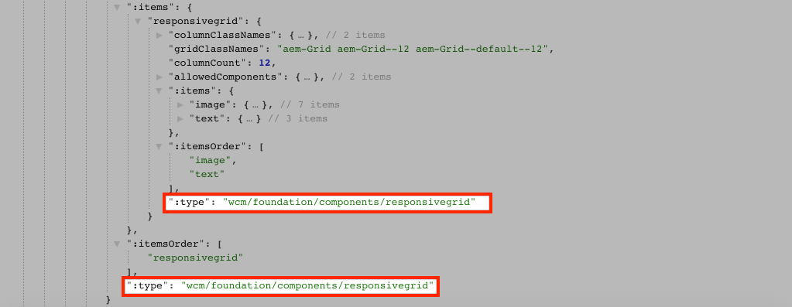

# Mapear componentes SPA para AEM componentes {#map-components}

Saiba como mapear componentes do Angular para componentes do Adobe Experience Manager (AEM) com o SDK AEM SPA Editor JS. O mapeamento de componentes permite que os usuários façam atualizações dinâmicas para SPA componentes no AEM SPA Editor, de forma semelhante à criação tradicional AEM.

Este capítulo aprofunda a API do modelo JSON AEM e mostra como o conteúdo JSON exposto por um componente AEM pode ser inserido automaticamente em um componente de Angular como props.

## Objetivo

1. Saiba como mapear componentes AEM para SPA componentes.
2. Entenda a diferença entre os componentes **Container** e **Content**.
3. Crie um novo componente de Angular que mapeie para um componente AEM existente.

## O que você vai criar

Este capítulo verificará como o componente `Text` SPA fornecido é mapeado para o componente AEM `Text`. Um novo componente de SPA `Image` será criado e poderá ser usado no SPA e criado no AEM. Os recursos prontos para uso das políticas **Container de layout** e **Editor de modelos** também serão usados para criar uma visualização com uma aparência um pouco mais variada.


## Pré-requisitos

Revise as ferramentas e instruções necessárias para configurar um [ambiente de desenvolvimento local](overview.md#local-dev-environment).

### Obter o código

1. Baixe o ponto de partida para este tutorial via Git:

   ```shell
   $ git clone git@github.com:adobe/aem-guides-wknd-spa.git
   $ cd aem-guides-wknd-spa
   $ git checkout Angular/map-components-start
   ```

2. Implante a base de código para uma instância AEM local usando Maven:

   ```shell
   $ mvn clean install -PautoInstallSinglePackage
   ```

   Se estiver usando [AEM 6.x](overview.md#compatibility) adicione o perfil `classic`:

   ```shell
   $ mvn clean install -PautoInstallSinglePackage -Pclassic
   ```

Você sempre pode visualização o código finalizado em [GitHub](https://github.com/adobe/aem-guides-wknd-spa/tree/Angular/map-components-solution) ou fazer check-out do código localmente ao alternar para a ramificação `Angular/map-components-solution`.

## Abordagem de mapeamento

O conceito básico é mapear um componente SPA para um componente AEM. AEM componentes, execute o lado do servidor e exporte conteúdo como parte da API do modelo JSON. O conteúdo JSON é consumido pelo SPA, executando o lado do cliente no navegador. Um mapeamento 1:1 entre SPA componentes e um componente AEM é criado.


*Visão geral de alto nível do mapeamento de um componente AEM para um componente de Angular*

## Inspect o componente de texto

O [AEM Project Archetype](https://github.com/adobe/aem-project-archetype) fornece um componente `Text` que está mapeado para o AEM [componente de Texto](https://docs.adobe.com/content/help/pt/experience-manager-core-components/using/components/text.html). Este é um exemplo de um componente **content**, na medida em que renderiza *content* do AEM.

Vamos ver como o componente funciona.

### Inspect o modelo JSON

1. Antes de pular para o código SPA, é importante entender o modelo JSON que AEM fornece. Navegue até [Biblioteca de componentes principais](https://www.aemcomponents.dev/content/core-components-examples/library/page-authoring/text.html) e visualização a página do componente de Texto. A Biblioteca de componentes principais fornece exemplos de todos os componentes principais AEM.
2. Selecione a guia **JSON** para um dos exemplos:

   

   Você deve ver três propriedades: `text`, `richText` e `:type`.

   `:type` é uma propriedade reservada que lista o  `sling:resourceType` (ou caminho) do Componente AEM. O valor de `:type` é o que é usado para mapear o componente AEM para o componente SPA.

   `text` e  `richText` são propriedades adicionais que serão expostas ao componente SPA.

### Inspect do componente Texto

1. Abra um novo terminal e navegue até a pasta `ui.frontend` dentro do projeto. Execute `npm install` e `npm start` para start do **servidor dev do webpack**:

   ```shell
   $ cd ui.frontend
   $ npm run start:mock
   ```

   O módulo `ui.frontend` está configurado para usar o [modelo JSON](./integrate-spa.md#mock-json).

2. Você deverá ver uma nova janela do navegador aberta para [http://localhost:4200/content/wknd-spa-angular/us/en/home.html](http://localhost:4200/content/wknd-spa-angular/us/en/home.html)

   

3. No IDE de sua escolha, abra o AEM Project para a SPA WKND. Expanda o módulo `ui.frontend` e abra o arquivo **text.component.ts** em `ui.frontend/src/app/components/text/text.component.ts`:

   

4. A primeira área a ser inspecionada é a `class TextComponent` na ~linha 35:

   ```js
   export class TextComponent {
       @Input() richText: boolean;
       @Input() text: string;
       @Input() itemName: string;
   
       @HostBinding('innerHtml') get content() {
           return this.richText
           ? this.sanitizer.bypassSecurityTrustHtml(this.text)
           : this.text;
       }
       @HostBinding('attr.data-rte-editelement') editAttribute = true;
   
       constructor(private sanitizer: DomSanitizer) {}
   }
   ```

   [@Input()](https://angular.io/api/core/Input) decorator é usado para declarar campos cujos valores estão definidos por meio do objeto JSON mapeado, revisado anteriormente.

   `@HostBinding('innerHtml') get content()` é um método que expõe o conteúdo de texto criado do valor de  `this.text`. Caso o conteúdo seja rich text (determinado pelo sinalizador `this.richText`), a segurança integrada do Angular será ignorada. O angular [DomSanitizer](https://angular.io/api/platform-browser/DomSanitizer) é usado para &quot;depurar&quot; o HTML bruto e impedir vulnerabilidades de Scripts entre sites. O método está vinculado à propriedade `innerHtml` usando o decorador [@HostBinding](https://angular.io/api/core/HostBinding).

5. Em seguida, inspecione `TextEditConfig` em ~linha 24:

   ```js
   const TextEditConfig = {
       emptyLabel: 'Text',
       isEmpty: cqModel =>
           !cqModel || !cqModel.text || cqModel.text.trim().length < 1
   };
   ```

   O código acima é responsável por determinar quando renderizar o espaço reservado no ambiente do autor AEM. Se o método `isEmpty` retornar **true**, o espaço reservado será renderizado.

6. Por fim, veja a chamada `MapTo` em ~linha 53:

   ```js
   MapTo('wknd-spa-angular/components/text')(TextComponent, TextEditConfig );
   ```

   **O** MapTois é fornecido pelo AEM SPA Editor JS SDK (`@adobe/cq-angular-editable-components`). O caminho `wknd-spa-angular/components/text` representa `sling:resourceType` do componente AEM. Esse caminho é correspondido com o `:type` exposto pelo modelo JSON observado anteriormente. **O** MapTopara analisa a resposta do modelo JSON e transmite os valores corretos para as  `@Input()` variáveis do componente SPA.

   Você pode encontrar a definição do componente AEM `Text` em `ui.apps/src/main/content/jcr_root/apps/wknd-spa-angular/components/text`.

7. Experimente modificando o arquivo **en.model.json** em `ui.frontend/src/mocks/json/en.model.json`.

   Em ~line 62, atualize o primeiro valor `Text` para usar as tags **`H1`** e **`u`**:

   ```json
       "text": {
           "text": "<h1><u>Hello World!</u></h1>",
           "richText": true,
           ":type": "wknd-spa-angular/components/text"
       }
   ```

   Retorne ao navegador para ver os efeitos servidos pelo **servidor dev de webpack**:

   

   Tente alternar a propriedade `richText` entre **true** / **false** para ver a lógica de renderização em ação.

8. Inspect **text.component.html** em `ui.frontend/src/app/components/text/text.component.html`.

   Este arquivo está vazio, pois todo o conteúdo do componente será definido pela propriedade `innerHTML`.

9. Inspect o **app.module.ts** em `ui.frontend/src/app/app.module.ts`.

   ```js
   @NgModule({
   imports: [
       BrowserModule,
       SpaAngularEditableComponentsModule,
       AppRoutingModule
   ],
   providers: [ModelManagerService, { provide: APP_BASE_HREF, useValue: '/' }],
   declarations: [AppComponent, TextComponent, PageComponent, HeaderComponent],
   entryComponents: [TextComponent, PageComponent],
   bootstrap: [AppComponent]
   })
   export class AppModule {}
   ```

   O **TextComponent** não está incluído explicitamente, mas sim dinamicamente via **AEMResponsiveGridComponent** fornecido pelo AEM SPA Editor JS SDK. Portanto, deve estar listado na matriz **app.module.ts**&#39; [entryComponents](https://angular.io/guide/entry-components).

## Criar o componente de imagem

Em seguida, crie um componente de Angular `Image` mapeado para o componente de imagem [AEM](https://docs.adobe.com/content/help/br/experience-manager-core-components/using/components/image.html). O componente `Image` é outro exemplo de um componente **content**.

### Inspect o JSON

Antes de pular para o código SPA, inspecione o modelo JSON fornecido pela AEM.

1. Navegue até [Exemplos de imagem na biblioteca do Componente Principal](https://www.aemcomponents.dev/content/core-components-examples/library/page-authoring/image.html).

   

   As propriedades de `src`, `alt` e `title` serão usadas para preencher o componente SPA `Image`.

   >[!NOTE]
   >
   > Há outras propriedades de Imagem expostas (`lazyEnabled`, `widths`) que permitem que um desenvolvedor crie um componente adaptativo e com carregamento lento. O componente criado neste tutorial será simples e **não** usará essas propriedades avançadas.

2. Retorne ao seu IDE e abra o `en.model.json` em `ui.frontend/src/mocks/json/en.model.json`. Como este é um componente novo para nosso projeto, precisamos &quot;zombar&quot; do Image JSON.

   Na ~linha 70, adicione uma entrada JSON para o modelo `image` (não se esqueça da vírgula à direita `,` após a segunda `text_386303036`) e atualize a matriz `:itemsOrder`.

   ```json
   ...
   ":items": {
               ...
               "text_386303036": {
                   "text": "<p>A new text component.</p>\r\n",
                   "richText": true,
                   ":type": "wknd-spa-angular/components/text"
                   },
               "image": {
                   "alt": "Rock Climber in New Zealand",
                   "title": "Rock Climber in New Zealand",
                   "src": "/mocks/images/adobestock-140634652.jpeg",
                   ":type": "wknd-spa-angular/components/image"
               }
           },
           ":itemsOrder": [
               "text",
               "text_386303036",
               "image"
           ],
   ```

   O projeto inclui uma imagem de amostra em `/mock-content/adobestock-140634652.jpeg` que será usada com o **servidor dev de webpack**.

   Você pode visualização o [en.model.json completo aqui](https://github.com/adobe/aem-guides-wknd-spa/blob/Angular/map-components-solution/ui.frontend/src/mocks/json/en.model.json).

3. Adicione uma foto do estoque a ser exibida pelo componente.

   Crie uma nova pasta chamada **images** abaixo de `ui.frontend/src/mocks`. Baixe [adobadia-140634652.jpeg](assets/map-components/adobestock-140634652.jpeg) e coloque-o na pasta **images** recém-criada. Sinta-se à vontade para usar sua própria imagem, se desejar.

### Implementar o componente de Imagem

1. Pare o **servidor dev de webpack** se iniciado.
2. Crie um novo componente de Imagem executando o comando Angular CLI `ng generate component` na pasta `ui.frontend`:

   ```shell
   $ ng generate component components/image
   ```

3. No IDE, abra **image.component.ts** em `ui.frontend/src/app/components/image/image.component.ts` e atualize como segue:

   ```js
   import {Component, Input, OnInit} from '@angular/core';
   import {MapTo} from '@adobe/cq-angular-editable-components';
   
   const ImageEditConfig = {
   emptyLabel: 'Image',
   isEmpty: cqModel =>
       !cqModel || !cqModel.src || cqModel.src.trim().length < 1
   };
   
   @Component({
   selector: 'app-image',
   templateUrl: './image.component.html',
   styleUrls: ['./image.component.scss']
   })
   export class ImageComponent implements OnInit {
   
   @Input() src: string;
   @Input() alt: string;
   @Input() title: string;
   
   constructor() { }
   
   get hasImage() {
       return this.src && this.src.trim().length > 0;
   }
   
   ngOnInit() { }
   }
   
   MapTo('wknd-spa-angular/components/image')(ImageComponent, ImageEditConfig);
   ```

   `ImageEditConfig` é a configuração para determinar se o espaço reservado do autor deve ser renderizado no AEM, com base no preenchimento da  `src` propriedade.

   `@Input()` de  `src`,  `alt`e  `title` são as propriedades mapeadas da API JSON.

   `hasImage()` é um método que determinará se a imagem deve ser renderizada.

   `MapTo` mapeia o componente SPA para o componente AEM localizado em  `ui.apps/src/main/content/jcr_root/apps/wknd-spa-angular/components/image`.

4. Abra **image.component.html** e atualize-o da seguinte forma:

   ```html
   <ng-container *ngIf="hasImage">
       
   </ng-container>
   ```

   Isso renderizará o elemento `` se `hasImage` retornar **true**.

5. Abra **image.component.scss** e atualize-o da seguinte forma:

   ```scss
   :host-context {
       display: block;
   }
   
   .image {
       margin: 1rem 0;
       width: 100%;
       border: 0;
   }
   ```

   >[!NOTE]
   >
   > A regra `:host-context` é **crítica** para que o espaço reservado do editor de SPA AEM funcione corretamente. Todos os componentes SPA que devem ser criados no editor de páginas AEM precisarão dessa regra no mínimo.

6. Abra `app.module.ts` e adicione `ImageComponent` à matriz `entryComponents`:

   ```js
   entryComponents: [TextComponent, PageComponent, ImageComponent],
   ```

   Como `TextComponent`, `ImageComponent` é carregado dinamicamente e deve ser incluído na matriz `entryComponents`.

7. Start o **servidor dev de webpack** para ver a renderização `ImageComponent`.

   ```shell
   $ npm run start:mock
   ```

   

   *Imagem adicionada ao SPA*

   >[!NOTE]
   >
   > **Desafio** de bônus: Implemente um novo método para exibir o valor de  `title` como uma legenda abaixo da imagem.

## Atualizar políticas em AEM

O componente `ImageComponent` só está visível no **servidor dev de webpack**. Em seguida, implante o SPA atualizado para AEM e atualizar as políticas de modelo.

1. Pare o **servidor dev de webpack** e a partir de **root** do projeto, implemente as alterações para AEM usando suas habilidades Maven:

   ```shell
   $ cd aem-guides-wknd-spa
   $ mvn clean install -PautoInstallSinglePackage
   ```

2. Na tela AEM Start, navegue até **[!UICONTROL Ferramentas]** > **[!UICONTROL Modelos]** > **[Angular SPA WKND](http://localhost:4502/libs/wcm/core/content/sites/templates.html/conf/wknd-spa-angular)**.

   Selecione e edite a **Página SPA**:

   

3. Selecione o Container **Layout** e clique no ícone **policy** para editar a política:

   

4. Em **Componentes permitidos** > **Angular SPA WKND - Content** > verifique o componente **Image**:

   

   Em **Componentes Padrão** > **Adicionar mapeamento** e escolha o componente **Imagem - Angular SPA WKND - Conteúdo**:

   

   Digite um **tipo mime** de `image/*`.

   Clique em **Concluído** para salvar as atualizações de política.

5. No **Container de layout** clique no ícone **policy** para o componente **Text**:

   

   Crie uma nova política chamada **Texto SPA WKND**. Em **Plug-ins** > **Formatação** > marque todas as caixas para ativar opções de formatação adicionais:

   

   Em **Plug-ins** > **Estilos de parágrafo** > marque a caixa de seleção **Ativar estilos de parágrafo**:

   

   Clique em **Concluído** para salvar a atualização da política.

6. Navegue até **Página inicial** [http://localhost:4502/editor.html/content/wknd-spa-angular/us/en/home.html](http://localhost:4502/editor.html/content/wknd-spa-angular/us/en/home.html).

   Você também pode editar o componente `Text` e adicionar estilos de parágrafo adicionais no modo **tela cheia**.

   

7. Você também pode arrastar e soltar uma imagem do **Localizador de ativos**:

   

8. Adicione suas próprias imagens via [AEM Assets](http://localhost:4502/assets.html/content/dam) ou instale a base de código finalizada para o site de referência padrão [WKND](https://github.com/adobe/aem-guides-wknd/releases/latest). O [site de referência WKND](https://github.com/adobe/aem-guides-wknd/releases/latest) inclui muitas imagens que podem ser reutilizadas no SPA WKND. O pacote pode ser instalado usando [AEM Gerenciador de pacotes](http://localhost:4502/crx/packmgr/index.jsp).

   

## Inspect o Container Layout

O suporte para **Container de layout** é fornecido automaticamente pelo AEM SPA Editor SDK. O container **Layout**, conforme indicado pelo nome, é um componente **Container**. Os componentes do container são componentes que aceitam estruturas JSON que representam *outros* componentes e os instanciam dinamicamente.

Vamos inspecionar o Container Layout ainda mais.

1. No IDE, abra **responsive-grid.component.ts** em `ui.frontend/src/app/components/responsive-grid`:

   ```js
   import { AEMResponsiveGridComponent,MapTo } from '@adobe/cq-angular-editable-components';
   
   MapTo('wcm/foundation/components/responsivegrid')(AEMResponsiveGridComponent);
   ```

   O `AEMResponsiveGridComponent` é implementado como parte do AEM SPA Editor SDK e é incluído no projeto via `import-components`.

2. Em um navegador, navegue até [http://localhost:4502/content/wknd-spa-angular/us/en.model.json](http://localhost:4502/content/wknd-spa-angular/us/en.model.json)

   

   O componente **Container de layout** tem `sling:resourceType` de `wcm/foundation/components/responsivegrid` e é reconhecido pelo Editor de SPA usando a propriedade `:type`, assim como os componentes `Text` e `Image`.

   Os mesmos recursos de redimensionar um componente usando [Modo de layout](https://docs.adobe.com/content/help/en/experience-manager-65/authoring/siteandpage/responsive-layout.html#defining-layouts-layout-mode) estão disponíveis no Editor de SPA.

3. Retorne para [http://localhost:4502/editor.html/content/wknd-spa-angular/us/en/home.html](http://localhost:4502/editor.html/content/wknd-spa-angular/us/en/home.html). Adicione outros componentes **Image** e tente redimensioná-los usando a opção **Layout**:

   

4. Reabra o modelo JSON [http://localhost:4502/content/wknd-spa-angular/us/en.model.json](http://localhost:4502/content/wknd-spa-angular/us/en.model.json) e observe `columnClassNames` como parte do JSON:

   

   O nome da classe `aem-GridColumn--default--4` indica que o componente deve ter 4 colunas de largura com base em uma grade de 12 colunas. Mais detalhes sobre a grade responsiva [podem ser encontrados aqui](https://adobe-marketing-cloud.github.io/aem-responsivegrid/).

5. Retorne ao IDE e no módulo `ui.apps` há uma biblioteca do lado do cliente definida em `ui.apps/src/main/content/jcr_root/apps/wknd-spa-angular/clientlibs/clientlib-grid`. Abra o arquivo `less/grid.less`.

   Este arquivo determina os pontos de interrupção (`default`, `tablet` e `phone`) usados pelo **Container de layout**. Este arquivo deve ser personalizado de acordo com as especificações do projeto. Atualmente, os pontos de interrupção estão definidos como `1200px` e `650px`.

6. Você deve ser capaz de usar os recursos responsivos e as políticas de rich text atualizadas do componente `Text` para criar uma visualização como a seguinte:

   

## Parabéns! {#congratulations}

Parabéns, você aprendeu a mapear SPA componentes para AEM Componentes e implementou um novo componente `Image`. Você também tem a chance de explorar os recursos responsivos do **Container de layout**.

Você sempre pode visualização o código finalizado em [GitHub](https://github.com/adobe/aem-guides-wknd-spa/tree/Angular/map-components-solution) ou fazer check-out do código localmente ao alternar para a ramificação `Angular/map-components-solution`.

### Próximas etapas {#next-steps}

[Navegação e Roteamento](navigation-routing.md)  - saiba como várias visualizações no SPA podem ser suportadas ao mapear para AEM páginas com o SPA Editor SDK. A navegação dinâmica é implementada usando o Roteador de Angulars e adicionada a um componente de Cabeçalho existente.

## Bônus - Persistir em configurações para o controle de origem {#bonus}

Em muitos casos, especialmente no início de um projeto AEM é importante persistir em configurações, como modelos e políticas de conteúdo relacionadas, para o controle de origem. Isso garante que todos os desenvolvedores estejam trabalhando em relação ao mesmo conjunto de conteúdo e configurações e pode garantir uma consistência adicional entre os ambientes. Quando um projeto atinge um certo nível de maturidade, a prática de gerenciar modelos pode ser transferida para um grupo especial de usuários avançados.

As próximas etapas serão executadas usando o Visual Studio Code IDE e [VSCode AEM Sync](https://marketplace.visualstudio.com/items?itemName=yamato-ltd.vscode-aem-sync), mas podem ser executadas usando qualquer ferramenta e qualquer IDE que você tenha configurado para **pull** ou **importar** conteúdo de uma instância local do AEM.

1. No Visual Studio Code IDE, verifique se você tem **VSCode AEM Sync** instalado por meio da extensão do Marketplace:

   

2. Expanda o módulo **ui.content** no Explorador de projetos e navegue até `/conf/wknd-spa-angular/settings/wcm/templates`.

3. **Clique com o botão direito do mouse** na  `templates` pasta e selecione  **Importar do servidor** AEM:

   

4. Repita as etapas para importar conteúdo, mas selecione a pasta **policies** localizada em `/conf/wknd-spa-angular/settings/wcm/policies`.

5. Inspect o arquivo `filter.xml` localizado em `ui.content/src/main/content/META-INF/vault/filter.xml`.

   ```xml
   <!--ui.content filter.xml-->
   <?xml version="1.0" encoding="UTF-8"?>
    <workspaceFilter version="1.0">
        <filter root="/conf/wknd-spa-angular" mode="merge"/>
        <filter root="/content/wknd-spa-angular" mode="merge"/>
        <filter root="/content/dam/wknd-spa-angular" mode="merge"/>
        <filter root="/content/experience-fragments/wknd-spa-angular" mode="merge"/>
    </workspaceFilter>
   ```

   O arquivo `filter.xml` é responsável por identificar os caminhos dos nós que serão instalados com o pacote. Observe `mode="merge"` em cada um dos filtros que indica que o conteúdo existente não será modificado, somente o novo conteúdo será adicionado. Como os autores de conteúdo podem estar atualizando esses caminhos, é importante que uma implantação de código **e não** substitua o conteúdo. Consulte a [documentação do FileVault](https://jackrabbit.apache.org/filevault/filter.html) para obter mais detalhes sobre como trabalhar com elementos de filtro.

   Compare `ui.content/src/main/content/META-INF/vault/filter.xml` e `ui.apps/src/main/content/META-INF/vault/filter.xml` para entender os diferentes nós gerenciados por cada módulo.
