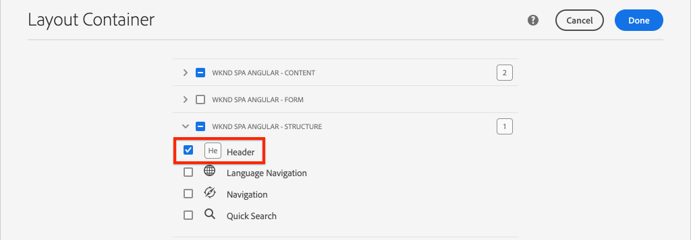
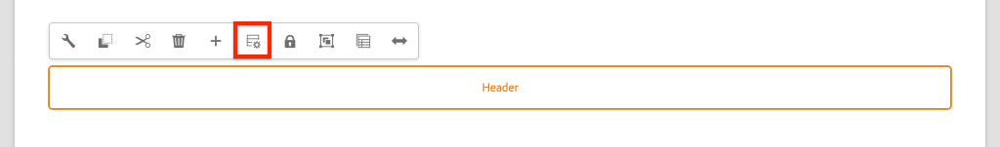
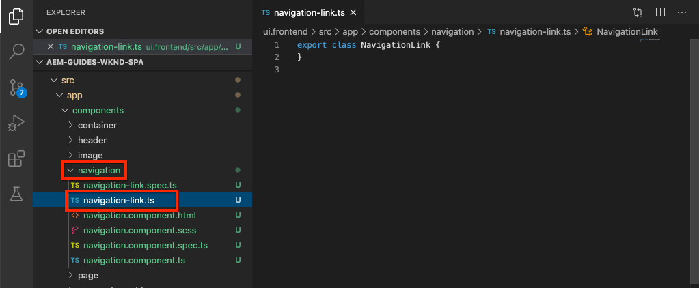

# Adicionar navegação e roteamento {#navigation-routing}

Saiba como várias visualizações no SPA são suportadas usando as Páginas AEM e o SDK do Editor SPA. A navegação dinâmica é implementada usando rotas Angulares e adicionada a um componente Cabeçalho existente.

## Objetivo

1. Entenda as opções de roteamento do modelo SPA disponíveis ao usar o Editor SPA.
2. Saiba como usar o roteamento [](https://angular.io/guide/router) angular para navegar entre diferentes visualizações do SPA.
3. Implemente uma navegação dinâmica orientada pela hierarquia de páginas AEM.

## O que você vai criar

Este capítulo adiciona um menu de navegação a um `Header` componente existente. O menu de navegação é conduzido pela hierarquia de páginas AEM e usa o modelo JSON fornecido pelo Componente [principal de](https://docs.adobe.com/content/help/pt/experience-manager-core-components/using/components/navigation.html)navegação.


## Pré-requisitos

Revise as ferramentas e instruções necessárias para configurar um ambiente [de desenvolvimento](overview.md#local-dev-environment)local.

### Obter o código

1. Baixe o ponto de partida para este tutorial via Git:

   ```shell
   $ git clone git@github.com:adobe/aem-guides-wknd-spa.git
   $ cd aem-guides-wknd-spa
   $ git checkout Angular/navigation-routing-start
   ```

2. Implante a base de código para uma instância AEM local usando Maven:

   ```shell
   $ mvn clean install -PautoInstallSinglePackage
   ```

   Se estiver usando [AEM 6.x](overview.md#compatibility) , adicione o `classic` perfil:

   ```shell
   $ mvn clean install -PautoInstallSinglePackage -Pclassic
   ```

3. Instale o pacote finalizado para o site [de referência](https://github.com/adobe/aem-guides-wknd/releases/latest)WKND tradicional. As imagens fornecidas pelo site [de referência](https://github.com/adobe/aem-guides-wknd/releases/latest) WKND serão reutilizadas no SPA WKND. O pacote pode ser instalado usando [AEM Gerenciador](http://localhost:4502/crx/packmgr/index.jsp)de pacotes.

   

Você sempre pode visualização o código finalizado no [GitHub](https://github.com/adobe/aem-guides-wknd-spa/tree/Angular/navigation-routing-solution) ou fazer check-out do código localmente ao alternar para a ramificação `Angular/navigation-routing-solution`.

## Atualizações do Inspect HeaderComponent {#inspect-header}

Em capítulos anteriores, o `HeaderComponent` componente foi adicionado como um componente Angular puro incluído via `app.component.html`. Neste capítulo, o `HeaderComponent` componente é removido do aplicativo e será adicionado por meio do Editor [de](https://docs.adobe.com/content/help/en/experience-manager-learn/sites/page-authoring/template-editor-feature-video-use.html)modelos. Isso permite que os usuários configurem o menu de navegação do `HeaderComponent` de dentro do AEM.

>[!NOTE]
>
> Várias atualizações de CSS e JavaScript já foram feitas na base de código para start deste capítulo. Para focalizar os conceitos principais, nem **todas** as alterações de código são discutidas. Você pode visualização as mudanças completas [aqui](https://github.com/adobe/aem-guides-wknd-spa/compare/Angular/map-components-solution...Angular/navigation-routing-start).

1. No IDE de sua escolha, abra o projeto inicial do SPA para este capítulo.
2. Abaixo do `ui.frontend` módulo, inspecione o arquivo `header.component.ts` em: `ui.frontend/src/app/components/header/header.component.ts`.

   Várias atualizações foram feitas, incluindo a adição de um `HeaderEditConfig` e um `MapTo` para permitir que o componente seja mapeado para um componente AEM `wknd-spa-angular/components/header`.

   ```js
   /* header.component.ts */
   ...
   const HeaderEditConfig = {
       ...
   };
   
   @Component({
   selector: 'app-header',
   templateUrl: './header.component.html',
   styleUrls: ['./header.component.scss']
   })
   export class HeaderComponent implements OnInit {
   @Input() items: object[];
       ...
   }
   ...
   MapTo('wknd-spa-angular/components/header')(withRouter(Header), HeaderEditConfig);
   ```

   Observe a `@Input()` anotação para `items`. `items` conterá uma matriz de objetos de navegação passados do AEM.

3. No `ui.apps` módulo inspecione a definição do componente do AEM `Header` : `ui.apps/src/main/content/jcr_root/apps/wknd-spa-angular/components/header/.content.xml`:

   ```xml
   <?xml version="1.0" encoding="UTF-8"?>
   <jcr:root xmlns:sling="http://sling.apache.org/jcr/sling/1.0" xmlns:cq="http://www.day.com/jcr/cq/1.0"
       xmlns:jcr="http://www.jcp.org/jcr/1.0"
       jcr:primaryType="cq:Component"
       jcr:title="Header"
       sling:resourceSuperType="wknd-spa-angular/components/navigation"
       componentGroup="WKND SPA Angular - Structure"/>
   ```

   O componente AEM `Header` herdará toda a funcionalidade do Componente [principal de](https://docs.adobe.com/content/help/pt/experience-manager-core-components/using/components/navigation.html) navegação por meio da `sling:resourceSuperType` propriedade.

## Adicionar HeaderComponent ao modelo SPA {#add-header-template}

1. Abra um navegador e faça logon no AEM, [http://localhost:4502/](http://localhost:4502/). A base de código inicial já deve ser implantada.
2. Navegue até o Modelo **[!UICONTROL de Página]** SPA: [http://localhost:4502/editor.html/conf/wknd-spa-angular/settings/wcm/templates/spa-page-template/structure.html](http://localhost:4502/editor.html/conf/wknd-spa-angular/settings/wcm/templates/spa-page-template/structure.html).
3. Selecione o Container **[!UICONTROL de layout]** raiz mais externo e clique no ícone **[!UICONTROL Política]** . Tenha cuidado para **não** selecionar o Container **[!UICONTROL de]** layout desbloqueado para criação.

   

4. Copie a política atual e crie uma nova política chamada Estrutura **** SPA:

   

   Em **[!UICONTROL Componentes]** permitidos > **[!UICONTROL Geral]** > selecione o componente de Container **[!UICONTROL de]** layout.

   Em Componentes **** permitidos > **[!UICONTROL WKND SPA ANGULAR - ESTRUTURA]** > selecione o componente **[!UICONTROL Cabeçalho]** :

   

   Em Componentes **** permitidos > **[!UICONTROL WKND SPA ANGULAR - Conteúdo]** > selecione os componentes **[!UICONTROL Imagem]** e **[!UICONTROL Texto]** . Você deve ter quatro componentes totais selecionados.

   Click **[!UICONTROL Done]** to save the changes.

5. **Atualize a página.** Adicione o componente **[!UICONTROL Cabeçalho]** acima do Container **[!UICONTROL de]** layout não bloqueado:

   

6. Selecione o componente **[!UICONTROL Cabeçalho]** e clique no ícone **Política** para editar a política.

   

7. Crie uma nova política com um Título **[!UICONTROL de]** política de **&quot;Cabeçalho SPA WKND&quot;**.

   Em **[!UICONTROL Propriedades]**:

   * Defina a **[!UICONTROL Raiz]** de navegação como `/content/wknd-spa-angular/us/en`.
   * Defina **[!UICONTROL Excluir níveis]** raiz como **1**.
   * Desmarque **[!UICONTROL Coletar todas as páginas]** secundárias.
   * Defina a Profundidade **[!UICONTROL da estrutura de]** navegação como **3**.

   

   Isso coletará os 2 níveis de navegação abaixo `/content/wknd-spa-angular/us/en`.

8. Depois de salvar as alterações, você deve ver o preenchimento `Header` como parte do modelo:

   

## Criar páginas secundárias

Em seguida, crie páginas adicionais no AEM que servirão como visualizações diferentes no SPA. Inspecionaremos também a estrutura hierárquica do modelo JSON fornecido pela AEM.

1. Navegue até o console **Sites** : [http://localhost:4502/sites.html/content/wknd-spa-angular/us/en/home](http://localhost:4502/sites.html/content/wknd-spa-angular/us/en/home). Selecione o Home page **Angular SPA** WKND e clique em **[!UICONTROL Criar]** > **[!UICONTROL Página]**:

   

2. Em **[!UICONTROL Modelo]** , selecione Página **** SPA. Em **[!UICONTROL Propriedades]** , digite **&quot;Página 1&quot;** para o **[!UICONTROL Título]** e **&quot;página-1&quot;** como o nome.

   

   Clique em **[!UICONTROL Criar]** e, no pop-up de diálogo, clique em **[!UICONTROL Abrir]** para abrir a página no Editor SPA AEM.

3. Adicione um novo componente de **[!UICONTROL Texto]** ao Container **[!UICONTROL principal de]** Layout. Edite o componente e insira o texto: **&quot;Página 1&quot;** usando o RTE e o elemento **H1** (será necessário entrar no modo de tela cheia para alterar os elementos de parágrafo)

   

   Sinta-se à vontade para adicionar conteúdo adicional, como uma imagem.

4. Retorne ao console do AEM Sites e repita as etapas acima, criando uma segunda página chamada **&quot;Página 2&quot;** como um irmão da **Página 1**. Adicione conteúdo à **página 2** para que seja facilmente identificado.
5. Por fim, crie uma terceira página, **&quot;Página 3&quot;** , mas como **filho** da **Página 2**. Após a conclusão, a hierarquia do site deve ser semelhante ao seguinte:

   

6. Em uma nova guia, abra a API do modelo JSON fornecida pela AEM: [http://localhost:4502/content/wknd-spa-angular/us/en.model.json](http://localhost:4502/content/wknd-spa-angular/us/en.model.json). Este conteúdo JSON é solicitado quando o SPA é carregado pela primeira vez. A estrutura externa tem a seguinte aparência:

   ```json
   {
   "language": "en",
   "title": "en",
   "templateName": "spa-app-template",
   "designPath": "/libs/settings/wcm/designs/default",
   "cssClassNames": "spa page basicpage",
   ":type": "wknd-spa-angular/components/spa",
   ":items": {},
   ":itemsOrder": [],
   ":hierarchyType": "page",
   ":path": "/content/wknd-spa-angular/us/en",
   ":children": {
       "/content/wknd-spa-angular/us/en/home": {},
       "/content/wknd-spa-angular/us/en/home/page-1": {},
       "/content/wknd-spa-angular/us/en/home/page-2": {},
       "/content/wknd-spa-angular/us/en/home/page-2/page-3": {}
       }
   }
   ```

   Em `:children` você deve ver uma entrada para cada página criada. O conteúdo de todas as páginas está nesta solicitação JSON inicial. Depois que o roteamento de navegação for implementado, as visualizações subsequentes do SPA serão carregadas rapidamente, já que o conteúdo já está disponível no cliente.

   Não é recomendável carregar **TODO** o conteúdo de um SPA na solicitação JSON inicial, pois isso reduziria o carregamento da página inicial. Em seguida, vamos ver como a profundidade de hierarquia das páginas é coletada.

7. Navegue até o modelo Raiz **do** SPA em: [http://localhost:4502/editor.html/conf/wknd-spa-angular/settings/wcm/templates/spa-app-template/structure.html](http://localhost:4502/editor.html/conf/wknd-spa-angular/settings/wcm/templates/spa-app-template/structure.html).

   Clique no menu **[!UICONTROL Propriedades da]** página > Política **** de página:

   

8. O modelo raiz **** SPA tem uma guia Estrutura **** hierárquica extra para controlar o conteúdo JSON coletado. A Profundidade **[!UICONTROL da]** estrutura determina a profundidade na hierarquia do site para coletar páginas secundárias abaixo da **raiz**. Você também pode usar o campo Padrões **[!UICONTROL de]** estrutura para filtrar páginas adicionais com base em uma expressão regular.

   Atualize a profundidade da **[!UICONTROL estrutura]** para **&quot;2&quot;**:

   

   Clique em **[!UICONTROL Concluído]** para salvar as alterações na política.

9. Abra novamente o modelo JSON [http://localhost:4502/content/wknd-spa-angular/us/en.model.json](http://localhost:4502/content/wknd-spa-angular/us/en.model.json).

   ```json
   {
   "language": "en",
   "title": "en",
   "templateName": "spa-app-template",
   "designPath": "/libs/settings/wcm/designs/default",
   "cssClassNames": "spa page basicpage",
   ":type": "wknd-spa-angular/components/spa",
   ":items": {},
   ":itemsOrder": [],
   ":hierarchyType": "page",
   ":path": "/content/wknd-spa-angular/us/en",
   ":children": {
       "/content/wknd-spa-angular/us/en/home": {},
       "/content/wknd-spa-angular/us/en/home/page-1": {},
       "/content/wknd-spa-angular/us/en/home/page-2": {}
       }
   }
   ```

   Observe que o caminho da **Página 3** foi removido: `/content/wknd-spa-angular/us/en/home/page-2/page-3` do modelo JSON inicial.

   Posteriormente, observaremos como o AEM SPA Editor SDK pode carregar dinamicamente conteúdo adicional.

## Implementar a navegação

Em seguida, implemente o menu de navegação com um novo `NavigationComponent`. Poderíamos adicionar o código diretamente, `header.component.html` mas uma prática melhor é evitar componentes grandes. Em vez disso, implemente um `NavigationComponent` que possa ser reutilizado posteriormente.

1. Examine o JSON exposto pelo `Header` componente AEM em [http://localhost:4502/content/wknd-spa-angular/us/en.model.json](http://localhost:4502/content/wknd-spa-angular/us/en.model.json):

   ```json
   ...
   "header": {
       "items": [
       {
       "level": 0,
       "active": true,
       "path": "/content/wknd-spa-angular/us/en/home",
       "description": null,
       "url": "/content/wknd-spa-angular/us/en/home.html",
       "lastModified": 1589062597083,
       "title": "WKND SPA Angular Home Page",
       "children": [
               {
               "children": [],
               "level": 1,
               "active": false,
               "path": "/content/wknd-spa-angular/us/en/home/page-1",
               "description": null,
               "url": "/content/wknd-spa-angular/us/en/home/page-1.html",
               "lastModified": 1589429385100,
               "title": "Page 1"
               },
               {
               "level": 1,
               "active": true,
               "path": "/content/wknd-spa-angular/us/en/home/page-2",
               "description": null,
               "url": "/content/wknd-spa-angular/us/en/home/page-2.html",
               "lastModified": 1589429603507,
               "title": "Page 2",
               "children": [
                   {
                   "children": [],
                   "level": 2,
                   "active": false,
                   "path": "/content/wknd-spa-angular/us/en/home/page-2/page-3",
                   "description": null,
                   "url": "/content/wknd-spa-angular/us/en/home/page-2/page-3.html",
                   "lastModified": 1589430413831,
                   "title": "Page 3"
                   }
               ],
               }
           ]
           }
       ],
   ":type": "wknd-spa-angular/components/header"
   ```

   A natureza hierárquica das páginas AEM é modelada no JSON que pode ser usada para preencher um menu de navegação. Lembre-se de que o `Header` componente herda toda a funcionalidade do Componente [principal de](https://www.aemcomponents.dev/content/core-components-examples/library/templating/navigation.html) navegação e o conteúdo exposto por meio do JSON será automaticamente mapeado para a `@Input` anotação Angular.

2. Abra uma nova janela de terminal e navegue até a `ui.frontend` pasta do projeto SPA. Crie um novo `NavigationComponent` usando a ferramenta CLI Angular:

   ```shell
   $ cd ui.frontend
   $ ng generate component components/navigation
   CREATE src/app/components/navigation/navigation.component.scss (0 bytes)
   CREATE src/app/components/navigation/navigation.component.html (25 bytes)
   CREATE src/app/components/navigation/navigation.component.spec.ts (656 bytes)
   CREATE src/app/components/navigation/navigation.component.ts (286 bytes)
   UPDATE src/app/app.module.ts (2032 bytes)
   ```

3. Em seguida, crie uma classe chamada `NavigationLink` usando a CLI Angular no `components/navigation` diretório recém-criado:

   ```shell
   $ cd src/app/components/navigation/
   $ ng generate class NavigationLink
   CREATE src/app/components/navigation/navigation-link.spec.ts (187 bytes)
   CREATE src/app/components/navigation/navigation-link.ts (32 bytes)
   ```

4. Retorne ao IDE de sua escolha e abra o arquivo em `navigation-link.ts``/src/app/components/navigation/navigation-link.ts`.

   

5. Preencha `navigation-link.ts` com o seguinte:

   ```js
   export class NavigationLink {
   
       title: string;
       path: string;
       url: string;
       level: number;
       children: NavigationLink[];
       active: boolean;
   
       constructor(data) {
           this.path = data.path;
           this.title = data.title;
           this.url = data.url;
           this.level = data.level;
           this.active = data.active;
           this.children = data.children.map( item => {
               return new NavigationLink(item);
           });
       }
   }
   ```

   Essa é uma classe simples para representar um link de navegação individual. No construtor de classe, esperamos `data` ser o objeto JSON passado da AEM. Essa classe será usada dentro da estrutura de navegação `NavigationComponent` e para preencher com facilidade `HeaderComponent` .

   Nenhuma transformação de dados é executada, essa classe é criada principalmente para digitar fortemente o modelo JSON. Observe que `this.children` é digitado como `NavigationLink[]` e que o construtor cria recursivamente novos `NavigationLink` objetos para cada um dos itens na `children` matriz. Lembre-se de que o modelo JSON para o `Header` é hierárquico.

6. Open the file `navigation-link.spec.ts`. Este é o arquivo de teste da `NavigationLink` classe. Atualize-o com o seguinte:

   ```js
   import { NavigationLink } from './navigation-link';
   
   describe('NavigationLink', () => {
       it('should create an instance', () => {
           const data = {
               children: [],
               level: 1,
               active: false,
               path: '/content/wknd-spa-angular/us/en/home/page-1',
               description: null,
               url: '/content/wknd-spa-angular/us/en/home/page-1.html',
               lastModified: 1589429385100,
               title: 'Page 1'
           };
           expect(new NavigationLink(data)).toBeTruthy();
       });
   });
   ```

   Observe que `const data` segue o mesmo modelo JSON inspecionado anteriormente para um único link. Isto está longe de ser um teste de unidade robusto, no entanto, deve ser suficiente para testar o construtor de `NavigationLink`.

7. Open the file `navigation.component.ts`. Atualize-o com o seguinte:

   ```js
   import { Component, OnInit, Input } from '@angular/core';
   import { NavigationLink } from './navigation-link';
   
   @Component({
   selector: 'app-navigation',
   templateUrl: './navigation.component.html',
   styleUrls: ['./navigation.component.scss']
   })
   export class NavigationComponent implements OnInit {
   
       @Input() items: object[];
   
       constructor() { }
   
       get navigationLinks(): NavigationLink[] {
   
           if (this.items && this.items.length > 0) {
               return this.items.map(item => {
                   return new NavigationLink(item);
               });
           }
   
           return null;
       }
   
       ngOnInit() {}
   
   }
   ```

   `NavigationComponent` espera um `object[]` nome `items` que seja o modelo JSON da AEM. Essa classe expõe um único método `get navigationLinks()` que retorna uma matriz de `NavigationLink` objetos.

8. Abra o arquivo `navigation.component.html` e atualize-o com o seguinte:

   ```html
   <ul *ngIf="navigationLinks && navigationLinks.length > 0" class="navigation__group">
       <ng-container *ngTemplateOutlet="recursiveListTmpl; context:{ links: navigationLinks }"></ng-container>
   </ul>
   ```

   Isso gera um inicial `<ul>` e chama o `get navigationLinks()` método de `navigation.component.ts`. Um `<ng-container>` é usado para fazer uma chamada para um modelo nomeado `recursiveListTmpl` e passa-o `navigationLinks` como uma variável chamada com nome `links`.

   Adicione o `recursiveListTmpl` seguinte:

   ```html
   <ng-template #recursiveListTmpl let-links="links">
       <li *ngFor="let link of links" class="{{'navigation__item navigation__item--' + link.level}}">
           <a [routerLink]="link.url" class="navigation__item-link" [title]="link.title" [attr.aria-current]="link.active">
               {{link.title}}
           </a>
           <ul *ngIf="link.children && link.children.length > 0">
               <ng-container *ngTemplateOutlet="recursiveListTmpl; context:{ links: link.children }"></ng-container>
           </ul>
       </li>
   </ng-template>
   ```

   Aqui o restante da renderização do link de navegação é implementado. Observe que a variável `link` é do tipo `NavigationLink` e todos os métodos/propriedades criados por essa classe estão disponíveis. [`[routerLink]`](https://angular.io/api/router/RouterLink) é usada em vez do `href` atributo normal. Isso nos permite vincular a rotas específicas no aplicativo, sem uma atualização de página completa.

   A parte recursiva da navegação também é implementada pela criação de outra `<ul>` se a atual `link` tiver uma `children` matriz não vazia.

9. Atualize `navigation.component.spec.ts` para adicionar suporte para `RouterTestingModule`:

   ```diff
    ...
   + import { RouterTestingModule } from '@angular/router/testing';
    ...
    beforeEach(async(() => {
       TestBed.configureTestingModule({
   +   imports: [ RouterTestingModule ],
       declarations: [ NavigationComponent ]
       })
       .compileComponents();
    }));
    ...
   ```

   A adição do componente `RouterTestingModule` é necessária, pois ele usa `[routerLink]`.

10. Atualize `navigation.component.scss` para adicionar alguns estilos básicos ao `NavigationComponent`:

   ```scss
   @import "~src/styles/variables";
   
   $link-color: $black;
   $link-hover-color: $white;
   $link-background: $black;
   
   :host-context {
       display: block;
       width: 100%;
   }
   
   .navigation__item {
       list-style: none;
   }
   
   .navigation__item-link {
       color: $link-color;
       font-size: $font-size-large;
       text-transform: uppercase;
       padding: $gutter-padding;
       display: flex;
       border-bottom: 1px solid $gray;
   
       &:hover {
           background: $link-background;
           color: $link-hover-color;
       }
   
   }
   ```

## Atualizar o componente de cabeçalho

Agora que a diretiva `NavigationComponent` foi implementada, `HeaderComponent` é necessário atualizá-la para a referenciar.

1. Abra um terminal e navegue até a `ui.frontend` pasta no projeto SPA. Start do servidor **dev do** webpack:

   ```shell
   $ npm start
   ```

2. Open a browser tab and navigate to [http://localhost:4200/](http://localhost:4200/).

   O servidor **de desenvolvimento de** webpack deve ser configurado para proxy do modelo JSON de uma instância local de AEM (`ui.frontend/proxy.conf.json`). Isso nos permitirá codificar diretamente em relação ao conteúdo criado no AEM a partir do início do tutorial.

   

   A funcionalidade de alternância de menus já foi implementada no `HeaderComponent` momento. Em seguida, adicione o componente de navegação.

3. Retorne ao IDE de sua escolha e abra o arquivo `header.component.ts` em `ui.frontend/src/app/components/header/header.component.ts`.
4. Atualize o `setHomePage()` método para remover a string codificada e use os props dinâmicos passados pelo componente AEM:

   ```js
   /* header.component.ts */
   import { NavigationLink } from '../navigation/navigation-link';
   ...
    setHomePage() {
       if (this.hasNavigation) {
           const rootNavigationLink: NavigationLink = new NavigationLink(this.items[0]);
           this.isHome = rootNavigationLink.path === this.route.snapshot.data.path;
           this.homePageUrl = rootNavigationLink.url;
       }
   }
   ...
   ```

   Uma nova instância do `NavigationLink` é criada com base em `items[0]`, a raiz do modelo de navegação JSON passado do AEM. `this.route.snapshot.data.path` retorna o caminho da rota Angular atual. Esse valor é usado para determinar se a rota atual é o **Home page**. `this.homePageUrl` é usada para preencher o link de âncora no **logotipo**.

5. Abra `header.component.html` e substitua o espaço reservado estático para a navegação por uma referência ao recém-criado `NavigationComponent`:

   ```diff
       <div class="header-navigation">
           <div class="navigation">
   -            Navigation Placeholder
   +           <app-navigation [items]="items"></app-navigation>
           </div>
       </div>
   ```

   `[items]=items` passa o atributo `@Input() items` do `HeaderComponent` para o `NavigationComponent` onde criará a navegação.

6. Abra `header.component.spec.ts` e adicione uma declaração para o `NavigationComponent`:

   ```diff
       /* header.component.spect.ts */
   +   import { NavigationComponent } from '../navigation/navigation.component';
   
       describe('HeaderComponent', () => {
       let component: HeaderComponent;
       let fixture: ComponentFixture<HeaderComponent>;
   
       beforeEach(async(() => {
           TestBed.configureTestingModule({
           imports: [ RouterTestingModule ],
   +       declarations: [ HeaderComponent, NavigationComponent ]
           })
           .compileComponents();
       }));
   ```

   Uma vez que o teste `NavigationComponent` é agora usado como parte do teste, `HeaderComponent` ele precisa ser declarado como parte do banco de teste.

7. Salve as alterações em qualquer arquivo aberto e volte ao servidor **de desenvolvimento do** webpack: [http://localhost:4200/](http://localhost:4200/)

   

   Abra a navegação clicando no menu para alternar e você deverá ver os links de navegação preenchidos. Você deve ser capaz de navegar para diferentes visualizações do SPA.

## Entenda o roteamento SPA

Agora que a navegação foi implementada, inspecione o roteamento em AEM.

1. No IDE, abra o arquivo `app-routing.module.ts` em `ui.frontend/src/app`.

   ```js
   /* app-routing.module.ts */
   import { AemPageDataResolver, AemPageRouteReuseStrategy } from '@adobe/cq-angular-editable-components';
   import { NgModule } from '@angular/core';
   import { RouteReuseStrategy, RouterModule, Routes, UrlMatchResult, UrlSegment } from '@angular/router';
   import { PageComponent } from './components/page/page.component';
   
   export function AemPageMatcher(url: UrlSegment[]): UrlMatchResult {
       if (url.length) {
           return {
               consumed: url,
               posParams: {
                   path: url[url.length - 1]
               }
           };
       }
   }
   
   const routes: Routes = [
       {
           matcher: AemPageMatcher,
           component: PageComponent,
           resolve: {
               path: AemPageDataResolver
           }
       }
   ];
   @NgModule({
       imports: [RouterModule.forRoot(routes)],
       exports: [RouterModule],
       providers: [
           AemPageDataResolver,
           {
           provide: RouteReuseStrategy,
           useClass: AemPageRouteReuseStrategy
           }
       ]
   })
   export class AppRoutingModule {}
   ```

   A `routes: Routes = [];` matriz define as rotas ou os caminhos de navegação para os mapeamentos de componentes angulares.

   `AemPageMatcher` é um roteador Angular [UrlMatcher](https://angular.io/api/router/UrlMatcher)personalizado que corresponde a qualquer &quot;aparência&quot; de uma página no AEM que faz parte deste aplicativo Angular.

   `PageComponent` é o Componente Angular que representa uma Página no AEM, e as rotas correspondentes serão acionadas. O relatório `PageComponent` será examinado posteriormente.

   `AemPageDataResolver`, fornecido pelo SDK JS do Editor SPA AEM, é um Resolvedor [de Roteador](https://angular.io/api/router/Resolve) Angular personalizado usado para transformar a URL de rota, que é o caminho na extensão AEM incluindo a extensão .html, no caminho do recurso em AEM, que é o caminho da página menos a extensão.

   Por exemplo, o `AemPageDataResolver` transforma o URL de uma rota de `content/wknd-spa-angular/us/en/home.html` em um caminho de `/content/wknd-spa-angular/us/en/home`. Isso é usado para resolver o conteúdo da página com base no caminho na API do modelo JSON.

   `AemPageRouteReuseStrategy`, fornecido pelo SDK JS do Editor SPA AEM, é um [RouteReuseStrategy](https://angular.io/api/router/RouteReuseStrategy) personalizado que impede a reutilização dos `PageComponent` roteiros. Caso contrário, o conteúdo da página &quot;A&quot; pode aparecer ao navegar para a página &quot;B&quot;.

2. Open the file `page.component.ts` at `ui.frontend/src/app/components/page/`.

   ```js
   ...
   export class PageComponent {
       items;
       itemsOrder;
       path;
   
       constructor(
           private route: ActivatedRoute,
           private modelManagerService: ModelManagerService
       ) {
           this.modelManagerService
           .getData({ path: this.route.snapshot.data.path })
           .then(data => {
               this.path = data[Constants.PATH_PROP];
               this.items = data[Constants.ITEMS_PROP];
               this.itemsOrder = data[Constants.ITEMS_ORDER_PROP];
           });
       }
   }
   ```

   O `PageComponent` é necessário para processar o JSON recuperado do AEM e é usado como o componente Angular para renderizar as rotas.

   `ActivatedRoute`, que é fornecido pelo módulo Roteador Angular, contém o estado que indica qual conteúdo JSON da Página AEM deve ser carregado nesta instância do componente Página Angular.

   `ModelManagerService`, obtém os dados JSON com base na rota e mapeia os dados para variáveis de classe `path`, `items`, `itemsOrder`. Eles serão passados para o [AEMPageComponent](https://www.npmjs.com/package/@adobe/cq-angular-editable-components#aempagecomponent.md)

3. Open the file `page.component.html` at `ui.frontend/src/app/components/page/`

   ```html
   <aem-page 
       class="structure-page" 
       [attr.data-cq-page-path]="path" 
       [cqPath]="path" 
       [cqItems]="items" 
       [cqItemsOrder]="itemsOrder">
   </aem-page>
   ```

   `aem-page` inclui o [AEMPageComponent](https://www.npmjs.com/package/@adobe/cq-angular-editable-components#aempagecomponent.md). As variáveis `path`, `items`e `itemsOrder` são passadas para o `AEMPageComponent`. O `AemPageComponent`, fornecido pelo SDKs JavaScript do Editor do SPA, repetirá esses dados e instanciará dinamicamente os componentes angulares com base nos dados do JSON, conforme visto no tutorial [Componentes do](./map-components.md)mapa.

   O `PageComponent` é apenas um substituto para o `AEMPageComponent` e é o `AEMPageComponent` que faz a maioria dos levantamentos pesados para mapear corretamente o modelo JSON para os componentes angulares.

## Inspect o roteamento SPA em AEM

1. Abra um terminal e pare o servidor **de desenvolvimento do** webpack se ele for iniciado. Navegue até a raiz do projeto e implante o projeto para AEM usando suas habilidades Maven:

   ```shell
   $ cd aem-guides-wknd-spa
   $ mvn clean install -PautoInstallSinglePackage
   ```

   >[!CAUTION]
   >
   > O projeto Angular tem algumas regras de linting muito restritas ativadas. Se a compilação Maven falhar, verifique o erro e procure por erros de **fiapos encontrados nos arquivos listados.**. Corrija quaisquer problemas encontrados pelo link e execute novamente o comando Maven.

2. Navegue até a página inicial do SPA em AEM: [http://localhost:4502/content/wknd-spa-angular/us/en/home.html](http://localhost:4502/content/wknd-spa-angular/us/en/home.html) e abra as ferramentas de desenvolvedor do seu navegador. As capturas de tela abaixo são capturadas do navegador Google Chrome.

   Atualize a página e você deverá ver uma solicitação XHR para `/content/wknd-spa-angular/us/en.model.json`, que é a Raiz do SPA. Observe que apenas três páginas secundárias são incluídas com base na configuração de profundidade da hierarquia para o modelo Raiz do SPA feito anteriormente no tutorial. Isso não inclui a **Página 3**.

   

3. Com as ferramentas do desenvolvedor abertas, navegue até a **Página 3**:

   

   Observe que uma nova solicitação XHR é feita para: `/content/wknd-spa-angular/us/en/home/page-2/page-3.model.json`

   

   O AEM Model Manager entende que o conteúdo JSON da **Página 3** não está disponível e aciona automaticamente a solicitação XHR adicional.

4. Continue navegando no SPA usando os vários links de navegação. Observe que nenhuma solicitação XHR adicional é feita e que nenhuma atualização de página completa ocorre. Isso torna o SPA rápido para o usuário final e reduz solicitações desnecessárias de volta para o AEM.

   

5. Experimente links profundos navegando diretamente para: [http://localhost:4502/content/wknd-spa-angular/us/en/home/page-2.html](http://localhost:4502/content/wknd-spa-angular/us/en/home/page-2.html). Observe que o botão Voltar do navegador continua funcionando.

## Parabéns! {#congratulations}

Parabéns, você aprendeu como várias visualizações no SPA podem ser suportadas pelo mapeamento para AEM páginas com o SDK do editor do SPA. A navegação dinâmica foi implementada usando o roteamento Angular e adicionada ao `Header` componente.

Você sempre pode visualização o código finalizado no [GitHub](https://github.com/adobe/aem-guides-wknd-spa/tree/Angular/navigation-routing-solution) ou fazer check-out do código localmente ao alternar para a ramificação `Angular/navigation-routing-solution`.

### Próximas etapas {#next-steps}

[Criar um componente](custom-component.md) personalizado - saiba como criar um componente personalizado para ser usado com o Editor SPA AEM. Saiba como desenvolver diálogos do autor e Modelos Sling para estender o modelo JSON para preencher um componente personalizado.
