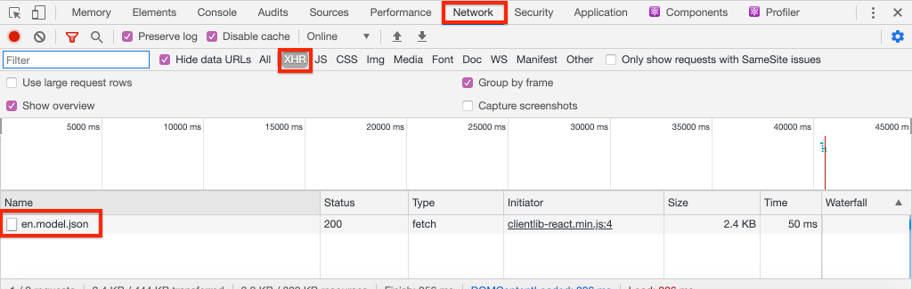

# Projeto do Editor SPA {#spa-editor-project}

Saiba como usar um projeto Adobe Experience Manager (AEM) Maven como ponto de partida para um aplicativo React integrado ao Editor SPA AEM.

## Objetivo

1. Entenda a estrutura de um novo projeto AEM Editor SPA criado a partir de um arquétipo Maven.
2. Implante o projeto inicial para uma instância local do AEM.

## O que você vai criar

Neste capítulo, um novo projeto AEM será implantado, com base no [AEM Project Archetype](https://github.com/adobe/aem-project-archetype). O projeto AEM será inicializado com um ponto de partida muito simples para a SPA Reata. O projeto utilizado neste capítulo servirá de base para a implementação da ZPE da WKND e será desenvolvido em futuros capítulos.


*Hierarquia inicial do site para o SPA WKND.*

## Pré-requisitos

Revise as ferramentas e instruções necessárias para configurar um ambiente [de desenvolvimento](overview.md#local-dev-environment)local. Verifique se uma nova instância do Adobe Experience Manager, iniciada no modo de **autor** , está sendo executada localmente.

## Obter o projeto

Há várias opções para criar um projeto Maven Multi-module para AEM. Este tutorial usou o último [AEM do Project Archetype](https://github.com/adobe/aem-project-archetype) como base para o código do tutorial. Foram feitas modificações no código do projeto para suportar várias versões de AEM. Leia [a nota sobre a compatibilidade](overview.md#compatibility)com versões anteriores.

>[!CAUTION]
>
> É uma prática recomendada usar a versão **mais recente** do [arquétipo](https://github.com/adobe/aem-project-archetype) para gerar um novo projeto para uma implementação real. AEM projetos devem público alvo uma única versão de AEM usando a `aemVersion` propriedade do tipo de arquétipo.

1. Baixe o ponto de partida para este tutorial via Git:

   ```shell
   $ git clone git@github.com:adobe/aem-guides-wknd-spa.git
   $ cd aem-guides-wknd-spa
   $ git checkout React/create-project-start
   ```

2. A pasta e a estrutura de arquivos a seguir representam o Projeto AEM que foi gerado pelo arquétipo Maven no sistema de arquivos local:

   ```plain
   |--- aem-guides-wknd-spa
       |--- all/
       |--- core/
       |--- dispatcher/
       |--- ui.apps/
       |--- ui.apps.structure/
       |--- ui.content/
       |--- ui.frontend /
       |--- it.tests/
       |--- pom.xml
       |--- README.md
       |--- .gitignore
       |--- archetype.properties
   ```

3. As seguintes propriedades foram usadas ao gerar o projeto AEM a partir do arquétipo de projeto do [AEM](https://github.com/Adobe-Marketing-Cloud/aem-project-archetype/releases/tag/aem-project-archetype-14):

   | Propriedade | Valor |
   |-----------------|-------------------------------------|
   | aemVersion | nuvem |
   | appTitle | Reação de WKND SPA |
   | appId | reação de wknd-spa |
   | groupId | com.adobe.aem.guides |
   | fronendModule | reação |
   | package | com.adobe.aem.guides.wknd.spa.react |
   | includeExamples | n |

   >[!NOTE]
   >
   > Notice the `frontendModule=react` property. Isso instrui o AEM Project Archetype a inicializar o projeto com uma base [de código inicial](https://docs.adobe.com/content/help/en/experience-manager-core-components/using/developing/archetype/uifrontend-react.html) React a ser usada com o AEM Editor SPA.

## Criar o projeto

Em seguida, compile, crie e implante o código do projeto em uma instância local do AEM usando o Maven.

1. Verifique se uma instância do AEM está sendo executada localmente na porta **4502**.
2. No terminal da linha de comando, verifique se o Maven está instalado:

   ```shell
   $ mvn --version
    Apache Maven 3.6.2
    Maven home: /Library/apache-maven-3.6.2
    Java version: 11.0.4, vendor: Oracle Corporation, runtime: /Library/Java/JavaVirtualMachines/jdk-11.0.4.jdk/Contents/Home
   ```

3. Execute o comando Maven abaixo no `aem-guides-wknd-spa` diretório para criar e implantar o projeto no AEM:

   ```shell
   $ mvn clean install -PautoInstallSinglePackage
   ```

   Se estiver usando [AEM 6.x](overview.md#compatibility):

   ```shell
   $ mvn clean install -PautoInstallSinglePackage -Pclassic
   ```

   Os vários módulos do projeto devem ser compilados e implantados no AEM.

   ```plain
    [INFO] ------------------------------------------------------------------------
    [INFO] Reactor Summary for wknd-spa-react 1.0.0-SNAPSHOT:
    [INFO] 
    [INFO] wknd-spa-react ..................................... SUCCESS [  0.523 s]
    [INFO] WKND SPA React - Core .............................. SUCCESS [  8.069 s]
    [INFO] wknd-spa-react.ui.frontend - UI Frontend ........... SUCCESS [01:23 min]
    [INFO] WKND SPA React - Repository Structure Package ...... SUCCESS [  0.830 s]
    [INFO] WKND SPA React - UI apps ........................... SUCCESS [  4.654 s]
    [INFO] WKND SPA React - UI content ........................ SUCCESS [  1.607 s]
    [INFO] WKND SPA React - All ............................... SUCCESS [  0.384 s]
    [INFO] WKND SPA React - Integration Tests Bundles ......... SUCCESS [  0.770 s]
    [INFO] WKND SPA React - Integration Tests Launcher ........ SUCCESS [  1.407 s]
    [INFO] WKND SPA React - Dispatcher ........................ SUCCESS [  0.055 s]
    [INFO] ------------------------------------------------------------------------
    [INFO] BUILD SUCCESS
    [INFO] ------------------------------------------------------------------------
    [INFO] Total time:  01:44 min
   ```

   O perfil Maven ***autoInstallSinglePackage*** compila os módulos individuais do projeto e implanta um único pacote para a instância AEM. Por padrão, esse pacote será implantado em uma instância AEM executada localmente na porta **4502** e com as credenciais de **admin:admin**.

4. Navegue até **[!UICONTROL Gerenciador]** de pacotes na instância de AEM local: [http://localhost:4502/crx/packmgr/index.jsp](http://localhost:4502/crx/packmgr/index.jsp).

5. Você deve ver três pacotes para `wknd-spa-react.all`, `wknd-spa-react.ui.apps` e `wknd-spa-react.ui.content`.

   

   *Gerenciador de pacote AEM*

   Todos os códigos personalizados necessários para o projeto serão agrupados nesses pacotes e instalados no tempo de execução AEM.

6. Você também deve ver vários pacotes para `spa.project.core` e `core.wcm.components`. Essas dependências são incluídas automaticamente pelo tipo de arquivo. Mais informações sobre [AEM componentes principais podem ser encontradas aqui](https://docs.adobe.com/content/help/pt-BR/experience-manager-core-components/using/introduction.html).

   `spa.project.core` é uma dependência necessária para gerar a API de modelo JSON que o Editor SPA espera.

## Conteúdo do autor

Em seguida, abra o SPA inicial gerado pelo arquétipo e atualize parte do conteúdo.

1. Navegue até o console **[!UICONTROL Sites]** : [http://localhost:4502/sites.html/content](http://localhost:4502/sites.html/content).

   O WKND SPA inclui uma estrutura básica do site com um país, um idioma e um home page. Essa hierarquia se baseia nos valores padrão do arquétipo para `language_country` e `isSingleCountryWebsite`. Esses valores podem ser sobrescritos atualizando as propriedades [](https://github.com/adobe/aem-project-archetype#available-properties) disponíveis ao gerar um projeto.

2. Abra a página **[!DNL us]** > **[!DNL en]** > **[!DNL WKND SPA React Home Page]** selecionando a página e clicando no botão **[!UICONTROL Editar]** na barra de menus:

   

3. Um componente de **[!UICONTROL Texto]** já foi adicionado à página. Você pode editar esse componente como qualquer outro componente no AEM.

   

4. Adicione um componente **[!UICONTROL de texto]** adicional à página.

   Observe que a experiência de criação é semelhante à de uma página tradicional do AEM Sites. Atualmente, há um número limitado de componentes disponíveis para serem usados. Mais serão adicionados ao longo do tutorial.

## Inspect o aplicativo de página única

Em seguida, verifique se este é um aplicativo de página única com o uso das ferramentas de desenvolvedor do seu navegador.

1. No Editor **[!UICONTROL de]** páginas, clique no botão Informações **[!UICONTROL da]** página > **[!UICONTROL Visualização como publicada]**:

   

   Isso abrirá uma nova guia com o parâmetro query `?wcmmode=disabled` , que efetivamente desliga o editor de AEM: [http://localhost:4502/content/wknd-spa-react/us/en/home.html?wcmmode=disabled](http://localhost:4502/content/wknd-spa-react/us/en/home.html?wcmmode=disabled)

2. Visualização na origem da página e observe que o conteúdo do texto **[!DNL Hello World]** ou qualquer outro conteúdo não foi encontrado. Em vez disso, você deve ver o HTML da seguinte maneira:

   ```html
   ...
   <body>
       <noscript>You need to enable JavaScript to run this app.</noscript>
       <div id="spa-root"></div>
       <script type="text/javascript" src="/etc.clientlibs/wknd-spa-react/clientlibs/clientlib-react.min.js"></script>
   </body>
   ...
   ```

   `clientlib-react.min.js` é o React SPA que é carregado na página e responsável pela renderização do conteúdo.

   Entretanto, de *onde vem o conteúdo?*

3. Retorne à guia: [http://localhost:4502/content/wknd-spa-react/us/en/home.html?wcmmode=disabled](http://localhost:4502/content/wknd-spa-react/us/en/home.html?wcmmode=disabled)
4. Abra as ferramentas do desenvolvedor do navegador e inspecione o tráfego da rede da página durante uma atualização. Visualização das solicitações **XHR** :

   

   Deve haver uma solicitação para [http://localhost:4502/content/wknd-spa-react/us/en.model.json](http://localhost:4502/content/wknd-spa-react/us/en.model.json). Ele contém todo o conteúdo, formatado em JSON, que direcionará o SPA.

5. Em uma nova guia, abra [http://localhost:4502/content/wknd-spa-react/us/en.model.json](http://localhost:4502/content/wknd-spa-react/us/en.model.json)

   A solicitação `en.model.json` representa o modelo de conteúdo que orientará o aplicativo. Inspect a saída JSON e você deve encontrar o trecho que representa os componentes de **[!UICONTROL Texto]** .

   ```json
   ...
   ":items": {
       "text": {
           "text": "<p>Hello World! Updated content!</p>\r\n",
           "richText": true,
           ":type": "wknd-spa-react/components/text"
       },
       "text_98796435": {
           "text": "<p>A new text component.</p>\r\n",
           "richText": true,
           ":type": "wknd-spa-react/components/text"
       },
   }
   ...
   ```

   No próximo capítulo, verificaremos como esse conteúdo JSON é mapeado de Componentes AEM para Componentes SPA para formar a base da experiência do Editor SPA AEM.

   >[!NOTE]
   >
   > Pode ser útil instalar uma extensão do navegador para formatar automaticamente a saída JSON.

## Parabéns! {#congratulations}

Parabéns, você acabou de criar seu primeiro projeto do editor AEM SPA!

O SPA é bem simples. Nos próximos capítulos, será adicionada mais funcionalidade.

### Próximas etapas {#next-steps}

[Integrar o SPA](integrate-spa.md) - saiba como o código fonte do SPA é integrado ao AEM Project e entenda as ferramentas disponíveis para desenvolver rapidamente o SPA.
