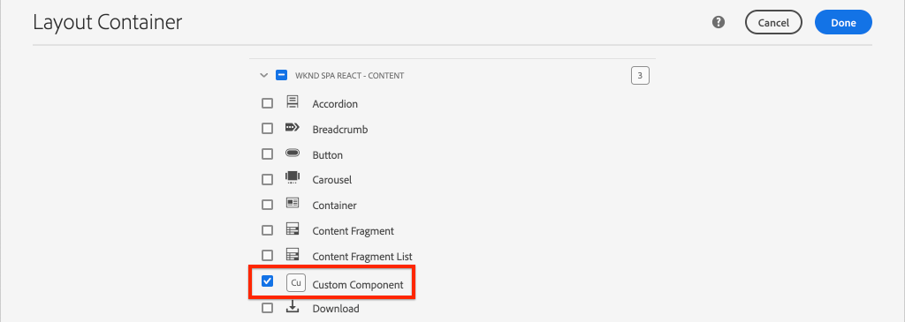

# Criar um componente personalizado {#custom-component}

Saiba como criar um componente personalizado para ser usado com o Editor SPA AEM. Saiba como desenvolver diálogos do autor e Modelos Sling para estender o modelo JSON para preencher um componente personalizado.

## Objetivo

1. Entenda a função dos Modelos Sling na manipulação da API do modelo JSON fornecida pela AEM.
2. Saiba como criar novas caixas de diálogo de componentes AEM.
3. Saiba como criar um componente de AEM **personalizado** que será compatível com a estrutura do editor de SPA.

## O que você vai criar

O foco dos capítulos anteriores era desenvolver componentes do SPA e mapeá-los para os componentes principais *existentes* AEM. Este capítulo se concentrará em como criar e estender *novos* componentes AEM e manipular o modelo JSON servido pela AEM.

Um simples `Custom Component` ilustra as etapas necessárias para criar um novo componente de AEM.


## Pré-requisitos

Revise as ferramentas e instruções necessárias para configurar um ambiente [de desenvolvimento](overview.md#local-dev-environment)local.

### Obter o código

1. Baixe o ponto de partida para este tutorial via Git:

   ```shell
   $ git clone git@github.com:adobe/aem-guides-wknd-spa.git
   $ cd aem-guides-wknd-spa
   $ git checkout React/custom-component-start
   ```

2. Implante a base de código para uma instância AEM local usando Maven:

   ```shell
   $ mvn clean install -PautoInstallSinglePackage
   ```

   Se estiver usando [AEM 6.x](overview.md#compatibility) , adicione o `classic` perfil:

   ```shell
   $ mvn clean install -PautoInstallSinglePackage -Pclassic
   ```

3. Instale o pacote finalizado para o site [de referência](https://github.com/adobe/aem-guides-wknd/releases/latest)WKND tradicional. As imagens fornecidas pelo site [de referência](https://github.com/adobe/aem-guides-wknd/releases/latest) WKND serão reutilizadas no SPA WKND. O pacote pode ser instalado usando [AEM Gerenciador](http://localhost:4502/crx/packmgr/index.jsp)de pacotes.

   

Você sempre pode visualização o código finalizado no [GitHub](https://github.com/adobe/aem-guides-wknd-spa/tree/React/custom-component-solution) ou fazer check-out do código localmente ao alternar para a ramificação `React/custom-component-solution`.

## Definir o componente AEM

Um componente AEM é definido como um nó e propriedades. No projeto, esses nós e propriedades são representados como arquivos XML no `ui.apps` módulo. Em seguida, crie o componente AEM no `ui.apps` módulo.

>[!NOTE]
>
> Uma atualização rápida dos [conceitos básicos dos componentes AEM pode ser útil](https://docs.adobe.com/content/help/en/experience-manager-learn/getting-started-wknd-tutorial-develop/component-basics.html).

1. No IDE de sua escolha, abra a `ui.apps` pasta.
2. Navegue até `ui.apps/src/main/content/jcr_root/apps/wknd-spa-react/components` e crie uma nova pasta chamada `custom-component`.
3. Create a new file named `.content.xml` beneath the `custom-component` folder. Preencha o `custom-component/.content.xml` seguinte:

   ```xml
   <?xml version="1.0" encoding="UTF-8"?>
   <jcr:root xmlns:sling="http://sling.apache.org/jcr/sling/1.0" xmlns:cq="http://www.day.com/jcr/cq/1.0" xmlns:jcr="http://www.jcp.org/jcr/1.0"
       jcr:primaryType="cq:Component"
       jcr:title="Custom Component"
       componentGroup="WKND SPA React - Content"/>
   ```

   

   `jcr:primaryType="cq:Component"` - identifica que esse nó será um componente AEM.

   `jcr:title` é o valor que será exibido para os autores de conteúdo e `componentGroup` determina o agrupamento de componentes na interface de criação.

4. Abaixo da `custom-component` pasta, crie outra pasta chamada `_cq_dialog`.
5. Abaixo da `_cq_dialog` pasta, crie um novo arquivo chamado `.content.xml` e preencha-o com o seguinte:

   ```xml
   <?xml version="1.0" encoding="UTF-8"?>
   <jcr:root xmlns:sling="http://sling.apache.org/jcr/sling/1.0" xmlns:granite="http://www.adobe.com/jcr/granite/1.0" xmlns:cq="http://www.day.com/jcr/cq/1.0" xmlns:jcr="http://www.jcp.org/jcr/1.0" xmlns:nt="http://www.jcp.org/jcr/nt/1.0"
       jcr:primaryType="nt:unstructured"
       jcr:title="Custom Component"
       sling:resourceType="cq/gui/components/authoring/dialog">
       <content
           jcr:primaryType="nt:unstructured"
           sling:resourceType="granite/ui/components/coral/foundation/container">
           <items jcr:primaryType="nt:unstructured">
               <tabs
                   jcr:primaryType="nt:unstructured"
                   sling:resourceType="granite/ui/components/coral/foundation/tabs"
                   maximized="{Boolean}true">
                   <items jcr:primaryType="nt:unstructured">
                       <properties
                           jcr:primaryType="nt:unstructured"
                           jcr:title="Properties"
                           sling:resourceType="granite/ui/components/coral/foundation/container"
                           margin="{Boolean}true">
                           <items jcr:primaryType="nt:unstructured">
                               <columns
                                   jcr:primaryType="nt:unstructured"
                                   sling:resourceType="granite/ui/components/coral/foundation/fixedcolumns"
                                   margin="{Boolean}true">
                                   <items jcr:primaryType="nt:unstructured">
                                       <column
                                           jcr:primaryType="nt:unstructured"
                                           sling:resourceType="granite/ui/components/coral/foundation/container">
                                           <items jcr:primaryType="nt:unstructured">
                                               <message
                                                   jcr:primaryType="nt:unstructured"
                                                   sling:resourceType="granite/ui/components/coral/foundation/form/textfield"
                                                   fieldDescription="The text to display on the component."
                                                   fieldLabel="Message"
                                                   name="./message"/>
                                           </items>
                                       </column>
                                   </items>
                               </columns>
                           </items>
                       </properties>
                   </items>
               </tabs>
           </items>
       </content>
   </jcr:root>
   ```

   

   O arquivo XML acima gera uma caixa de diálogo muito simples para o `Custom Component`. A parte crítica do arquivo é o `<message>` nó interno. Essa caixa de diálogo conterá um nome simples `textfield` e persistirá o valor do campo de texto para uma propriedade chamada `Message` `message`.

   Um Modelo Sling será criado ao lado de expor o valor da `message` propriedade por meio do modelo JSON.

   >[!NOTE]
   >
   > É possível visualização de muito mais [exemplos de caixas de diálogo exibindo as definições](https://github.com/adobe/aem-core-wcm-components/tree/master/content/src/content/jcr_root/apps/core/wcm/components)dos componentes principais. Também é possível visualização de campos de formulário adicionais, como `select`, `textarea`, `pathfield`, disponíveis abaixo `/libs/granite/ui/components/coral/foundation/form` no [CRXDE-Lite](http://localhost:4502/crx/de/index.jsp#/libs/granite/ui/components/coral/foundation/form).

   Com um componente AEM tradicional, um script [HTL](https://docs.adobe.com/content/help/pt-BR/experience-manager-htl/using/overview.html) geralmente é necessário. Como o SPA renderizará o componente, nenhum script HTL é necessário.

## Criar o modelo Sling

Os modelos Sling são Java &quot;POJO&#39;s&quot; (objetos Java simples) orientados por anotação que facilitam o mapeamento de dados do JCR para variáveis Java. [Normalmente, os Modelos](https://docs.adobe.com/content/help/en/experience-manager-learn/getting-started-wknd-tutorial-develop/component-basics.html#sling-models) Sling funcionam para encapsular uma lógica comercial complexa do lado do servidor para AEM Componentes.

No contexto do Editor SPA, os Modelos Sling expõem o conteúdo de um componente por meio do modelo JSON por meio de um recurso usando o Exportador [do Modelo](https://docs.adobe.com/content/help/en/experience-manager-learn/foundation/development/develop-sling-model-exporter.html)Sling.

1. No IDE de sua escolha, abra o `core` módulo. `CustomComponent.java` e já `CustomComponentImpl.java` foram criados e descartados como parte do código inicial do capítulo.

   >[!NOTE]
   >
   > Se estiver usando o Visual Studio Code IDE, pode ser útil instalar [extensões para Java](https://code.visualstudio.com/docs/java/extensions).

2. Abra a interface Java `CustomComponent.java` em `core/src/main/java/com/adobe/aem/guides/wknd/spa/react/core/models/CustomComponent.java`:

   

   Esta é a interface Java que será implementada pelo Modelo Sling.

3. Atualize `CustomComponent.java` para estender a `ComponentExporter` interface:

   ```java
   package com.adobe.aem.guides.wknd.spa.react.core.models;
   import com.adobe.cq.export.json.ComponentExporter;
   
   public interface CustomComponent extends ComponentExporter {
   
       public String getMessage();
   
   }
   ```

   A implementação da `ComponentExporter` interface é um requisito para que o Modelo Sling seja automaticamente selecionado pela API do modelo JSON.

   A `CustomComponent` interface inclui um único método getter `getMessage()`. Esse é o método que exporá o valor da caixa de diálogo do autor por meio do modelo JSON. Somente métodos de getter público com parâmetros vazios `()` serão exportados no modelo JSON.

4. Abra `CustomComponentImpl.java` no `core/src/main/java/com/adobe/aem/guides/wknd/spa/react/core/models/impl/CustomComponentImpl.java`.

   Esta é a implementação da `CustomComponent` interface. A `@Model` anotação identifica a classe Java como um Modelo Sling. A `@Exporter` anotação permite que a classe Java seja serializada e exportada por meio do Exportador do Modelo Sling.

5. Atualize a variável estática `RESOURCE_TYPE` para apontar para o componente AEM `wknd-spa-react/components/custom-component` criado no exercício anterior.

   ```java
   static final String RESOURCE_TYPE = "wknd-spa-react/components/custom-component";
   ```

   O tipo de recurso do componente é o que vinculará o Modelo Sling ao componente AEM e será mapeado ao componente React.

6. Adicione o `getExportedType()` método à `CustomComponentImpl` classe para retornar o tipo de recurso do componente:

   ```java
   @Override
   public String getExportedType() {
       return CustomComponentImpl.RESOURCE_TYPE;
   }
   ```

   Esse método é necessário ao implementar a `ComponentExporter` interface e exporá o tipo de recurso que permite o mapeamento para o componente React.

7. Atualize o `getMessage()` método para retornar o valor da `message` propriedade persistida pela caixa de diálogo do autor. Use a `@ValueMap` anotação para mapear o valor do JCR `message` para uma variável Java:

   ```java
   import org.apache.commons.lang3.StringUtils;
   ...
   
   @ValueMapValue
   private String message;
   
   @Override
   public String getMessage() {
       return StringUtils.isNotBlank(message) ? message.toUpperCase() : null;
   }
   ```

   Alguns outros &quot;business logic&quot; são adicionados para retornar o valor String da mensagem com todas as letras maiúsculas. Isso nos permitirá ver a diferença entre o valor bruto armazenado pela caixa de diálogo do autor e o valor exposto pelo Modelo Sling.

   >[!NOTE]
   >
   > Você pode visualização o CustomComponentImpl.java [finalizado aqui](https://github.com/adobe/aem-guides-wknd-spa/blob/React/custom-component-solution/core/src/main/java/com/adobe/aem/guides/wknd/spa/react/core/models/impl/CustomComponentImpl.java).

## Atualizar o componente React

O código React para o Componente personalizado já foi criado. Em seguida, faça algumas atualizações para mapear o componente React para o componente AEM.

1. No `ui.frontend` módulo, abra o arquivo `ui.frontend/src/components/Custom/Custom.js`.
2. Observe a `{this.props.message}` variável como parte do `render()` método:

   ```js
   return (
           <div class="CustomComponent">
               <h2 class="CustomComponent__message">{this.props.message}</h2>
           </div>
       );
   ```

   Espera-se que o valor em maiúsculas transformado do Modelo Sling seja mapeado para essa `message` propriedade.

3. Importe o `MapTo` objeto do SDK JS do Editor SPA AEM e use-o para mapear para o componente AEM:

   ```diff
   + import {MapTo} from '@adobe/aem-react-editable-components';
   
    ...
    export default class Custom extends Component {
        ...
    }
   
   + MapTo('wknd-spa-react/components/custom-component')(Custom, CustomEditConfig);
   ```

4. Implante todas as atualizações para um ambiente AEM local da raiz do diretório do projeto, usando suas habilidades Maven:

   ```shell
   $ cd aem-guides-wknd-spa
   $ mvn clean install -PautoInstallSinglePackage
   ```

## Atualizar a Política de Modelo

Em seguida, navegue até AEM para verificar as atualizações e permitir que elas sejam adicionadas `Custom Component` ao SPA.

1. Verifique o registro do novo Modelo Sling navegando até [http://localhost:4502/system/console/status-slingmodels](http://localhost:4502/system/console/status-slingmodels).

   ```plain
   com.adobe.aem.guides.wknd.spa.react.core.models.impl.CustomComponentImpl - wknd-spa-react/components/custom-component
   
   com.adobe.aem.guides.wknd.spa.react.core.models.impl.CustomComponentImpl exports 'wknd-spa-react/components/custom-component' with selector 'model' and extension '[Ljava.lang.String;@6fb4a693' with exporter 'jackson'
   ```

   Você deve ver as duas linhas acima que indicam que o componente `CustomComponentImpl` está associado ao `wknd-spa-react/components/custom-component` componente e que ele está registrado por meio do Exportador de Modelo Sling.

2. Navegue até Modelo de página SPA em [http://localhost:4502/editor.html/conf/wknd-spa-react/settings/wcm/templates/spa-page-template/structure.html](http://localhost:4502/editor.html/conf/wknd-spa-react/settings/wcm/templates/spa-page-template/structure.html).
3. Atualize a política de Container de layout para adicionar o novo componente `Custom Component` como permitido:

   

   Salve as alterações na política e observe o `Custom Component` como um componente permitido:

   

## Autor do componente personalizado

Em seguida, crie o `Custom Component` usando o Editor SPA AEM.

1. Navegue até [http://localhost:4502/editor.html/content/wknd-spa-react/us/en/home.html](http://localhost:4502/editor.html/content/wknd-spa-react/us/en/home.html).
2. No `Edit` modo, adicione o `Custom Component` ao `Layout Container`:

   

3. Abra a caixa de diálogo do componente e insira uma mensagem que contenha algumas letras minúsculas.

   

   Esta é a caixa de diálogo criada com base no arquivo XML no início do capítulo.

4. Salve as alterações. Observe que a mensagem exibida está toda em maiúsculas.

   

5. Visualização o modelo JSON navegando até [http://localhost:4502/content/wknd-spa-react/us/en.model.json](http://localhost:4502/content/wknd-spa-react/us/en.model.json). Pesquisar `wknd-spa-react/components/custom-component`:

   ```json
   "custom_component_208183317": {
       "message": "HELLO WORLD",
       ":type": "wknd-spa-react/components/custom-component"
   }
   ```

   Observe que o valor JSON está definido para todas as letras maiúsculas com base na lógica adicionada ao Modelo Sling.

## Parabéns! {#congratulations}

Parabéns, você aprendeu a criar um componente de AEM personalizado para ser usado com o Editor SPA. Você também aprendeu como diálogos, propriedades JCR e Modelos Sling interagem para produzir o modelo JSON.

Você pode visualização o código finalizado no [GitHub](https://github.com/adobe/aem-guides-wknd-spa/tree/React/custom-component-solution) ou fazer check-out local do código ao alternar para a ramificação `React/custom-component-solution`.

### Próximas etapas {#next-steps}

[Estender um componente](extend-component.md) principal - saiba como estender um componente principal existente para ser usado com o Editor SPA AEM. Entender como adicionar propriedades e conteúdo a um componente existente é uma técnica avançada para expandir os recursos de uma implementação do Editor SPA AEM.
