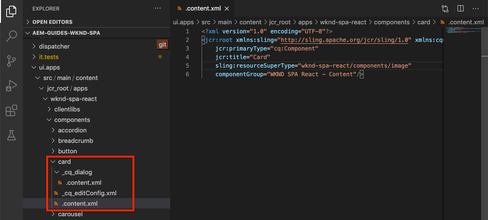

# Estender um componente principal {#extend-component}

Saiba como estender um Componente principal existente a ser usado com o Editor de SPA do AEM. Entender como estender um componente existente é uma técnica poderosa para personalizar e expandir os recursos de uma implementação do AEM SPA Editor.

## Objetivo

1. Estenda um Componente principal existente com propriedades e conteúdo adicionais.
2. Entenda a base da Herança de componente com o uso de `sling:resourceSuperType`.
3. Saiba como aproveitar o [Padrão de delegação](https://github.com/adobe/aem-core-wcm-components/wiki/Delegation-Pattern-for-Sling-Models) para Modelos do Sling para reutilizar a lógica e funcionalidade existentes.

## O que você vai criar

Neste capítulo, um novo componente `Card` será criado. O componente `Card` estenderá o [Componente principal de imagem](https://docs.adobe.com/content/help/br/experience-manager-core-components/using/components/image.html) adicionando campos de conteúdo adicionais como um Título e um botão de Ação de chamada para executar a função de um teaser para outro conteúdo dentro do SPA.


>[!NOTE]
>
> Em uma implementação real, pode ser mais apropriado simplesmente usar o [Teaser Component](https://docs.adobe.com/content/help/br/experience-manager-core-components/using/components/teaser.html) e estender o [Image Core Component](https://docs.adobe.com/content/help/en/experience-manager-core-components/using/components/image.html) para fazer um componente `Card` dependendo dos requisitos do projeto. Sempre é recomendável usar [Componentes principais](https://docs.adobe.com/content/help/pt-BR/experience-manager-core-components/using/introduction.html) diretamente quando possível.

## Pré-requisitos

Revise as ferramentas e instruções necessárias para configurar um [ambiente de desenvolvimento local](overview.md#local-dev-environment).

### Obter o código

1. Baixe o ponto de partida para este tutorial via Git:

   ```shell
   $ git clone git@github.com:adobe/aem-guides-wknd-spa.git
   $ cd aem-guides-wknd-spa
   $ git checkout React/extend-component-start
   ```

2. Implante a base de código em uma instância do AEM local usando o Maven:

   ```shell
   $ mvn clean install -PautoInstallSinglePackage
   ```

   Se estiver usando [AEM 6.x](overview.md#compatibility) adicione o perfil `classic`:

   ```shell
   $ mvn clean install -PautoInstallSinglePackage -Pclassic
   ```

3. Instale o pacote concluído para o site de referência tradicional [WKND](https://github.com/adobe/aem-guides-wknd/releases/latest). As imagens fornecidas pelo [site de referência WKND](https://github.com/adobe/aem-guides-wknd/releases/latest) serão reutilizadas no SPA da WKND. O pacote pode ser instalado usando o [Gerenciador de Pacotes do AEM](http://localhost:4502/crx/packmgr/index.jsp).

   

Você sempre pode visualizar o código concluído em [GitHub](https://github.com/adobe/aem-guides-wknd-spa/tree/React/extend-component-solution) ou verificar o código localmente ao alternar para a ramificação `React/extend-component-solution`.

## Inspecionar a implementação inicial do Cartão

Um componente de cartão inicial foi fornecido pelo código inicial do capítulo. Inspecione o ponto de partida para verificar a implementação do cartão.

1. No IDE de sua escolha, abra o módulo `ui.apps`.
2. Navegue até `ui.apps/src/main/content/jcr_root/apps/wknd-spa-react/components/card` e exiba o arquivo `.content.xml`.

   

   ```xml
   <?xml version="1.0" encoding="UTF-8"?>
   <jcr:root xmlns:sling="http://sling.apache.org/jcr/sling/1.0" xmlns:cq="http://www.day.com/jcr/cq/1.0" xmlns:jcr="http://www.jcp.org/jcr/1.0"
       jcr:primaryType="cq:Component"
       jcr:title="Card"
       sling:resourceSuperType="wknd-spa-react/components/image"
       componentGroup="WKND SPA React - Content"/>
   ```

   A propriedade `sling:resourceSuperType` aponta para `wknd-spa-react/components/image` indicando que o componente `Card` herdará toda a funcionalidade do componente de imagem SPA WKND.

3. Inspecione o arquivo `ui.apps/src/main/content/jcr_root/apps/wknd-spa-react/components/image/.content.xml`:

   ```xml
   <?xml version="1.0" encoding="UTF-8"?>
   <jcr:root xmlns:sling="http://sling.apache.org/jcr/sling/1.0" xmlns:cq="http://www.day.com/jcr/cq/1.0" xmlns:jcr="http://www.jcp.org/jcr/1.0"
       jcr:primaryType="cq:Component"
       jcr:title="Image"
       sling:resourceSuperType="core/wcm/components/image/v2/image"
       componentGroup="WKND SPA React - Content"/>
   ```

   Observe que `sling:resourceSuperType` aponta para `core/wcm/components/image/v2/image`. Isso indica que o componente WKND SPA Image herda toda a funcionalidade da Imagem do componente principal.

   Também conhecido como [Proxy pattern](https://docs.adobe.com/content/help/en/experience-manager-core-components/using/developing/guidelines.html#proxy-component-pattern) A herança de recurso Sling é um padrão de design avançado para permitir que os componentes filho herdem a funcionalidade e estendam/substituam o comportamento quando desejado. A herança do Sling suporta vários níveis de herança, portanto, em última análise, o novo componente `Card` herda a funcionalidade da Imagem do componente principal.

   Muitas equipes de desenvolvimento se esforçam para ser D.R.Y. (não se repitam). A herança do Sling possibilita isso com o AEM.

4. Abaixo da pasta `card`, abra o arquivo `_cq_dialog/.content.xml`.

   Esse arquivo é a definição da caixa de diálogo de componente para o componente `Card`. Se estiver usando a herança Sling, é possível usar os recursos do [Sling Resource Merger](https://docs.adobe.com/content/help/en/experience-manager-65/developing/platform/sling-resource-merger.html) para substituir ou estender partes da caixa de diálogo. Neste exemplo, uma nova guia foi adicionada à caixa de diálogo para capturar dados adicionais de um autor para preencher o Componente de cartão.

   Propriedades como `sling:orderBefore` permitem que um desenvolvedor escolha onde inserir novas guias ou campos de formulário. Nesse caso, a guia `Text` será inserida antes da guia `asset`. Para utilizar totalmente o Sling Resource Merger , é importante conhecer a estrutura original do nó da caixa de diálogo para a caixa de diálogo [Image component dialog](https://github.com/adobe/aem-core-wcm-components/blob/master/content/src/content/jcr_root/apps/core/wcm/components/image/v2/image/_cq_dialog/.content.xml).

5. Abaixo da pasta `card`, abra o arquivo `_cq_editConfig.xml`. Esse arquivo determina o comportamento de arrastar e soltar na interface do usuário de criação do AEM. Ao estender o componente de Imagem , é importante que o tipo de recurso corresponda ao próprio componente. Revise o nó `<parameters>`:

   ```xml
   <parameters
       jcr:primaryType="nt:unstructured"
       sling:resourceType="wknd-spa-react/components/card"
       imageCrop=""
       imageMap=""
       imageRotate=""/>
   ```

   A maioria dos componentes não requer um `cq:editConfig`, os descendentes da Imagem e do filho do componente de Imagem são exceções.

6. No switch IDE para o módulo `ui.frontend`, navegando até `ui.frontend/src/components/Card`:

   

7. Inspecione o arquivo `Card.js`.

   O componente já foi preparado para mapear para o Componente AEM `Card` usando a função padrão `MapTo`.

   ```js
   MapTo('wknd-spa-react/components/card')(Card, CardEditConfig);
   ```

8. Inspecione o método `get imageContent()`:

   ```js
    get imageContent() {
       return (
           <div className="Card__image">
               <Image {...this.props} />
           </div>)
   }
   ```

   Neste exemplo, optamos por reutilizar o componente Imagem de reação existente `Image` simplesmente passando o `this.props` do componente `Card`. Posteriormente no tutorial, o método `get bodyContent()` será implementado para exibir um título, uma data e um botão de ação.

## Atualizar a Política de Modelo

Com essa implementação inicial `Card`, revise a funcionalidade no Editor de SPA do AEM. Para ver o componente inicial `Card` é necessário atualizar a política Modelo.

1. Implante o código inicial em uma instância local do AEM, caso ainda não tenha:

   ```shell
   $ cd aem-guides-wknd-spa
   $ mvn clean install -PautoInstallSinglePackage
   ```

2. Navegue até o modelo de página SPA em [http://localhost:4502/editor.html/conf/wknd-spa-react/settings/wcm/templates/spa-page-template/structure.html](http://localhost:4502/editor.html/conf/wknd-spa-react/settings/wcm/templates/spa-page-template/structure.html).
3. Atualize a política do Contêiner de layout para adicionar o novo componente `Card` como um componente permitido:

   

   Salve as alterações na política e observe o componente `Card` como um componente permitido:

   

## Componente de cartão inicial do autor

Em seguida, crie o componente `Card` usando o Editor de SPA do AEM.

1. Navegue até [http://localhost:4502/editor.html/content/wknd-spa-react/us/en/home.html](http://localhost:4502/editor.html/content/wknd-spa-react/us/en/home.html).
2. No modo `Edit`, adicione o componente `Card` ao `Layout Container`:

   

3. Arraste e solte uma imagem do Localizador de ativos no componente `Card` :

   

4. Abra a caixa de diálogo `Card` do componente e observe a adição de uma guia **Text**.
5. Insira os seguintes valores na guia **Text**:

   

   **Caminho do cartão**  - escolha uma página abaixo da página inicial do SPA.

   **Texto**  CTA - &quot;Leia mais&quot;

   **Título do cartão**  - deixe em branco

   **Obter título da página vinculada**  - marque a caixa de seleção para indicar verdadeiro.

6. Atualize a guia **Metadados do ativo** para adicionar valores para **Texto alternativo** e **Legenda**.

   No momento, nenhuma alteração adicional é exibida após a atualização da caixa de diálogo. Para expor os novos campos ao Componente de reação, precisamos atualizar o Modelo de sling para o componente `Card`.

7. Abra uma nova guia e navegue até [CRXDE-Lite](http://localhost:4502/crx/de/index.jsp#/content/wknd-spa-react/us/en/home/jcr%3Acontent/root/responsivegrid/card). Inspecione os nós de conteúdo abaixo de `/content/wknd-spa-react/us/en/home/jcr:content/root/responsivegrid` para localizar o conteúdo do componente `Card`.

   

   Observe que as propriedades `cardPath`, `ctaText`, `titleFromPage` são persistentes pela caixa de diálogo.

## Atualizar modelo de sling de placa

Para expor os valores da caixa de diálogo do componente ao componente React , precisamos atualizar o Modelo do Sling que preenche o JSON para o componente `Card`. Também temos a oportunidade de implementar duas lógicas de negócios:

* Se `titleFromPage` para **true**, retorne o título da página especificado por `cardPath` caso contrário, retorne o valor de `cardTitle` campo de texto.
* Retorna a data da última modificação da página especificada por `cardPath`.

Retorne ao IDE de sua escolha e abra o módulo `core`.

1. Abra o arquivo `Card.java` em `core/src/main/java/com/adobe/aem/guides/wknd/spa/react/core/models/Card.java`.

   Observe que a interface `Card` atualmente estende `com.adobe.cq.wcm.core.components.models.Image` e, portanto, herda todos os métodos da interface `Image`. A interface `Image` já estende a interface `ComponentExporter` que permite que o Modelo do Sling seja exportado como JSON e mapeado pelo editor do SPA. Portanto, não precisamos estender explicitamente a interface `ComponentExporter` como fizemos no [Componente personalizado capítulo](custom-component.md).

2. Adicione os seguintes métodos à interface:

   ```java
   @ProviderType
   public interface Card extends Image {
   
       /***
       * The URL to populate the CTA button as part of the card.
       * The link should be based on the cardPath property that points to a page.
       * @return String URL
       */
       public String getCtaLinkURL();
   
       /***
       * The text to display on the CTA button of the card.
       * @return String CTA text
       */
       public String getCtaText();
   
   
   
       /***
       * The date to be displayed as part of the card.
       * This is based on the last modified date of the page specified by the cardPath
       * @return
       */
       public Calendar getCardLastModified();
   
   
       /**
       * Return the title of the page specified by cardPath if `titleFromPage` is set to true.
       * Otherwise return the value of `cardTitle`
       * @return
       */
       public String getCardTitle();
   }
   ```

   Esses métodos serão expostos por meio da API do modelo JSON e passados para o componente React .

3. Abrir `CardImpl.java`. Esta é a implementação da interface `Card.java`. Essa implementação já foi parcialmente adiada para acelerar o tutorial.  Observe a utilização das anotações `@Model` e `@Exporter` para garantir que o Modelo do Sling possa ser serializado como JSON por meio do Exportador de Modelo do Sling.

   `CardImpl.java` também usa o padrão  [Delegação para ](https://github.com/adobe/aem-core-wcm-components/wiki/Delegation-Pattern-for-Sling-Models) Modelos do Sling para evitar a regravação de toda a lógica do componente principal Imagem .

4. Observe as seguintes linhas:

   ```java
   @Self
   @Via(type = ResourceSuperType.class)
   private Image image;
   ```

   A anotação acima instanciará um objeto de Imagem chamado `image` com base na herança `sling:resourceSuperType` do componente `Card`.

   ```java
   @Override
   public String getSrc() {
       return null != image ? image.getSrc() : null;
   }
   ```

   É possível simplesmente usar o objeto `image` para implementar métodos definidos pela interface `Image`, sem precisar gravar a lógica por conta própria. Essa técnica é usada para `getSrc()`, `getAlt()` e `getTitle()`.

5. Em seguida, implemente o método `initModel()` para iniciar uma variável privada `cardPage` com base no valor de `cardPath`

   ```java
   @PostConstruct
   public void initModel() {
       if(StringUtils.isNotBlank(cardPath) && pageManager != null) {
           cardPage = pageManager.getPage(this.cardPath);
       }
   }
   ```

   O `@PostConstruct initModel()` sempre será chamado quando o Modelo do Sling for inicializado, portanto, é uma boa oportunidade para inicializar objetos que podem ser usados por outros métodos no modelo. O `pageManager` é um dos vários [objetos globais com suporte para Java](https://docs.adobe.com/content/help/en/experience-manager-htl/using/htl/global-objects.html#java-backed-objects) disponibilizados aos Modelos do Sling por meio da anotação `@ScriptVariable`. O método [getPage](https://docs.adobe.com/content/help/en/experience-manager-cloud-service/implementing/developing/ref/javadoc/com/day/cq/wcm/api/PageManager.html#getPage-java.lang.String-) assume um caminho e retorna um objeto AEM [Page](https://docs.adobe.com/content/help/en/experience-manager-cloud-service/implementing/developing/ref/javadoc/com/day/cq/wcm/api/Page.html) ou nulo se o caminho não apontar para uma página válida.

   Isso inicializará a variável `cardPage`, que será usada pelos outros novos métodos para retornar dados sobre a página vinculada subjacente.

6. Revise as variáveis globais já mapeadas para as propriedades do JCR que salvaram a caixa de diálogo do autor. A anotação `@ValueMapValue` é usada para executar automaticamente o mapeamento.

   ```java
   @ValueMapValue
   private String cardPath;
   
   @ValueMapValue
   private String ctaText;
   
   @ValueMapValue
   private boolean titleFromPage;
   
   @ValueMapValue
   private String cardTitle;
   ```

   Essas variáveis serão usadas para implementar os métodos adicionais para a interface `Card.java` .

7. Implemente os métodos adicionais definidos na interface `Card.java`:

   ```java
   @Override
   public String getCtaLinkURL() {
       if(cardPage != null) {
           return cardPage.getPath() + ".html";
       }
       return null;
   }
   
   @Override
   public String getCtaText() {
       return ctaText;
   }
   
   @Override
   public Calendar getCardLastModified() {
      if(cardPage != null) {
          return cardPage.getLastModified();
      }
      return null;
   }
   
   @Override
   public String getCardTitle() {
       if(titleFromPage) {
           return cardPage != null ? cardPage.getTitle() : null;
       }
       return cardTitle;
   }
   ```

   >[!NOTE]
   >
   > Você pode visualizar o [CardImpl.java concluído aqui](https://github.com/adobe/aem-guides-wknd-spa/blob/React/extend-component-solution/core/src/main/java/com/adobe/aem/guides/wknd/spa/react/core/models/impl/CardImpl.java).

8. Abra uma janela de terminal e implante apenas as atualizações do módulo `core` usando o perfil Maven `autoInstallBundle` do diretório `core`.

   ```shell
   $ cd core/
   $ mvn clean install -PautoInstallBundle
   ```

   Se estiver usando [AEM 6.x](overview.md#compatibility) adicione o perfil `classic`.

9. Visualize a resposta do modelo JSON em: [http://localhost:4502/content/wknd-spa-react/us/en.model.json](http://localhost:4502/content/wknd-spa-react/us/en.model.json) e procure pelo `wknd-spa-react/components/card`:

   ```json
   "card": {
       "ctaText": "Read More",
       "cardTitle": "Page 1",
       "title": "Woman chillaxing with river views in Australian bushland",
       "src": "/content/wknd-spa-react/us/en/home/_jcr_content/root/responsivegrid/card.coreimg.jpeg/1595190732886/adobestock-216674449.jpeg",
       "alt": "Female sitting on a large rock relaxing in afternoon dappled light the Australian bushland with views over the river",
       "cardLastModified": 1591360492414,
       "ctaLinkURL": "/content/wknd-spa-react/us/en/home/page-1.html",
       ":type": "wknd-spa-react/components/card"
   }
   ```

   Observe que o modelo JSON é atualizado com pares de chave/valor adicionais após atualizar os métodos no `CardImpl` Modelo do Sling.

## Atualizar Componente React

Agora que o modelo JSON está preenchido com novas propriedades para `ctaLinkURL`, `ctaText`, `cardTitle` e `cardLastModified`, podemos atualizar o componente React para exibi-las.

1. Retorne ao IDE e abra o módulo `ui.frontend`. Opcionalmente, inicie o servidor de desenvolvimento do webpack a partir de uma nova janela de terminal para ver as alterações em tempo real:

   ```shell
   $ cd ui.frontend
   $ npm install
   $ npm start
   ```

2. Abra `Card.js` em `ui.frontend/src/components/Card/Card.js`.
3. Adicione o método `get ctaButton()` para renderizar a chamada para a ação:

   ```js
   import {Link} from "react-router-dom";
   ...
   
   export default class Card extends Component {
   
       get ctaButton() {
           if(this.props && this.props.ctaLinkURL && this.props.ctaText) {
               return (
                   <div className="Card__action-container">
                       <Link to={this.props.ctaLinkURL} title={this.props.title}
                           className="Card__action-link">
                           {this.props.ctaText}
                       </Link>
                   </div>
               );
           }
   
           return null;
       }
       ...
   }
   ```

4. Adicione um método para `get lastModifiedDisplayDate()` transformar `this.props.cardLastModified` em uma String localizada que representa a data.

   ```js
   export default class Card extends Component {
       ...
       get lastModifiedDisplayDate() {
           const lastModifiedDate = this.props.cardLastModified ? new Date(this.props.cardLastModified) : null;
   
           if (lastModifiedDate) {
               return lastModifiedDate.toLocaleDateString();
           }
           return null;
       }
       ...
   }
   ```

5. Atualize o `get bodyContent()` para exibir `this.props.cardTitle` e use os métodos criados nas etapas anteriores:

   ```js
   export default class Card extends Component {
       ...
       get bodyContent() {
          return (<div class="Card__content">
                       <h2 class="Card__title"> {this.props.cardTitle}
                           <span class="Card__lastmod">
                               {this.lastModifiedDisplayDate}
                           </span>
                       </h2>
                       {this.ctaButton}
               </div>);
       }
       ...
   }
   ```

6. As regras do Sass já foram adicionadas em `Card.scss` para criar um estilo no título, chamar para a ação e data da última modificação. Inclua esses estilos adicionando a seguinte linha em `Card.js` na parte superior do arquivo:

   ```diff
     import {MapTo} from '@adobe/aem-react-editable-components';
   
   + require('./Card.scss');
   
     export const CardEditConfig = {
   ```

   >[!NOTE]
   >
   > Você pode visualizar o [React card component code here](https://github.com/adobe/aem-guides-wknd-spa/blob/React/extend-component-solution/ui.frontend/src/components/Card/Card.js) concluído.

7. Implante as alterações completas no AEM a partir da raiz do projeto usando o Maven:

   ```shell
   $ cd aem-guides-wknd-spa
   $ mvn clean install -PautoInstallSinglePackage
   ```

8. Navegue até [http://localhost:4502/editor.html/content/wknd-spa-react/us/en/home.html](http://localhost:4502/editor.html/content/wknd-spa-react/us/en/home.html) para ver o componente atualizado:

   

9. Você deve ser capaz de recriar o conteúdo existente para criar uma página semelhante ao seguinte:

   

## Parabéns! {#congratulations}

Parabéns, você aprendeu a estender um componente do AEM usando o e como os Modelos e diálogos do Sling funcionam com o modelo JSON.

Você sempre pode visualizar o código concluído em [GitHub](https://github.com/adobe/aem-guides-wknd-spa/tree/React/extend-component-solution) ou verificar o código localmente ao alternar para a ramificação `React/extend-component-solution`.
