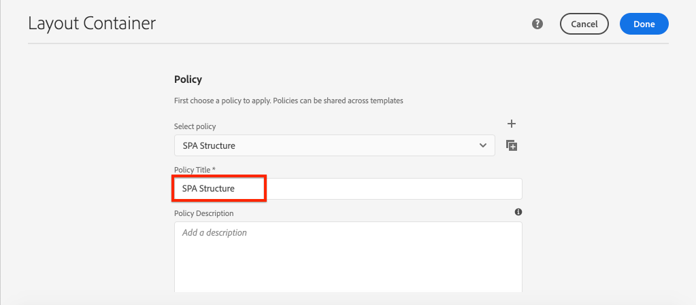

# Adicionar navegação e roteamento {#navigation-routing}

Saiba como várias visualizações no SPA podem ser suportadas pelo mapeamento para AEM páginas com o SDK do editor SPA. A navegação dinâmica é implementada usando o Roteador de Reação e adicionada a um componente de Cabeçalho existente.

## Objetivo

1. Entenda as opções de roteamento do modelo SPA disponíveis ao usar o Editor de SPA.
1. Saiba como usar o [React Router](https://reacttraining.com/react-router/) para navegar entre diferentes visualizações do SPA.
1. Implemente uma navegação dinâmica orientada pela hierarquia de páginas AEM.

## O que você vai criar

Este capítulo adicionará um menu de navegação a um componente `Header` existente. O menu de navegação será conduzido pela hierarquia de páginas AEM e usará o modelo JSON fornecido pelo [Componente principal de navegação](https://docs.adobe.com/content/help/pt/experience-manager-core-components/using/components/navigation.html).


## Pré-requisitos

Revise as ferramentas e instruções necessárias para configurar um [ambiente de desenvolvimento local](overview.md#local-dev-environment).

### Obter o código

1. Baixe o ponto de partida para este tutorial via Git:

   ```shell
   $ git clone git@github.com:adobe/aem-guides-wknd-spa.git
   $ cd aem-guides-wknd-spa
   $ git checkout React/navigation-routing-start
   ```

1. Implante a base de código para uma instância AEM local usando Maven:

   ```shell
   $ mvn clean install -PautoInstallSinglePackage
   ```

   Se estiver usando [AEM 6.x](overview.md#compatibility) adicione o perfil `classic`:

   ```shell
   $ mvn clean install -PautoInstallSinglePackage -Pclassic
   ```

1. Instale o pacote finalizado para o [site de referência WKND tradicional](https://github.com/adobe/aem-guides-wknd/releases/latest). As imagens fornecidas pelo [site de referência WKND](https://github.com/adobe/aem-guides-wknd/releases/latest) serão reutilizadas no SPA WKND. O pacote pode ser instalado usando [AEM Gerenciador de pacotes](http://localhost:4502/crx/packmgr/index.jsp).

   

Você sempre pode visualização o código finalizado em [GitHub](https://github.com/adobe/aem-guides-wknd-spa/tree/React/navigation-routing-solution) ou fazer check-out do código localmente ao alternar para a ramificação `React/navigation-routing-solution`.

## Atualizações do cabeçalho do Inspect {#inspect-header}

Em capítulos anteriores, o componente `Header` foi adicionado como um componente React puro incluído por `App.js`. Neste capítulo, o componente `Header` foi removido e será adicionado pelo [Editor de modelos](https://docs.adobe.com/content/help/en/experience-manager-learn/sites/page-authoring/template-editor-feature-video-use.html). Isso permitirá que os usuários configurem o menu de navegação de `Header` no AEM.

>[!NOTE]
>
> Várias atualizações de CSS e JavaScript já foram feitas na base de código para start deste capítulo. Para se concentrar nos conceitos principais, não **todas** das alterações de código são discutidas. Você pode visualização as alterações completas [aqui](https://github.com/adobe/aem-guides-wknd-spa/compare/React/map-components-solution...React/navigation-routing-start).

1. No IDE de sua escolha, abra o SPA projeto inicial para este capítulo.
1. Abaixo do módulo `ui.frontend` inspecione o arquivo `Header.js` em: `ui.frontend/src/components/Header/Header.js`.

   Várias atualizações foram feitas, incluindo a adição de um `HeaderEditConfig` e um `MapTo` para permitir que o componente seja mapeado para um componente AEM `wknd-spa-react/components/header`.

   ```js
   /* Header.js */
   ...
   export const HeaderEditConfig = {
       ...
   }
   ...
   MapTo('wknd-spa-react/components/header')(withRouter(Header), HeaderEditConfig);
   ```

1. No módulo `ui.apps` inspecione a definição do componente do componente AEM `Header`: `ui.apps/src/main/content/jcr_root/apps/wknd-spa-react/components/header/.content.xml`:

   ```xml
   <?xml version="1.0" encoding="UTF-8"?>
   <jcr:root xmlns:sling="http://sling.apache.org/jcr/sling/1.0" xmlns:cq="http://www.day.com/jcr/cq/1.0"
       xmlns:jcr="http://www.jcp.org/jcr/1.0"
       jcr:primaryType="cq:Component"
       jcr:title="Header"
       sling:resourceSuperType="wknd-spa-react/components/navigation"
       componentGroup="WKND SPA React - Structure"/>
   ```

   O componente AEM `Header` herdará toda a funcionalidade do [Componente Core de Navegação](https://docs.adobe.com/content/help/en/experience-manager-core-components/using/components/navigation.html) por meio da propriedade `sling:resourceSuperType`.

## Adicionar o cabeçalho ao modelo {#add-header-template}

1. Abra um navegador e faça logon no AEM, [http://localhost:4502/](http://localhost:4502/). A base de código inicial já deve ser implantada.
1. Navegue até **SPA Modelo de Página**: [http://localhost:4502/editor.html/conf/wknd-spa-react/settings/wcm/templates/spa-page-template/structure.html](http://localhost:4502/editor.html/conf/wknd-spa-react/settings/wcm/templates/spa-page-template/structure.html).
1. Selecione o Container de layout raiz **mais externo** e clique no ícone **Política**. Tenha cuidado **e não** para selecionar o **Container de layout** desbloqueado para criação.

   

1. Crie uma nova política chamada **SPA Structure**:

   

   Em **Componentes permitidos** > **Geral** > selecione o componente **Container de layout**.

   Em **Componentes permitidos** > **WKND SPA REACT - STRUCTURE** > selecione o componente **Cabeçalho**:

   

   Em **Componentes permitidos** > **WKND SPA REACT - Content** > selecione os componentes **Image** e **Text**. Você deve ter quatro componentes totais selecionados.

   Clique em **Concluído** para salvar as alterações.

1. Atualize a página e adicione o componente **Cabeçalho** acima do Container **Layout** desbloqueado:

   

1. Selecione o componente **Cabeçalho** e clique no ícone **Política** para editar a política.
1. Crie uma nova política com um **Título da política** de **Cabeçalho SPA WKND**.

   Em **Propriedades**:

   * Defina **Raiz de navegação** como `/content/wknd-spa-react/us/en`.
   * Defina **Excluir níveis raiz** como **1**.
   * Desmarque **Coletar todas as páginas secundárias**.
   * Defina **Profundidade da estrutura de navegação** como **3**.

   

   Isso coletará os 2 níveis de navegação abaixo de `/content/wknd-spa-react/us/en`.

1. Depois de salvar suas alterações, você deve ver o `Header` preenchido como parte do modelo:

   

## Criar páginas secundárias

Em seguida, crie páginas adicionais no AEM que servirão como visualizações diferentes no SPA. Inspecionaremos também a estrutura hierárquica do modelo JSON fornecido pela AEM.

1. Navegue até o console **Sites**: [http://localhost:4502/sites.html/content/wknd-spa-react/us/en/home](http://localhost:4502/sites.html/content/wknd-spa-react/us/en/home). Selecione **WKND SPA React Home page** e clique em **Criar** > **Página**:

   

1. Em **Modelo** selecione **SPA Página**. Em **Propriedades**, digite **Página 1** para **Título** e **página-1** como nome.

   

   Clique em **Criar** e, no pop-up da caixa de diálogo, clique em **Abrir** para abrir a página no Editor de SPA AEM.

1. Adicione um novo componente **Text** ao Container de layout principal **a3/>.** Edite o componente e insira o texto: **Página 1** utilizando o RTE e o elemento **H1** (terá de entrar no modo de ecrã completo para alterar os elementos de parágrafo)

   

   Sinta-se à vontade para adicionar conteúdo adicional, como uma imagem.

1. Retorne ao console do AEM Sites e repita as etapas acima, criando uma segunda página chamada **Página 2** como um irmão de **Página 1**.
1. Por fim, crie uma terceira página, **Página 3**, mas como **filho** de **Página 2**. Após a conclusão, a hierarquia do site deve ser semelhante ao seguinte:

   

1. Em uma nova guia, abra a API do modelo JSON fornecida pela AEM: [http://localhost:4502/content/wknd-spa-react/us/en.model.json](http://localhost:4502/content/wknd-spa-react/us/en.model.json). Este conteúdo JSON é solicitado quando o SPA é carregado pela primeira vez. A estrutura externa tem a seguinte aparência:

   ```json
   {
   "language": "en",
   "title": "en",
   "templateName": "spa-app-template",
   "designPath": "/libs/settings/wcm/designs/default",
   "cssClassNames": "spa page basicpage",
   ":type": "wknd-spa-react/components/spa",
   ":items": {},
   ":itemsOrder": [],
   ":hierarchyType": "page",
   ":path": "/content/wknd-spa-react/us/en",
   ":children": {
       "/content/wknd-spa-react/us/en/home": {},
       "/content/wknd-spa-react/us/en/home/page-1": {},
       "/content/wknd-spa-react/us/en/home/page-2": {},
       "/content/wknd-spa-react/us/en/home/page-2/page-3": {}
       }
   }
   ```

   Em `:children`, você deve ver uma entrada para cada página criada. O conteúdo de todas as páginas está nesta solicitação JSON inicial. Depois que o roteamento de navegação for implementado, as visualizações subsequentes do SPA serão carregadas rapidamente, já que o conteúdo já está disponível no cliente.

   Não é recomendável carregar **ALL** do conteúdo de um SPA na solicitação JSON inicial, pois isso reduziria o carregamento da página inicial. Em seguida, vamos ver como a profundidade de hierarquia das páginas é coletada.

1. Navegue até o modelo **SPA Root** em: [http://localhost:4502/editor.html/conf/wknd-spa-react/settings/wcm/templates/spa-app-template/structure.html](http://localhost:4502/editor.html/conf/wknd-spa-react/settings/wcm/templates/spa-app-template/structure.html).

   Clique no menu **Propriedades da página** > **Política de página**:

   

1. O modelo **SPA Root** tem uma guia **Estrutura Hierárquica** extra para controlar o conteúdo JSON coletado. A **Profundidade da estrutura** determina a profundidade na hierarquia do site para coletar páginas secundárias abaixo da **raiz**. Você também pode usar o campo **Padrões de estrutura** para filtrar páginas adicionais com base em uma expressão regular.

   Atualize a **Profundidade da estrutura** para **2**:

   

   Clique em **Concluído** para salvar as alterações na política.

1. Abra novamente o modelo JSON [http://localhost:4502/content/wknd-spa-react/us/en.model.json](http://localhost:4502/content/wknd-spa-react/us/en.model.json).

   ```json
   {
   "language": "en",
   "title": "en",
   "templateName": "spa-app-template",
   "designPath": "/libs/settings/wcm/designs/default",
   "cssClassNames": "spa page basicpage",
   ":type": "wknd-spa-react/components/spa",
   ":items": {},
   ":itemsOrder": [],
   ":hierarchyType": "page",
   ":path": "/content/wknd-spa-react/us/en",
   ":children": {
       "/content/wknd-spa-react/us/en/home": {},
       "/content/wknd-spa-react/us/en/home/page-1": {},
       "/content/wknd-spa-react/us/en/home/page-2": {}
       }
   }
   ```

   Observe que o caminho **Página 3** foi removido: `/content/wknd-spa-react/us/en/home/page-2/page-3` do modelo JSON inicial.

   Posteriormente, observaremos como o AEM SPA Editor SDK pode carregar dinamicamente conteúdo adicional.

## Implementar a navegação

Em seguida, implemente o menu de navegação como parte do `Header`. Poderíamos adicionar o código diretamente em `Header.js`, mas uma prática melhor é evitar componentes grandes. Em vez disso, implementaremos um componente `Navigation` SPA que poderá ser reutilizado posteriormente.

1. Examine o JSON exposto pelo componente AEM `Header` em [http://localhost:4502/content/wknd-spa-react/us/en.model.json](http://localhost:4502/content/wknd-spa-react/us/en.model.json):

   ```json
   ...
   "header": {
       "items": [
       {
       "level": 0,
       "active": true,
       "path": "/content/wknd-spa-react/us/en/home",
       "description": null,
       "url": "/content/wknd-spa-react/us/en/home.html",
       "lastModified": 1589062597083,
       "title": "WKND SPA React Home Page",
       "children": [
               {
               "children": [],
               "level": 1,
               "active": false,
               "path": "/content/wknd-spa-react/us/en/home/page-1",
               "description": null,
               "url": "/content/wknd-spa-react/us/en/home/page-1.html",
               "lastModified": 1589429385100,
               "title": "Page 1"
               },
               {
               "level": 1,
               "active": true,
               "path": "/content/wknd-spa-react/us/en/home/page-2",
               "description": null,
               "url": "/content/wknd-spa-react/us/en/home/page-2.html",
               "lastModified": 1589429603507,
               "title": "Page 2",
               "children": [
                   {
                   "children": [],
                   "level": 2,
                   "active": false,
                   "path": "/content/wknd-spa-react/us/en/home/page-2/page-3",
                   "description": null,
                   "url": "/content/wknd-spa-react/us/en/home/page-2/page-3.html",
                   "lastModified": 1589430413831,
                   "title": "Page 3"
                   }
               ],
               }
           ]
           }
       ],
   ":type": "wknd-spa-react/components/header"
   ```

   A natureza hierárquica das páginas AEM é modelada no JSON que pode ser usada para preencher um menu de navegação. Lembre-se de que o componente `Header` herda toda a funcionalidade do [Componente principal de navegação](https://docs.adobe.com/content/help/en/experience-manager-core-components/using/components/navigation.html) e que o conteúdo exposto por meio do JSON será mapeado automaticamente para React props.

1. Abra uma nova janela de terminal e navegue até a pasta `ui.frontend` do projeto SPA. Start **webpack-dev-server** pelo comando `npm start`.

   ```shell
   $ cd ui.frontend
   $ npm start
   ```

1. Abra uma nova guia do navegador e navegue até [http://localhost:3000/](http://localhost:3000/).

   O **webpack-dev-server** deve ser configurado para proxy do modelo JSON de uma instância local do AEM (`ui.frontend/.env.development`). Isso permitirá codificar diretamente o conteúdo criado no AEM do exercício anterior. Certifique-se de estar autenticado em AEM na mesma sessão de navegação.

   

   O `Header` atualmente tem a funcionalidade de alternância de menus já implementada. Em seguida, implemente o menu de navegação.

1. Retorne ao IDE de sua escolha e abra `Header.js` em `ui.frontend/src/components/Header/Header.js`.
1. Atualize o método `homeLink()` para remover a string codificada e use os props dinâmicos passados pelo componente AEM:

   ```js
   /* Header.js */
   ...
   get homeLink() {
        //expect a single root defined as part of the navigation
       if(!this.props.items || this.props.items.length !== 1) {
           return null;
       }
   
       return this.props.items[0].url;
   }
   ...
   ```

   O código acima preencherá um url com base no item de navegação raiz configurado pelo componente. `homeLink()` é usado para preencher o logotipo no  `logo()` método e para determinar se o botão voltar deve ser exibido em  `backButton()`.

   Salve as alterações em `Header.js`.

1. Adicione uma linha na parte superior de `Header.js` para importar o componente `Navigation` abaixo das outras importações:

   ```js
   /* Header.js */
   ...
   import Navigation from '../Navigation/Navigation';
   ```

1. Em seguida, atualize o método `get navigation()` para instanciar o componente `Navigation`:

   ```js
   /* Header.js */
   ...
   get navigation() {
       //pass all the props to Navigation component
       return <Navigation {...this.props} />;
   }
   ...
   ```

   Como mencionado anteriormente, em vez de implementar a navegação dentro do `Header`, implementaremos a maioria da lógica no componente `Navigation`.  As props de `Header` incluem a estrutura JSON necessária para criar o menu e passamos por todas as props.
1. Abra o arquivo `Navigation.js` em `ui.frontend/src/components/Navigation/Navigation.js`.
1. Implemente o método `renderGroupNav(children)`:

   ```js
   /* Navigation.js */
   ...
   renderGroupNav(children) {
   
       if(children === null || children.length < 1 ) {
           return null;
       }
       return (<ul className={this.baseCss + '__group'}>
                   {children.map(
                       (item,index) => { return this.renderNavItem(item,index)}
                   )}
               </ul>
       );
   }
   ...
   ```

   Esse método pega uma matriz de itens de navegação, `children`, e cria uma lista não ordenada. Em seguida, ele repete o array e passa o item para `renderNavItem`, que será implementado em seguida.

1. Implemente `renderNavItem`:

   ```js
   /* Navigation.js */
   ...
   renderNavItem(item, index) {
       const cssClass = this.baseCss + '__item ' + 
                        this.baseCss + '__item--level-' + item.level + ' ' +
                        (item.active ? ' ' + this.baseCss + '__item--active' : '');
       return (
           <li key={this.baseCss + '__item-' + index} className={cssClass}>
                   { this.renderLink(item) }
                   { this.renderGroupNav(item.children) }
           </li>
       );
   }
   ...
   ```

   Este método renderiza um item de lista, com classes CSS com base nas propriedades `level` e `active`. O método então chama `renderLink` para criar a tag de âncora. Como o conteúdo `Navigation` é hierárquico, uma estratégia recursiva é usada para chamar `renderGroupNav` para os filhos do item atual.

1. Implemente o método `renderLink`:

   Adicione um método de importação para o componente [Link](https://reacttraining.com/react-router/web/api/Link), parte do roteador React, na parte superior do arquivo com as outras importações:

   ```js
   import {Link} from "react-router-dom";
   ```

   Em seguida, conclua a implementação do método `renderLink`:

   ```js
   renderLink(item){
       return (
           <Link to={item.url} title={item.title} aria-current={item.active && 'page'}
              className={this.baseCss + '__item-link'}>{item.title}</Link>
       );
   }
   ```

   Observe que, em vez de uma tag de âncora normal, `<a>`, o componente [Link](https://reacttraining.com/react-router/web/api/Link) é usado. Isso garante que a atualização completa da página não seja acionada e, em vez disso, aproveita o roteador React fornecido pelo SDK JS do Editor SPA AEM.

1. Salve as alterações em `Navigation.js` e volte para **webpack-dev-server**: [http://localhost:3000](http://localhost:3000)

   

   Abra a navegação clicando no menu para alternar e você deverá ver os links de navegação preenchidos. Você deve ser capaz de navegar para diferentes visualizações do SPA.

## Inspect o Roteamento SPA

Agora que a navegação foi implementada, inspecione o roteamento em AEM.

1. No IDE, abra o arquivo `index.js` em `ui.frontend/src/index.js`.

   ```js
   /* index.js */
   import { Router } from 'react-router-dom';
   ...
   ...
    ModelManager.initialize().then(pageModel => {
       const history = createBrowserHistory();
       render(
       <Router history={history}>
           <App
           history={history}
           cqChildren={pageModel[Constants.CHILDREN_PROP]}
           cqItems={pageModel[Constants.ITEMS_PROP]}
           cqItemsOrder={pageModel[Constants.ITEMS_ORDER_PROP]}
           cqPath={pageModel[Constants.PATH_PROP]}
           locationPathname={window.location.pathname}
           />
       </Router>,
       document.getElementById('spa-root')
       );
   });
   ```

   Observe que `App` está encapsulado no componente `Router` de [React Router](https://reacttraining.com/react-router/). O `ModelManager`, fornecido pelo AEM SPA Editor JS SDK, adiciona as rotas dinâmicas às Páginas AEM com base na API do modelo JSON.

1. Abra um terminal, navegue até a raiz do projeto e implante o projeto para AEM usando suas habilidades Maven:

   ```shell
   $ cd aem-guides-wknd-spa
   $ mvn clean install -PautoInstallSinglePackage
   ```

1. Navegue até a página inicial SPA em AEM: [http://localhost:4502/content/wknd-spa-react/us/en/home.html](http://localhost:4502/content/wknd-spa-react/us/en/home.html) e abra as ferramentas de desenvolvedor do seu navegador. As capturas de tela abaixo são capturadas do navegador Google Chrome.

   Atualize a página e você deverá ver uma solicitação XHR para `/content/wknd-spa-react/us/en.model.json`, que é a raiz SPA. Observe que apenas três páginas secundárias são incluídas com base na configuração de profundidade da hierarquia para o modelo Raiz SPA feito anteriormente no tutorial. Isso não inclui **Página 3**.

   

1. Com as ferramentas do desenvolvedor abertas, use a navegação `Header` para navegar até **Página 3**:

   

   Observe que uma nova solicitação XHR é feita para: `/content/wknd-spa-react/us/en/home/page-2/page-3.model.json`

   

   O Gerenciador de modelos de AEM entende que o conteúdo **Página 3** JSON não está disponível e aciona automaticamente a solicitação XHR adicional.

1. Continue navegando pelo SPA usando os vários links de navegação do componente `Header`. Observe que nenhuma solicitação XHR adicional é feita e que nenhuma atualização de página completa ocorre. Isso agiliza o SPA para o usuário final e reduz as solicitações desnecessárias de volta à AEM.

   

1. Experimente links profundos navegando diretamente para: [http://localhost:4502/content/wknd-spa-react/us/en/home/page-2.html](http://localhost:4502/content/wknd-spa-react/us/en/home/page-2.html). Observe que o botão Voltar do navegador continua funcionando.

## Parabéns! {#congratulations}

Parabéns, você aprendeu como várias visualizações no SPA podem ser suportadas pelo mapeamento para AEM páginas com o SDK do editor SPA. A navegação dinâmica foi implementada usando o Roteador React e adicionada ao componente `Header`.

Você sempre pode visualização o código finalizado em [GitHub](https://github.com/adobe/aem-guides-wknd-spa/tree/React/navigation-routing-solution) ou fazer check-out do código localmente ao alternar para a ramificação `React/navigation-routing-solution`.
